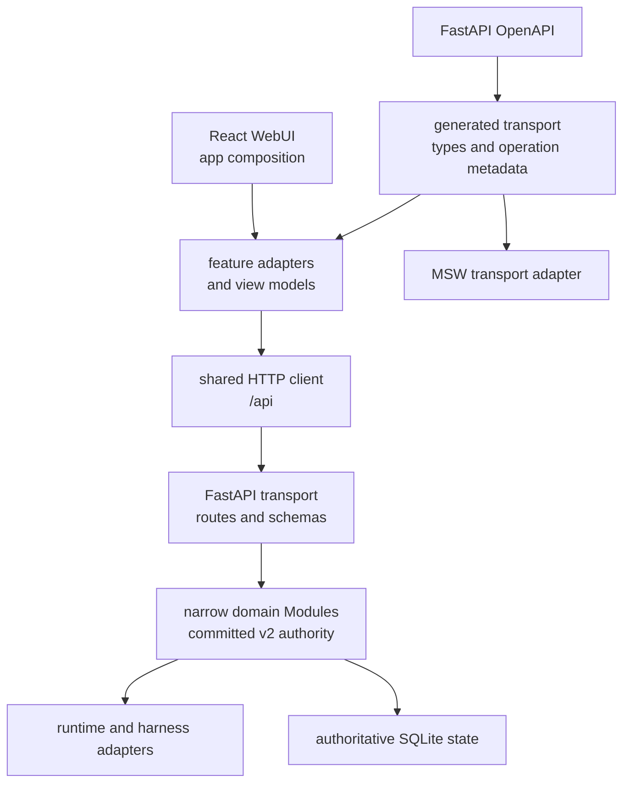

# 架构与兼容契约

本文是 OpenScience 当前架构与 compatibility surface 的长期 owner。历史设计和迁移审计保留在 `docs/superpowers/specs/`；当前产品 contract 以代码、generated OpenAPI artifact、正常测试和本文为准。

## 当前架构

- Backend product graph 不允许 cycle，也不允许 non-API product code 反向依赖 `ainrf.api`。
- Project、Workspace、Environment、Task 等领域通过窄 application Interface 暴露能力；SQLite repository 与共享 write kernel 保持私有。
- Release E 已完成 committed-v2 authority cutover。产品路径不得重新引入 legacy writer、legacy read fallback、双读或双写。
- Frontend 依赖方向为 `app -> features -> shared/design-system`。`shared` 与 `design-system` 不依赖 feature，page 只负责 composition。
- UI 不直接消费 raw generated payload；feature adapter 将 transport type 映射为 view model。

## HTTP 与 generated transport

- Canonical HTTP prefix 是 `/api`。
- root 与 `/v1` router registrations 是 deprecated compatibility aliases，不是第二套 authority。
- FastAPI/Pydantic OpenAPI 是唯一 transport schema authority。
- `npm --prefix frontend run generate:transport` 确定性生成 `frontend/src/generated/transport/`。
- `npm --prefix frontend run check:transport` 重建并检查 schema manifest、operation/path metadata 与工作树 drift。
- Generated transport 的长期验证由正常 drift gate、真实 HTTP contract tests 和 MSW Adapter tests 负责；临时 architecture-cleanup suite 已在 P6 删除。

## Release 与 rollback contract

- L0 是有界开发内循环；L1 是不依赖 Docker 或外部服务的完整确定性 gate。
- Frontend artifact 与 backend contract 必须通过 build info、contract version、capability preflight 和 release smoke 一起验证，不能只用相同 Git SHA 推断兼容。
- 领域结构重构保持 durable schema 与 canonical HTTP behavior 不变，可以回滚代码 artifact。
- Compatibility surface 的 removal change 必须同时更新 schema、generated artifact、contract tests、文档和 rollback evidence。
- 生产 release acceptance、只读 post-smoke 与 rollback 属于 L4；本地或 synthetic smoke 不能替代生产观察窗口。

## Fail-closed compatibility inventory

下列 surface 在 P6 继续保留。原因是没有可信生产 release telemetry 覆盖完整观察窗口，不能把缺失指标解释为零调用。

| Surface | Owner | Telemetry key | 删除条件 | P6 状态 |
| --- | --- | --- | --- | --- |
| root 与 `/v1` route aliases | API / release | `ainrf_deprecated_route_calls_total` | canonical caller 完整迁移；完整 release 观察窗口；指标零调用；同步 schema、tests、docs、rollback evidence | 保留，fail-closed |
| v2-backed Project / Workspace / Environment / Session / Task compatibility projections | API / release | `ainrf_deprecated_route_calls_total` | 同上，并复核 canonical generated operation/path metadata | 保留，fail-closed |
| flat Task mutation response compatibility | Task / API | `ainrf_deprecated_contract_calls_total` | callers 不再消费 flat projection；完整观察窗口为零；同步 contract 与 rollback evidence | 保留，fail-closed |
| Task `environment_id` | Task / API | `ainrf_deprecated_contract_calls_total` | generated callers 不再发送或消费；完整观察窗口为零；同步 schema/tests/docs | 保留，fail-closed |
| Task `task_input` | Task / API | `ainrf_deprecated_contract_calls_total` | generated callers 不再发送；完整观察窗口为零；同步 schema/tests/docs | 保留，fail-closed |
| Task `new_task` | Task / API | `ainrf_deprecated_contract_calls_total` | generated callers 不再消费；完整观察窗口为零；同步 schema/tests/docs | 保留，fail-closed |
| body/query idempotency aliases | API / release | `ainrf_deprecated_contract_calls_total` | 所有 caller 只用 `Idempotency-Key` header；完整观察窗口为零；同步 schema/tests/docs | 保留，fail-closed |
| read-only legacy migration/audit surfaces | Domain migration / release | migration audit evidence | 外部版本化审计证据完成保留决策，且 rollback/audit 不再依赖该 surface | 保留，read-only |
| `ainrf` package/CLI、`.ainrf` state 与 `AINRF_*` config aliases | Runtime / release | release config audit | 已发布兼容窗口结束；canonical `openscience` / `OPENSCIENCE_*` caller 迁移完成；完整观察窗口证明零使用 | 保留，fail-closed |

所有 removal 必须同时满足：canonical caller 已完整迁移、可信 release telemetry 覆盖完整观察窗口、指标明确为零调用，以及 removal change 同步更新 schema、contract tests、文档和 rollback evidence。

> 生产环境验证按用户要求跳过。

## 长期验证 owner

- Backend Module 与 HTTP contract：`tests/` 和 `bash scripts/test.sh <lane>`。
- Generated transport drift：`npm --prefix frontend run check:transport`。
- Frontend feature 与 MSW Adapter：`npm --prefix frontend run test:run`。
- Repository deterministic gate：`bash scripts/ci.sh l0` 与 `bash scripts/ci.sh l1`。
- 发布、rollback 与生产 compatibility telemetry：release owner；没有完整窗口证据时必须 fail-closed 保留。
