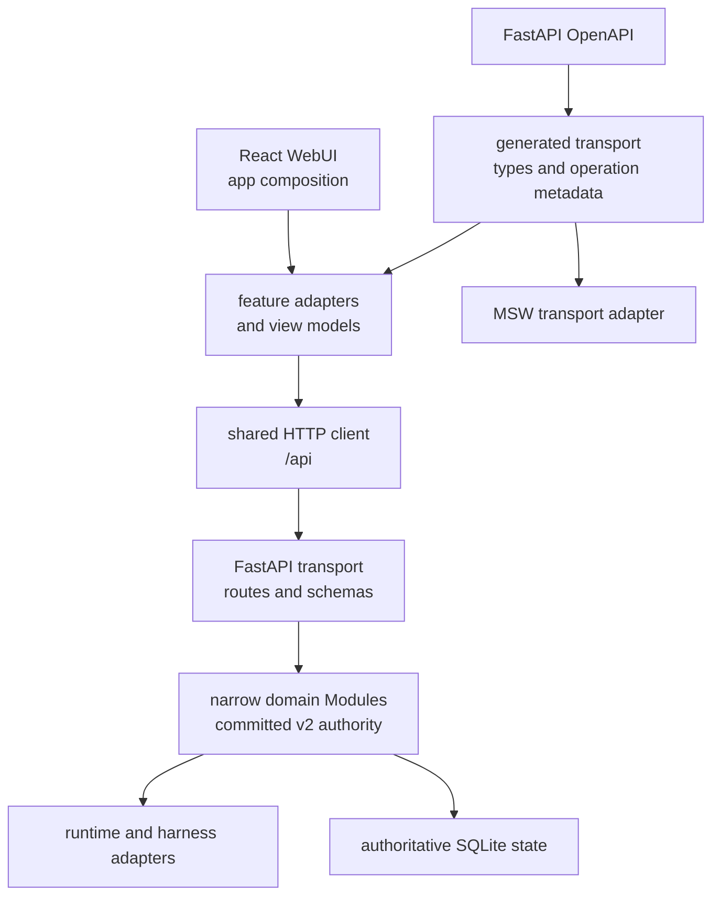

# 架构与兼容契约

本文是 OpenScience 当前架构与 compatibility surface 的长期 owner。活跃设计保留在 `docs/superpowers/specs/`，已完成或被取代的设计保留在 `docs/superpowers/specs/archived/`；当前产品 contract 以代码、generated OpenAPI artifact、正常测试和本文为准。

## 品牌与工程身份

- **OpenScience** 是产品与用户可见品牌，用于 WebUI、公开文档、CLI help 和发布物料。
- `AINRF` / `ainrf` 是稳定内部工程身份，用于 Python package/import namespace、状态路径、Linux identity、部署资源和 Prometheus metric namespace。
- `osci` 只用于前端设计系统、CSS 命名空间或紧凑品牌展示，不建立第三套后端 package、状态目录或部署身份。
- 用户文档优先使用 `openscience` CLI 与 `OPENSCIENCE_*`；`ainrf` CLI 与 `AINRF_*` 保持支持。它们不是等待一次性全量删除的 compatibility debt。

## 当前架构

- Backend product graph 不允许 cycle，也不允许 non-API product code 反向依赖 `ainrf.api`。
- Project、Workspace、Environment、Task 等领域通过窄 application Interface 暴露能力；SQLite repository 与共享 write kernel 保持私有。
- Release E 已完成 committed-v2 authority cutover。产品路径不得重新引入 legacy writer、legacy read fallback、双读或双写。
- Frontend 依赖方向为 `app -> features -> shared/design-system`。`shared` 与 `design-system` 不依赖 feature，page 只负责 composition。
- UI 不直接消费 raw generated payload；feature adapter 将 transport type 映射为 view model。

## HTTP 与 generated transport

- Canonical HTTP prefix 是 `/api`。
- root 与 `/v1` router registrations 是 deprecated compatibility aliases，不是第二套 authority。
- FastAPI/Pydantic OpenAPI 是唯一 transport schema authority。
- `npm --prefix frontend run generate:transport` 确定性生成 `frontend/src/generated/transport/`。
- `npm --prefix frontend run check:transport` 重建并检查 schema manifest、operation/path metadata 与工作树 drift。
- Generated transport 的长期验证由正常 drift gate、真实 HTTP contract tests 和 MSW Adapter tests 负责；临时 architecture-cleanup suite 已在 P6 删除。

## Release 与 rollback contract

- L0 是有界开发内循环；L1 是不依赖 Docker 或外部服务的完整确定性 gate。
- 默认 production 模型是实验室内部的计划维护窗口，允许约 2–3 小时停机，不要求零停机切换或任意中断后的自动接管恢复。
- Frontend、backend 与 worker 必须来自同一份简单 release manifest，并通过 build info、contract version 和 release smoke 验证版本一致；不要求高保证供应链证明或逐步骤发布 ledger。
- 领域结构重构保持 durable schema 与 canonical HTTP behavior 不变，可以回滚代码 artifact。
- Compatibility surface 的 removal change 必须同时更新 schema、generated artifact、contract tests、文档和 rollback 验证记录。
- L4 采用人工维护窗口流程：发布前完成完整备份及隔离恢复验证，停止 writer 后执行必要迁移，启动同版本服务并执行只读 post-smoke；失败时按 runbook 人工恢复数据和上一份 release manifest。

## 环境与发布边界

- Local development 不启动 Docker，使用 `uv`、npm 和 `scripts/dev.sh` 运行 repo 外隔离状态；未来 Pixi 只能补充工具链，不能削弱数据隔离。
- Staging 默认是 development-oriented 容器环境，允许源码和 staging 专属前端产物 bind mount，用于快速联调，不作为不可变 release evidence。
- Production 只消费同一 release manifest 绑定的不可变镜像。WebUI、nginx 配置、API 和 worker 代码均在镜像中；只允许注入 secrets、运行配置与 named persistent volumes，不依赖 Git checkout 或 worktree。
- API、domain worker 与 literature worker 必须使用同一个 API image reference。Web、API 与监控镜像全部构建成功后才能更新运行服务，禁止独立发布前端或后端。
- 默认发布不要求独立 release staging。若未来接入 registry 或确有额外验收需求，可以对同一组镜像引用增加 staging 验收，但不能把它扩张为默认的复杂发布控制面。代码 rollback 以上一份完整 manifest 为单位，数据 rollback 使用发布前验证过的完整备份。

## Fail-closed compatibility inventory

下列 surface 在 P6 继续保留。原因是没有可信生产 release telemetry 覆盖完整观察窗口，不能把缺失指标解释为零调用。

| Surface | Owner | Telemetry key | 删除条件 | P6 状态 |
| --- | --- | --- | --- | --- |
| root 与 `/v1` route aliases | API / release | `ainrf_http_contract_requests_total{surface=~"compat_root|compat_v1"}` | canonical caller 完整迁移；完整 release 观察窗口；指标零调用；同步 schema、tests、docs、rollback evidence | 保留，fail-closed |
| v2-backed Project / Workspace / Environment / Session / Task compatibility projections | API / release | `ainrf_http_contract_requests_total` 的 stable operation | 同上，并复核 canonical generated operation/path metadata | 保留，fail-closed |
| flat Task mutation response compatibility | Task / API | `ainrf_cleanup_compatibility_observations_total{item="task.mutation.flat_response",observation="response_field_emitted"}` | 静态 caller 迁移和已发布客户端证据；完整观察窗口；同步 contract 与 rollback evidence | 保留，fail-closed |
| Task `environment_id` | Task / API | cleanup item `task.create.environment_id` / `task.retry.environment_id` | generated callers 不再发送；完整观察窗口为零；同步 schema/tests/docs | 保留，fail-closed |
| Task `task_input` | Task / API | cleanup item `task.retry.task_input` | generated callers 不再发送；完整观察窗口为零；同步 schema/tests/docs | 保留，fail-closed |
| Task `new_task` | Task / API | cleanup item `task.retry.new_task`，事实仅为 response emitted | 静态 caller 迁移和已发布客户端证据；完整观察窗口；同步 schema/tests/docs | 保留，fail-closed |
| body/query idempotency aliases | API / release | cleanup item `task.request.idempotency_key` | 所有 caller 只用 `Idempotency-Key` header；完整观察窗口为零；同步 schema/tests/docs | 保留，fail-closed |
| read-only legacy migration/audit surfaces | Domain migration / release | migration audit evidence | 外部版本化审计证据完成保留决策，且 rollback/audit 不再依赖该 surface | 保留，read-only |

所有 removal 必须同时满足：canonical caller 已完整迁移、可信 release telemetry 覆盖完整观察窗口、指标明确为零调用，以及 removal change 同步更新 schema、contract tests、文档和 rollback evidence。

旧 `ainrf_deprecated_*` 指标仅在过渡 release 内并行保留用于新旧结果对照，已不再是 removal authority。新的 cleanup registry 为每个临时 item 固定 owner、replacement、2026-10-28 review deadline 与“双重门禁”；若 compatibility 尚未删除，到期必须显式复审，不能静默延期。

## 长期验证 owner

- Backend Module 与 HTTP contract：`tests/` 和 `bash scripts/test.sh <lane>`。
- Generated transport drift：`npm --prefix frontend run check:transport`。
- Frontend feature 与 MSW Adapter：`npm --prefix frontend run test:run`。
- Repository deterministic gate：`bash scripts/ci.sh l0` 与 `bash scripts/ci.sh l1`。
- 发布、rollback 与生产 compatibility telemetry：release owner；没有完整窗口证据时必须 fail-closed 保留。
