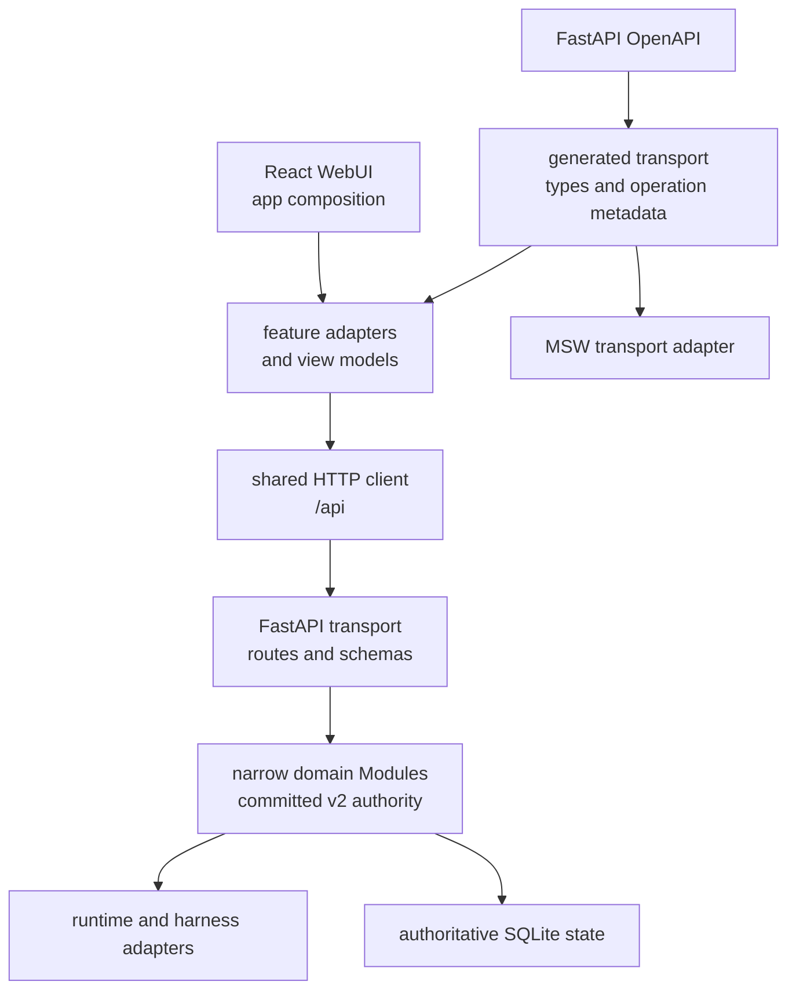

# 架构与兼容契约

本文是 OpenScience 当前架构与 compatibility surface 的长期 owner。活跃设计保留在 `docs/superpowers/specs/`，已完成或被取代的设计保留在 `docs/superpowers/specs/archived/`；当前产品 contract 以代码、generated OpenAPI artifact、正常测试和本文为准。

## 品牌与工程身份

- **OpenScience** 是产品与用户可见品牌，用于 WebUI、公开文档、CLI help 和发布物料。
- `AINRF` / `ainrf` 是稳定内部工程身份，用于 Python package/import namespace、状态路径、Linux identity、部署资源和 Prometheus metric namespace。
- `osci` 只用于前端设计系统、CSS 命名空间或紧凑品牌展示，不建立第三套后端 package、状态目录或部署身份。
- 用户文档优先使用 `openscience` CLI 与 `OPENSCIENCE_*`；`ainrf` CLI 与 `AINRF_*` 保持支持。它们不是等待一次性全量删除的 compatibility debt。

## 当前架构

- Backend product graph 不允许 cycle，也不允许 non-API product code 反向依赖 `ainrf.api`。
- `ainrf.api.cli` 是完整 CLI 的 HTTP Adapter composition root；`ainrf.api.server` 拥有 FastAPI construction、HTTP process composition、uvicorn/reload 与 daemon lifecycle。通用命令位于 `ainrf.command`，不依赖 HTTP Adapter。
- 正常 L0/L1 在 Python quality gate 开始时检查 product import cycle，以及 non-API Module 对 `ainrf.api` 的静态、惰性、动态和字符串入口依赖。
- Project、Workspace、Environment、Task 等领域通过窄 application Interface 暴露能力；SQLite repository 与共享 write kernel 保持私有。
- Release E 已完成 committed-v2 authority cutover。产品路径不得重新引入 legacy writer、legacy read fallback、双读或双写。
- Issue #76 将已完成的 cutover、migration chain 和 legacy Attempt/RuntimeSession authority 退休。当前 fresh-install schema baseline 是 `agentic_researcher=33`、`auth=7`、`literature=7`、`terminal=1`；Literature baseline 后的 migration 008 会安全退休已被当前 research-task intent/work/outbox authority 替代的 `literature_task_sagas`，并把新安装和可安全升级的 v7 数据库推进到当前 version 8。`literature_api_attempts` 仍保留为外部调用 durable attempt 记录。正常 startup 只注册 `src/ainrf/db/migrations/current.py` 和 `src/ainrf/db/baselines/*.sql`。
- 历史 `agentic_researcher` version 32 到 current baseline 33 的删除动作只存在于一次性的 `openscience migration retire-legacy preflight|apply|verify`；`apply` 同时删除 sidecar 中依赖旧 cutover/Attempt 模型的 snapshot 与 legacy-write counter，保留仍属当前契约的 durable counters。它不属于正常 import graph，也不承诺从任意历史版本升级。
- Frontend 依赖方向为 `app -> features -> shared/design-system`。`shared` 与 `design-system` 不依赖 feature，page 只负责 composition。
- UI 不直接消费 raw generated payload；feature adapter 将 transport type 映射为 view model。

## HTTP 与 generated transport

- Canonical HTTP prefix 是 `/api`。
- 产品 router 只注册在 `/api`。root 与产品 `/v1` aliases 已在用户确认当前无外部调用者后删除；`/v1/models`、`/v1/messages` 继续作为独立外部协议保留。
- FastAPI/Pydantic OpenAPI 是唯一 transport schema authority。
- `/api/tasks` 是唯一正式 Task HTTP Interface；Conversation Module 在该 Seam 后拥有 Task、Turn、Item、Submission、Execution 与 Binding 的行为和持久化。Project-owned relationship 与 usage 投影位于 `/api/domain/projects/{project_id}/task-relationships` 和 `/usage-summary`。管理侧 `/runs` 读取 Task/Turn/Item 投影，不存在独立 Session 资源。

Conversation Module 以小 Interface 隐藏幂等、因果 guard、可靠投递、runtime control 与 SQLite 事务，形成足够的 Depth。HTTP、worker 与 runtime driver 是该 Module 不同 Seam 上的 Adapter；这种 Locality 让状态机修复集中在一个实现中，并为所有 caller 提供 Leverage。退休完成后，旧 Attempt/RuntimeSession、cutover 和 migration tables 不再是 current schema；只读 admin audit 只保留 `legacy_domain_records` 历史证据，不能把历史 payload 转成新的 Task 或 Session。
- `npm --prefix frontend run generate:transport` 确定性生成 `frontend/src/generated/transport/`。
- `npm --prefix frontend run check:transport` 重建并检查 schema manifest、operation/path metadata 与工作树 drift。
- Generated transport 的长期验证由正常 drift gate、真实 HTTP contract tests 和 MSW Adapter tests 负责；临时 architecture-cleanup suite 已在 P6 删除。

## Release 与 rollback contract

- L0 是有界开发内循环；L1 是不依赖 Docker 或外部服务的完整确定性 gate。
- 默认 production 模型是实验室内部的计划维护窗口，允许约 2–3 小时停机，不要求零停机切换或任意中断后的自动接管恢复。
- Frontend、backend 与 worker 必须来自同一份简单 release manifest，并通过 build info、contract version 和 release smoke 验证版本一致；不要求高保证供应链证明或逐步骤发布 ledger。
- 领域结构重构保持 durable schema 与 canonical HTTP behavior 不变，可以回滚代码 artifact。
- Compatibility surface 的 removal change 必须同时更新 schema、generated artifact、contract tests、文档和 rollback 验证记录。
- L4 采用人工维护窗口流程：发布前完成完整备份及隔离恢复验证，停止 writer 后执行必要迁移，启动同版本服务并执行只读 post-smoke；失败时按 runbook 人工恢复数据和上一份 release manifest。

## 环境与发布边界

- Local development 不启动 Docker，使用 `uv`、npm 和 `scripts/dev.sh` 运行 repo 外隔离状态；未来 Pixi 只能补充工具链，不能削弱数据隔离。
- Staging 默认是 development-oriented 容器环境，允许源码和 staging 专属前端产物 bind mount，用于快速联调，不作为不可变 release evidence。
- Production 只消费同一 release manifest 绑定的不可变镜像。WebUI、nginx 配置、API 和 worker 代码均在镜像中；只允许注入 secrets、运行配置与 named persistent volumes，不依赖 Git checkout 或 worktree。
- API、domain worker 与 literature worker 必须使用同一个 API image reference。Web、API 与监控镜像全部构建成功后才能更新运行服务，禁止独立发布前端或后端。
- 默认发布不要求独立 release staging。若未来接入 registry 或确有额外验收需求，可以对同一组镜像引用增加 staging 验收，但不能把它扩张为默认的复杂发布控制面。代码 rollback 以上一份完整 manifest 为单位，数据 rollback 使用发布前验证过的完整备份。

## Fail-closed compatibility inventory

用户已用“当前没有外部调用者”的人工判断覆盖原观察窗口门槛。资源兼容入口、Session / Task compatibility projections 与 Literature `/convert` 已在 caller、generated transport 和 immutable release staging 验收后删除。下表是当前长期支持或仍承担只读迁移/审计职责的完整清单。

| Surface | Owner | 保留理由 | 状态 |
| --- | --- | --- | --- |
| `openscience` CLI | Product CLI | 用户可见的正式产品入口 | 长期支持 |
| `ainrf` CLI | Backend runtime | 稳定内部工程与运维入口 | 长期支持 |
| `AINRF_*` backend config | Backend runtime | canonical 后端配置命名空间 | 长期支持 |
| 对应的 `OPENSCIENCE_*` backend config aliases | Product / release | `PROJECT_BASIS.md` 明确规定的正式兼容别名 | 长期支持，不是 cleanup debt |
| `/v1/models`、`/v1/messages` | External protocol adapter | Anthropic-compatible 外部协议入口 | 长期支持 |
| `domain-migration` CLI 与 `/api/admin/domain/legacy-records` | Domain migration / release | 已退休状态的只读历史审计证据；不得成为 product read fallback | 保留，admin-only |
| `migration retire-legacy preflight|apply|verify` | Release owner | version 32 到 current baseline 33 的一次性维护窗口删除动作 | 保留，one-time only |
| `/api/tasks/{task_id}/fork` legacy one-shot Task fork | Conversation Domain / Task HTTP Adapter | WebUI caller 仍是 `frontend/src/features/tasks/api/endpoints.ts::forkTask`（由 `TasksPage` 的 Fork Task 操作调用）；继续以旧 payload 映射 canonical Task + Submission，待 UI 改用正式 transfer 流程 | fail-closed 保留；caller 尚未迁移，方向为 `/api/tasks/{task_id}/fork-preview` → `/api/tasks/{task_id}/fork-preview/{preview_id}/confirm`，完成 caller、generated transport、contract tests 与 release staging 验收后再评估删除 |
| Literature subscriptions CRUD（4 operations） | Literature compatibility Adapter | repo caller audit 未发现 WebUI caller；已收敛为正式 topic application Interface 上的 payload Adapter，但尚未完成删除批准 | fail-closed 保留 |
| Literature subscription fetch/status（2 operations） | Literature compatibility Adapter | repo caller audit 未发现 WebUI caller；已收敛为正式 durable check Interface 上的 Adapter，但尚未完成删除批准 | fail-closed 保留 |
| Literature paper read（1 operation） | Literature compatibility Adapter | repo caller audit 未发现 WebUI caller；已收敛为正式 paper state Interface 上的 Adapter，但尚未完成删除批准 | fail-closed 保留 |

后续 removal 默认仍要求 caller 迁移和同步更新 schema、contract tests、文档与 rollback evidence；Issue #76 的生产删除仍必须由用户在维护窗口完成 preflight、backup/restore 和 post-validation。

Literature 的正式 HTTP Interface 当前固定为 19 个 operation：overview 1、topics 6、checks 4、papers/detail/versions/state 4、summary 2、research-task create/list 2。singular research-task 查询已在 WebUI caller 迁移后退役；上述 7 个 compatibility operation 未获得独立删除批准，因此没有删除，也没有为收集 telemetry 部署未完整验收的代码到 production。

临时 `ainrf_cleanup_*` registry、指标、持久化表、日志和 Dashboard，以及 superseded `ainrf_deprecated_*` 指标、旧统计 helper 与 Release E 告警已在架构清理最终收口中删除。Compatibility route 观察统一由长期、低基数的 `ainrf_http_contract_*` 指标和 durable aggregate 承担；正式长期 alias 不再产生 cleanup-only 遥测。

## Production retirement checkpoint

本节定义 production retirement 的长期 gate 与授权边界，不记录某次发布是否已完成。Release owner 负责准备并保存证据；只有用户审阅证据并显式授权维护窗口后，才能执行 production migration、compatibility retirement 或 release。缺少授权或任一必需证据时，操作必须 fail-closed，不得推进；本文本身不构成 production 执行证据。

1. Release owner 必须在停止 writer 前完成完整 backup，并在隔离 staged root 验证 restore、SQLite integrity 和只读 post-restore smoke；用户授权前核对这些结果。
2. 获得用户授权后，release owner 才可停止 writers 并进入 maintenance；release manifest 中 API、Web、worker 和 schema artifact SHA 必须一致，并确认 participant drain、active Turn/Submission 为零或符合窗口策略，workspace/tenant source 稳定。
3. 在获授权的 maintenance window 中，release owner 在 production state root 运行 `openscience migration retire-legacy preflight`，人工核对 ready 后只运行一次 `apply`，确认旧 telemetry snapshot/legacy-write counter 已清除，再运行 `verify` 并保存 JSON/integrity evidence。
4. 启动同一 manifest 后，必须完成只读 health/domain/Task/Turn/Item/admin-audit smoke，并确认没有旧表访问、旧 writer 或 legacy fallback。
5. 失败时使用已验证的上一份 release manifest 和完整 backup 人工 rollback。代码回滚不能恢复已删除表，数据恢复必须依赖 backup；缺少 backup/restore、release consistency、post-smoke、rollback 或 telemetry evidence 时，必须保持 fail-closed。

## 最终收口验收

2026-08-01 的最终收口使用提交 SHA 对应的不可变 release manifest，在 `openscience-release-staging` 的独立 named volumes 与 `127.0.0.1:7192` / `127.0.0.1:17000` 上完成。API、Web 与 fixture worker 使用同一 release SHA；验收覆盖登录、用户、设置、Project、Workspace、Environment、文件读写与租户权限、Task 全生命周期、Runs、Timeline、Literature、Skills、Terminal、正式 HTTP contract 与已删除入口的 404。浏览器 Console、page error、真实 Network failure 与 5xx 均为零；Task 由 fixture worker 成功执行，API 重启后 Task、上传文件与 durable HTTP contract evidence 仍可读取。隔离 API、Web、init 与 worker 日志未发现相关 schema、权限或未处理异常。

该验收没有访问或操作 production 容器、数据、日志、端口或 HTTP。最终可审计的准确 SHA、manifest 与 required checks 以对应 release record 为准。

## 长期验证 owner

- Backend Module 与 HTTP contract：`tests/` 和 `bash scripts/test.sh <lane>`。
- Generated transport drift：`npm --prefix frontend run check:transport`。
- Frontend feature 与 MSW Adapter：`npm --prefix frontend run test:run`。
- Repository deterministic gate：`bash scripts/ci.sh l0` 与 `bash scripts/ci.sh l1`。
- 发布、rollback 与生产 compatibility telemetry：release owner；没有完整窗口证据时必须 fail-closed 保留。
