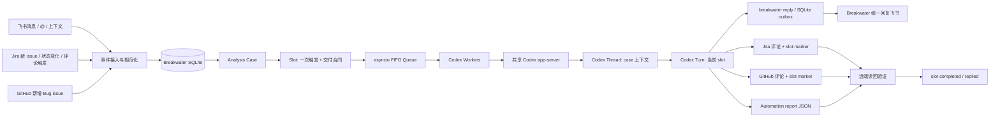
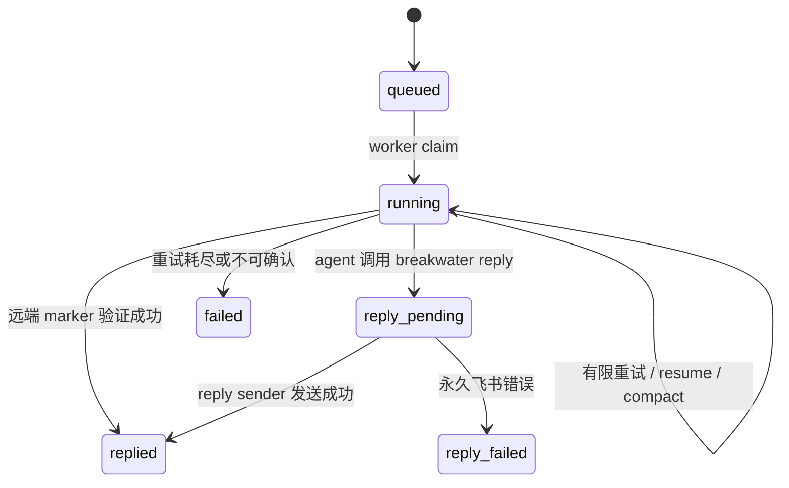
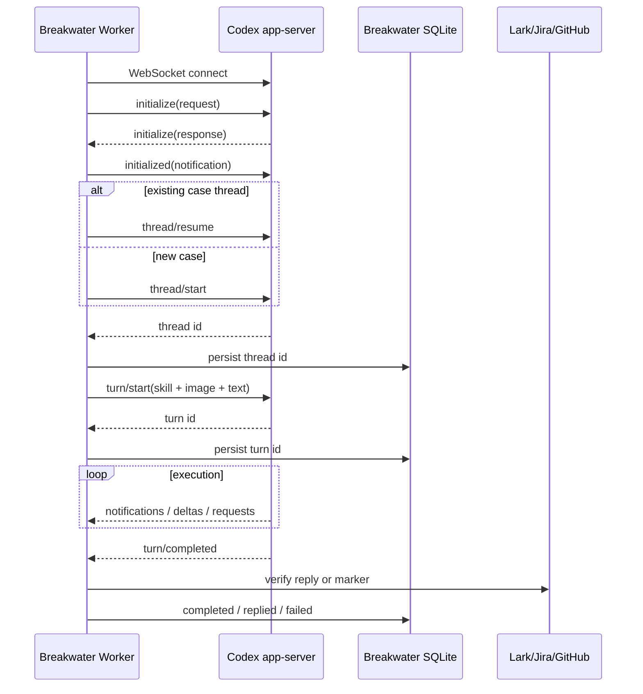

---
aliases:
  - Breakwater Agent Runtime 调研
  - Breakwater Codex App Server 调研
tags:
  - openscience
  - reference-project
  - agent-runtime
  - codex-app-server
  - observability
source_repo: Breakwater
source_path: ref-repos/Breakwater
source_url: https://github.com/zclllyybb/Breakwater
source_commit: e1cbe5e0e7f57f9426a56f95a36cc747007f271c
researched_at: 2026-07-16
---

# Breakwater 的 Agent Runtime、交互、任务分配与 Codex App Server 管理

> [!abstract]
> Breakwater 是一个面向 on-call 场景的本地 agent 服务。它最值得研究的不是单一模型调用，而是把外部事件、持久 case、一次性 slot、Codex thread/turn 和最终交付验证拆成不同层次。其强项是上下文连续性、来源幂等、case 级串行化和“执行完成不等于业务交付完成”的验证闭环；主要短板是凭据暴露面较宽、事件与 token 遥测不够持久、共享 WebSocket app-server 缺少运行期监督，以及没有实现完整的 app-server server-request/approval 控制面。

## 1. 调研范围与证据边界

- 上游仓库：`https://github.com/zclllyybb/Breakwater`
- 本地参考路径：`ref-repos/Breakwater`
- 调研快照：`e1cbe5e0e7f57f9426a56f95a36cc747007f271c`
- 上游默认分支：`open-source`
- 上游历史只有一个公开 commit：`Sanitize repository for open source release`。因此可以分析当前实现，不能从公开 git 历史可靠还原设计演进过程。
- 核心源码：
  - `breakwater/codex_app_server.py`
  - `breakwater/service.py`
  - `breakwater/db.py`
  - `breakwater/cases.py`
  - `breakwater/runtime.py`
  - `breakwater/cli.py`
  - `prompts/breakwater.md`
  - `skills/`
- 验证：`UV_CACHE_DIR=/tmp/uv-cache uv run python -m unittest discover -s tests -v`，共 112 个测试通过。
- Codex 当前能力交叉验证：本机 `codex-cli 0.144.4`；实测 WebSocket app-server 启动及 `/readyz`、`/healthz` 返回 200，并通过 `codex app-server generate-json-schema --experimental` 生成协议 schema。

> [!note]
> Breakwater 快照与本机 Codex CLI 相差约一个版本周期。下文凡标注“当前 Codex CLI”的内容是 2026-07-16 本机 `0.144.4` 的可验证能力，不应反向解释为 Breakwater 提交时已经实现。

## 2. 核心结论

1. Breakwater 的核心运行时对象不是 Codex thread，而是 `case → slot → thread → turn` 四层模型。
2. `case` 代表持续问题域，`slot` 代表一次触发及其交付合同；同一 case 通常复用同一个 Codex thread，但每个 slot 启动一个新 turn。
3. 任务分配不是模型自主抢单，而是外部监控器创建 slot，进程内 FIFO 队列分发给固定数量 asyncio worker。
4. 同一 case 通过进程内 claim 串行执行，不同 case 可以并发。这避免两个 turn 同时改写同一对话上下文。
5. Codex 的普通最终文本不被视为业务完成。飞书任务必须写入本地 reply outbox；Jira/GitHub 任务必须写入带 slot marker 的远端评论并由 Breakwater 读回验证。
6. Breakwater 会自行启动一个共享的本地 Codex WebSocket app-server，也能连接外部已运行实例；每个 slot/compact/read 操作建立独立 WebSocket 连接。
7. Jira/GitHub 凭据会注入 app-server 进程和 Codex thread 的 shell 环境，解决 skill 子进程取不到 token 的问题，但权限粒度是整个 thread，而不是单工具或单次调用。
8. Breakwater 只从 Codex 本地 `state_5.sqlite` 读取累计 `tokens_used`，没有消费 app-server 的实时 token usage 通知，也没有预算、成本、模型维度聚合或持久遥测。
9. 当前 OpenScience 的 stdio、attempt-scoped、tenant-aware Codex engine 在隔离、控制、pause/cancel 和审批请求处理上更完整；Breakwater 更值得借鉴的是 case/slot/交付验证模型，而不是共享 WebSocket 进程本身。

## 3. 总体架构



Breakwater README 中的架构图把多个业务事项画成独立 slot。源码进一步补出了三个重要层次：

- `analysis_cases`：问题连续性、别名、绑定群和主 Codex thread。
- `slots`：单次触发、重试、Codex 状态、回复状态、目标交付通道。
- `case_slots` / `case_aliases`：把 Jira key、GitHub issue、Lark message、slot id、Codex thread id 汇聚到同一 case。

## 4. 运行时状态模型

### 4.1 Case：持续问题域

`AnalysisCase` 保存：

- `scope_type` / `scope_key`：例如 `jira_issue:OPS-1234`、`github_issue:owner/repo#42`、`lark_chat:group:oc_xxx`。
- `primary_codex_thread_id`：第一次成功绑定的 Codex thread。
- `latest_codex_thread_id`：后续继续任务应恢复的 thread。
- `latest_slot_id`、`summary`、`status`。
- `bound_lark_chat_id` / `bound_lark_chat_name`：一个问题 case 最多绑定一个飞书群，防止上下文分叉。

case 可由以下别名定位：

- Jira issue key
- Jira comment id
- GitHub `owner/repo#number` 或 issue URL
- `case_id`
- `slot_id`
- Codex thread/session UUID
- Lark message id、chat id 或 sender id

飞书解析中，群名里出现的 Jira key 优先于消息正文引用。引用解析结果为未知或歧义时，Breakwater 不让 Codex 猜，而是直接要求用户澄清。

### 4.2 Slot：一次触发与交付合同

`Slot` 是真正进入队列的单位，关键字段包括：

- 来源：`lark_case_followup`、`lark_jira_analyze`、`jira_analyze`、`jira_issue_auto_analyze`、`jira_status_summary`、`github_issue_analyze` 等。
- 三组状态：`status`、`codex_status`、`reply_status`。
- `codex_attempts`、`codex_thread_id`、`codex_turn_id`。
- `trigger_key`：外部触发幂等键。
- `case_id`：所属持续问题域。
- `delivery_target`：`lark_reply`、`jira_comment`、`github_issue_comment`、双出口等。

这种拆分的意义是：模型执行状态和业务交付状态不会被混为一谈。例如 Codex turn 已经 `completed`，但没有调用 `breakwater reply`，slot 仍不能成功。

### 4.3 Thread 与 Turn

- 一个 case 的后续 slot 默认恢复 `latest_codex_thread_id`。
- 一个 slot 对应一个或多个尝试，每次尝试产生一个 turn。
- 首次 thread resume 失败时，Breakwater 新建 thread，但把 case summary 和当前输入重新放进 prompt。
- context window 超限时，优先对原 thread 执行 `thread/compact/start`，然后在同一 thread 重试，而不是立即丢弃上下文。

### 4.4 状态关系



数据库采用 SQLite WAL，并为 event id、trigger key、issue slot 等建立唯一约束。外部轮询使用时间 cursor 加 overlap window，再依靠数据库唯一键消除重复。

## 5. 交互方式

### 5.1 飞书

接入分成两条路径：

1. `lark-cli event consume im.message.receive_v1 --as bot` 作为长连接事件消费者，stdout 每行一个 JSON 事件。
2. Lark SDK 用于读取群名、验证真实 mention、下载图片和回复原消息。

群聊未 @ 机器人时，消息不会创建任务，但会保存为 future context。下一次真正触发时，Breakwater 把“上次处理后积累的新消息”按时间顺序附加到 prompt。

飞书图片最多取 5 张，下载到 `.breakwater/lark-images/<slot_id>/`，作为 app-server `localImage` 输入；下载失败时保留文字占位和错误说明。

飞书回复由 agent 调用本地 CLI 写入 SQLite：

```bash
BREAKWATER_DB=/absolute/path/to/breakwater.db \
  uv run breakwater reply <slot_id> --message-file .breakwater/reply-<slot_id>.txt
```

真正的 Lark API 回复由独立 `reply-sender` 循环完成。这样 agent 不持有“如何回复原消息”的协议细节，Breakwater 也能重试临时失败。

### 5.2 Jira

Jira 有三类自动任务：

- 评论以 `/analyze` 开头或真实结构化 @ bot。
- 新 issue 自动初始分析。
- issue 状态进入 Done/Backlog 等收口状态后的总结。

首次轮询只初始化 cursor，不回溯旧历史。轮询查询使用 overlap window，评论 id、issue key 和 trigger key 保证幂等。`/no-analyze` 可以阻止新 issue 分析和状态总结。

Jira 交付不是读取 Codex 最终答案，而是要求 agent 使用 `jira-issue` skill 写远端评论，评论中包含：

```text
Breakwater-Analysis-Slot: <slot_id>
```

Breakwater 随后重新读取 Jira 评论列表，只有 marker 存在才算交付成功。自动初始分析和状态总结还要求额外写入结构化 automation report；评论 marker 与 report 二者都存在才完成。

### 5.3 GitHub

GitHub 轮询只处理标题以 `[bug]` 开头的新 issue，并跳过 pull request。首次启动同样只初始化 cursor。

agent 通过 Breakwater CLI 写 GitHub 评论，评论必须包含：

```text
Breakwater-GitHub-Analysis-Slot: <slot_id>
```

Breakwater 再通过 GitHub REST API 读回 marker。这里与 Jira 一样，外部系统事实是完成判据。

### 5.4 状态页与管理页

- 普通状态页默认 `127.0.0.1:8765`，无认证，展示 queue、slot、case、Lark 消息、Jira/GitHub 记录、Codex thread 首条 prompt 和事件。
- 管理页默认关闭，单独监听 `127.0.0.1:8766`，使用 PBKDF2-SHA256 密码 hash 和 HMAC session cookie。

普通状态页如果配置为 `0.0.0.0`，会直接暴露 prompt、消息内容、issue 信息和运行状态，必须在外层加认证或保持 loopback-only。

## 6. 任务分配方式

| 触发来源 | case scope | 是否恢复 thread | 交付目标 | 完成验证 |
|---|---|---:|---|---|
| 普通飞书对话 | Lark group 或 sender | 是 | 飞书 reply | SQLite reply outbox 已记录，发送器完成投递 |
| 飞书中的既有 Jira case 追问 | Jira issue | 是 | Jira 新增进展 + 飞书摘要 | prompt 约束；飞书 outbox 必验，Jira 更新依任务内容 |
| 飞书识别到新 Jira | Jira issue | 首次否 | Jira 评论 + 飞书回复 | 双出口均存在 |
| Jira `/analyze` / 真实 @ | Jira issue | 后续是 | Jira 评论 | 远端 marker |
| Jira 新 issue 自动分析 | Jira issue | 后续是 | Jira 评论 + automation report | marker + 结构化 report |
| Jira 状态总结 | Jira issue | 后续是 | Jira 评论 + automation report | marker + 结构化 report |
| GitHub `[bug]` issue | GitHub issue | 后续是 | GitHub 评论 | 远端 marker |

### 6.1 Queue 与 worker

- `asyncio.Queue[str]` 保存 slot id。
- `queue.concurrency` 决定固定 worker 数量，默认 5。
- `_queued_slot_ids` 防止同进程重复入队。
- worker 取出 slot 后重新读取数据库，跳过已经 replied/failed 的任务。

### 6.2 Case 级串行化

`ActiveCaseRegistry` 同时维护 active slot id 和 active case id：

- 同一 slot 不会重复运行。
- 同一 case 的两个 slot 不会并行运行。
- 不同 case 仍可利用多个 worker 并发。
- 无 case 的本地 slot 只按 slot 去重，可以并发。

这是一个很好的上下文一致性策略，但它只在单进程内有效。如果两个 Breakwater 进程连接同一 SQLite，没有数据库 lease 或原子 claim 阻止跨进程并发。

### 6.3 Prompt 和 Skill 是“软路由器”

Breakwater 根据 slot source 选择 prompt section，并把 skill 作为 app-server typed input 附加：

- `breakwater-reply`
- `jira-issue`
- `breakwater-develop`

如果 app-server 不接受 `skill` input，客户端会退化为纯文本 prompt 再次 `turn/start`。

这里的 develop skill 会要求 Codex 建 branch/worktree、创建 goal、测试、调用 subagent review 和发布分支。但这些动作是 prompt/skill 对 Codex 的行为约束，Breakwater 自身没有 child-agent registry、任务树、subagent 生命周期或资源配额管理。因此它是“把复杂开发任务委派给一个 Codex thread”，不是一个真正的多 agent scheduler。

## 7. How to spawn and control a Codex app server

### 7.1 Breakwater 如何启动

Breakwater 先探测：

```text
http://127.0.0.1:17345/readyz
```

如果已 ready：

- 直接复用外部 app-server。
- `owned=false`，Breakwater 停止时不会终止它。
- app-server 进程级环境变量无法再注入，但 thread 的 shell environment 仍会通过 `thread/start` / `thread/resume` config 设置。

如果未 ready 且 `start_server=true`：

```bash
codex app-server --listen ws://127.0.0.1:17345
```

管理器行为：

1. `asyncio.create_subprocess_exec` 启动进程。
2. stdout 合并 stderr，逐行写结构化日志。
3. 最多轮询约 10 秒 `/readyz`。
4. 记录 `owned=true` 和 pid。
5. 服务停止时先 `terminate`，等待 5 秒后 `kill`。

本机 Codex 0.144.4 实测还提供 `/healthz`。当前 CLI 支持：

```text
stdio://
unix://
unix://PATH
ws://IP:PORT
off
```

非 loopback WebSocket 监听还支持 `capability-token` 或 `signed-bearer-token` 鉴权。Breakwater 默认只监听 `127.0.0.1`，未设置 WebSocket auth；不要把当前命令直接改成公网或局域网监听。

### 7.2 初始化握手

每个操作新建 WebSocket，然后执行：

```json
{"id": 1, "method": "initialize", "params": {
  "clientInfo": {"name": "breakwater", "version": "0.1.0", "title": "Breakwater"},
  "capabilities": {"experimentalApi": true}
}}
```

收到 response 后发送 notification：

```json
{"method": "initialized"}
```

Breakwater 使用递增整数 request id，并在等待 response 时顺带处理 notification。

### 7.3 新建或恢复 thread

新建：

```json
{
  "id": 2,
  "method": "thread/start",
  "params": {
    "cwd": "/workspace",
    "ephemeral": false,
    "sandbox": "workspace-write",
    "approvalPolicy": "never",
    "model": "<optional>",
    "serviceName": "breakwater",
    "config": {
      "shell_environment_policy": {
        "inherit": "all",
        "set": {
          "JIRA_TOKEN": "<injected>",
          "GITHUB_TOKEN": "<injected>"
        }
      }
    }
  }
}
```

恢复：

```json
{
  "id": 2,
  "method": "thread/resume",
  "params": {
    "threadId": "<existing-thread-id>",
    "cwd": "/workspace",
    "sandbox": "workspace-write",
    "approvalPolicy": "never"
  }
}
```

`serviceName=breakwater` 使 Codex 本地 state 可以标识来源；Breakwater 还把实际 slot 绑定的 thread id 保存到自己的 SQLite，避免只靠 cwd 或 prompt 猜归属。

### 7.4 启动 turn

输入可以同时包含 skill、图片和文本：

```json
{
  "id": 3,
  "method": "turn/start",
  "params": {
    "threadId": "<thread-id>",
    "cwd": "/workspace",
    "approvalPolicy": "never",
    "model": "<optional>",
    "effort": "<optional>",
    "input": [
      {"type": "skill", "name": "breakwater-reply", "path": "/.../SKILL.md"},
      {"type": "localImage", "path": "/.../image.png", "detail": "original"},
      {"type": "text", "text": "<rendered prompt>"}
    ]
  }
}
```

客户端收集：

- `item/agentMessage/delta`：拼接自然语言 answer。
- `error`：按 turn id 保存 `message`、`codexErrorInfo`。
- `turn/completed`：获得最终 status 和 `durationMs`。

Breakwater 不把 delta 流式传到 WebUI，也没有把 tool call、thinking 或 file change 变成结构化产品事件。

### 7.5 恢复、读取、compact 和中断

Breakwater 已使用：

- `thread/read {threadId, includeTurns: true}`：传输错误后读取原 turn 是否仍在运行或已终止。
- `thread/compact/start {threadId}`：context window exceeded 后压缩原 thread。

当前 Codex CLI 还支持：

- `turn/interrupt {threadId, turnId}`：暂停或取消当前 turn。
- app-server daemon：`bootstrap/start/restart/stop/version`。
- `app-server proxy`：通过 stdio 转发到受管 daemon 的 Unix control socket。

Breakwater 没有暴露 pause/cancel/interrupt 控制，也没有使用 daemon/proxy。

### 7.6 协议时序



## 8. Codex App Server 控制面的优点与缺口

### 8.1 优点

- 外部 app-server 与自管 app-server 都可使用。
- 进程所有权明确，避免误杀外部实例。
- `/readyz` 而非端口连通性作为启动判据。
- 每个任务独立 WebSocket，多个 worker 可并发共享同一 server。
- thread id 和 turn id 在运行中尽早写入 SQLite，状态页能在 turn 完成前显示 session。
- transport error 后不会立即重跑可能仍在后台执行的 turn，而是先 `thread/read` 对账，避免重复 Jira 评论。
- context window 超限优先 compact 原 thread。

### 8.2 缺口

1. **没有 app-server supervisor**：启动成功后进程若退出，没有自动重启或健康监督；Lark listener 有 supervisor，Codex server 没有。
2. **启动超时没有显式清理**：ready 等待超时后直接抛错，未在该路径调用 `stop()`。
3. **不支持 pause/cancel/steer**：虽然协议有 `turn/interrupt`，产品面没有控制入口。
4. **server request 处理不完整**：读取 turn 时，任何 app-server 主动 request 都返回 `-32601 unsupported`。当前协议可能发出 command/file/permissions approval、MCP elicitation、ChatGPT token refresh 等 request。
5. **握手 request 循环会忽略异步 server request**：`_request()` 看到不匹配的 `id` 只记录并丢弃，没有判断它是否是 server-to-client request，也没有响应，可能导致双方等待。
6. **approval policy 实际固定为 `never`**：`CodexConfig` 有字段，但 YAML/CLI builder 没有读取配置值。这降低交互复杂度，也失去可控审批能力。
7. **共享 WebSocket server 放大凭据和租户边界**：所有任务共用同一 app-server 进程与宿主 Codex state，不适合直接复制到多租户控制面。
8. **协议兼容靠手写字典**：没有锁定或生成 schema 的 CI contract test，CLI 升级后字段/notification 变化只能靠运行时发现。

## 9. 凭据管理

### 9.1 凭据来源和传播

| 凭据 | 来源优先级 | Breakwater 自身 | app-server 进程 | Codex thread shell |
|---|---|---:|---:|---:|
| Jira token | CLI → 顶层 YAML → `jira.token` → `JIRA_TOKEN` | 是 | 是（仅自管启动） | 是 |
| GitHub token | CLI → 顶层 YAML → `github.token` → `GITHUB_TOKEN` → `GH_TOKEN` | 是 | 是（配置解析成功时） | 是 |
| Lark app secret | CLI/YAML 或 lark-cli 配置 | 是 | 否 | 否 |
| Codex/OpenAI auth | app-server 继承的宿主环境或 `CODEX_HOME` 登录态 | 间接 | 是 | 由 Codex 管理 |
| Admin password/session | CLI/YAML/env | 管理页 | 否 | 否 |

Jira/GitHub token 有两次注入：

1. 启动 app-server 时加入子进程 env。
2. `thread/start` / `thread/resume` 的 `shell_environment_policy.set`。

第二层是关键：即使 app-server 已由别人启动，后续 thread 内 shell 命令仍能拿到 token。

### 9.2 Lark secret

如果配置未直接给出 app id/secret，Breakwater 读取 `~/.lark-cli/config.json`。当配置声明 secret 来源为 `keychain` 时，它读取：

- `~/.local/share/lark-cli/master.key`
- `~/.local/share/lark-cli/appsecret_<app_id>.enc`

并用 AES-GCM 解密。其安全强度取决于这两个文件的 OS 权限；密钥和密文都在同一用户目录，不是独立 KMS。

### 9.3 Prompt 防泄漏

配置会被递归 flatten 成 prompt variables，但代码只显式删除四个 key：

- `JIRA_TOKEN`
- `jira_token`
- `GITHUB_TOKEN`
- `github_token`

当前 prompt 没有引用 Lark secret、admin session secret 或 password hash，因此不会自动出现在模型输入中；但这里使用 denylist 而非 allowlist，后续热修改 prompt 时可能误引用其他敏感变量。更安全的做法是只允许显式声明的非敏感 prompt variables。

### 9.4 Daemon CLI 泄漏风险

`breakwater start` 会把 CLI 参数重建成 `serve` 命令，并把完整 command 写入 `.breakwater/breakwater.pid`。被转发的敏感参数包括：

- `--jira-token`
- `--lark-app-secret`
- `--admin-session-secret`
- `--admin-password-hash`

这些值还会短暂出现在进程 argv。代码没有对 pid file 设置显式 `0600`。生产使用应只通过受限 env/secret file/credential reference 传递，pid file 只保存 pid、非敏感启动摘要和配置指纹。

### 9.5 GitHub CLI 参数缺失

`start` 子命令接受 GitHub 配置参数，但 `build_serve_command()` 没有转发 `github_token`、repository、auto-analyze、poll interval 和 `no-github` 等参数，`cmd_start()` 也只显式把 Jira token 写入 child env。因此 GitHub CLI override 在后台启动路径可能静默丢失；通过 YAML 或父进程已有环境变量配置时才较稳定。

### 9.6 Codex 账号/API 管理

Breakwater 没有自己的 OpenAI credential profile、base URL、provider、key rotation 或 per-case account selection。它依赖 app-server 启动环境与 Codex 本地登录态。

当前 Codex app-server 协议已经有：

- `account/read`
- `account/login/start`
- `account/logout`
- `account/rateLimits/read`
- `account/updated`
- `account/rateLimits/updated`
- `account/chatgptAuthTokens/refresh` server request

Breakwater 没有使用这些能力。因此它能“让 Codex 跑起来”，但不是一个 Codex account/API 管理控制面。

## 10. API 管理

### 10.1 控制 API

Breakwater 自身没有完整的 agent REST API。主要控制入口是：

- CLI：start/stop/status/cases/case/reply/poll/comment/report。
- 无认证状态 API：`GET /api/status`。
- 密码保护的 automation records API/CSV。
- Codex WebSocket JSON-RPC。

### 10.2 外部业务 API

- Jira base URL 来自 Jira skill `.env`、用户 home `.env` 或环境变量；支持 bearer/basic。
- GitHub API URL 可配置，默认 `https://api.github.com`；token 可来自环境或 `gh auth token`。
- Lark 由 lark-cli 事件流和 Lark SDK 共同访问。

没有统一 API client registry、连接池政策、重试中间件、限流器、credential reference、租户隔离或 API 审计表。Jira/GitHub HTTP 请求使用固定 30 秒 timeout，主要依靠下轮 poll 或 slot retry 恢复。

## 11. 遥测与 token 用量追踪

### 11.1 现有遥测

Breakwater 有三层可见性：

1. JSON stdout/stderr 日志：`ts`、level、logger、message，以及可选 slot/thread/turn/component。
2. SQLite 业务状态：slot、case、Lark/Jira/GitHub 记录、automation report、cursor。
3. 进程内事件 deque：最多 500 条，供状态页显示。

`events` 表虽然存在，但 `log_event()` 不写数据库；`Database.init()` 还会清空旧 events。测试明确断言事件流是 process-local。服务重启后，事件时间线丢失，只剩结构化业务状态和日志文件。

### 11.2 Codex token

`recent_codex_threads()` 以只读方式打开：

```text
$CODEX_HOME/state_5.sqlite
```

读取 `threads.tokens_used`、model、reasoning effort、cwd、sandbox、首条 prompt 等。Breakwater 自己保存过的 thread id 用于过滤，避免把同 cwd 的其他 Codex 会话混进来。

但是：

- token 只是每个 thread 的累计整数。
- 没有 input/output/cached/reasoning breakdown。
- 没有 per-turn、per-slot、per-case 归属。
- 没有成本、预算、限额或告警。
- `tokens_used` 虽然出现在 `/api/status` JSON 中，状态页 UI 没有展示或聚合。
- 数据没有复制进 Breakwater SQLite；Codex state 缺失、schema 变化或 `CODEX_HOME` 不一致时直接返回空列表。

当前 Codex 0.144.4 schema 提供 `thread/tokenUsage/updated` notification，字段包括：

- `last.inputTokens`
- `last.cachedInputTokens`
- `last.outputTokens`
- `last.reasoningOutputTokens`
- `last.totalTokens`
- `total.*`
- `modelContextWindow`

Breakwater 的 notification handler 不处理该事件，因此错过了最准确的 slot/turn 计量来源。

### 11.3 Rate limit 与账号用量

当前协议还有 `account/rateLimits/read` 和 `account/rateLimits/updated`，可得到主/次窗口使用百分比、reset 时间、credits 和 spend control。Breakwater 没有读取这些信息，也不会在排队前做限流或预算决策。

### 11.4 Codex 自身 analytics

当前 CLI 帮助说明：app-server analytics 默认关闭，只有显式 opt-in 或第一方启动参数才默认开启。Breakwater 没有传 `--analytics-default-enabled`，也没有显式配置 `[analytics] enabled`。因此不能把 Codex 自身 analytics 当作 Breakwater 的可观测性替代品。

### 11.5 缺失项

- Prometheus / OpenTelemetry / trace id
- 持久事件表与事件保留策略
- queue wait、turn latency、delivery latency、retry rate
- Jira/GitHub/Lark API latency、status code、rate-limit header
- token/cost budget 与 per-user/per-case attribution
- app-server health restart counter
- credential source/fingerprint 审计（不应记录原值）

## 12. 可靠性设计

### 12.1 值得借鉴

- **来源幂等**：Lark event id、Jira comment id、GitHub issue、状态 transition trigger key 都有唯一约束。
- **cursor + overlap**：防止轮询窗口边界漏事件，再由唯一键去重。
- **case 级串行**：保护同一 thread 的上下文顺序。
- **运行中尽早持久化 session**：thread/start 后立即写 thread id，turn/start 后立即写 turn id。
- **重启恢复**：queued/running slot 会重新入队；running slot 优先恢复旧 thread 并发送“继续”。
- **transport reconciliation**：WebSocket 断开后先读原 turn 和远端 marker，避免双重执行。
- **业务事实验证**：Jira/GitHub marker 和 automation report 比“模型说完成了”可靠。
- **reply outbox**：agent 只记录回复，协调器负责真正投递和重试。

### 12.2 主要风险

| 优先级 | 风险 | 影响 |
|---|---|---|
| P0 | 状态页无认证且可配置公网监听 | 泄露 prompt、聊天、issue、session 等敏感内容 |
| P0 | CLI secret 写入 argv 和 pid JSON | 本机其他进程/用户可能读到凭据 |
| P1 | 整个 thread 注入 Jira/GitHub token | agent 任意 shell/tool 都拥有完整账号权限 |
| P1 | app-server 无 supervisor | server 退出后服务持续失败但不自愈 |
| P1 | app-server server request 不完整 | approval、MCP elicitation、auth refresh 场景可能死锁或失败 |
| P1 | token usage notification 未消费 | 无法做真实 per-turn 计量和预算控制 |
| P1 | event 仅进程内 | 重启后无法审计失败链路 |
| P1 | case claim 仅进程内 | 多实例时同 case 可能并发执行 |
| P2 | GitHub daemon CLI 参数丢失 | 后台模式和前台模式行为不一致 |
| P2 | prompt variable 使用敏感 key denylist | 新配置或 prompt 变更可能引入泄漏 |
| P2 | SQLite connection 未显式 close | 测试出现大量 `ResourceWarning`，长期服务可能增加资源压力 |
| P2 | 无 schema contract test | Codex CLI 升级兼容性不可控 |

## 13. 与 OpenScience 当前实现的对照

| 维度 | Breakwater | OpenScience 当前 Codex engine |
|---|---|---|
| app-server 进程 | 一个共享 WebSocket server | 每 attempt 一个 stdio app-server 子进程 |
| 多租户 | 宿主用户共享 | 支持 `sudo -u tenant_user` |
| runtime identity | case/slot/thread | task/attempt/runtime launch key/checkpoint |
| pause/cancel | 未实现 | `turn/interrupt`、pause、cancel 已实现 |
| server request | 统一拒绝 | command/file/permissions approval 可处理 |
| 进程恢复 | 重启后恢复 thread/slot，不重连原 WS | 可探测 surviving PID，但明确不伪装成可重接 stdio；checkpoint 恢复 thread |
| 交付合同 | 强：outbox/marker/readback | 主要以 engine event/task status 为中心 |
| case 聚合 | 强：跨 Lark/Jira/GitHub alias | task/project/workspace 为主，没有同等 case 聚合层 |
| token 追踪 | Codex state 累计值，未持久化 | 通用 token schema 已有，但 Codex engine 尚未消费 app-server token notification |
| credential scope | 整个共享 app-server/thread 环境 | per-task ExecutionContext 注入，更接近 profile override |

### 13.1 应借鉴

1. **Case/Slot 分层**：在 task 之上增加可选的长期 problem/case identity；一次用户输入或自动触发是 attempt/slot，不直接等于整个问题。
2. **交付合同**：为外部写入型任务定义 verifier，而不是以 engine `succeeded` 作为最终成功。
3. **Case 级串行、跨 case 并发**：可以映射到 durable lease，而不是只用进程内 set。
4. **alias graph**：把 issue、chat、external message、task、engine session 统一映射，支持自然追问恢复上下文。
5. **marker/readback**：所有外部 side effect 使用幂等 marker、idempotency key 或远端对象 id 对账。
6. **context-window compact/retry**：保留原 thread，且把 compact 作为显式 runtime 事件。
7. **serviceName / client metadata**：给 app-server thread 写入稳定来源和 task/attempt metadata，便于本地 state 与遥测归属。

### 13.2 不应直接复制

1. 共享无鉴权 WebSocket app-server 不适合 OpenScience 多租户；当前 stdio per-attempt 隔离更安全。
2. 不应把 raw token 放入 task row、argv、pid file 或 prompt variables；应使用 credential reference，在启动边界解析并注入。
3. 不应依赖 Codex 私有 SQLite 作为主要用量账本；它最多是恢复/核对 fallback。
4. 不应把事件只放内存；OpenScience 已有 durable telemetry 和 Prometheus，应继续沿用统一事件入口。
5. 不应统一自动接受所有 approval；应由任务权限、租户政策和 server request 类型决定。

## 14. 对 OpenScience 的建议优先级

### P0：补全 Codex token usage

在 `src/ainrf/harness_engine/engines/codex_app_server.py` 消费 `thread/tokenUsage/updated`，映射成统一 `EngineEvent(event_type="token", token_usage=...)`：

- `last` 作为增量事件。
- `total` 作为 turn/thread snapshot。
- 记录 model context window。
- 由现有 `AgenticResearcherService` 合并并持久化到 `token_usage_json`。
- 增加 current schema fixture/contract test，避免字段命名漂移。

### P0：明确外部交付合同

为“评论 issue、发送消息、提交 PR”等任务定义：

- delivery target
- idempotency key / marker
- verifier
- delivery status
- retry policy

engine 成功只表示 agent turn 完成；verifier 成功才表示业务完成。

### P1：引入可选 case 聚合层

不必替换现有 Task/Attempt。可以增加：

```text
Case 1 --- N Task
Task 1 --- N Attempt
Attempt 1 --- 1 runtime launch
```

case alias 可来自外部 issue、chat/thread、用户提供的 case id 或 engine session id。

### P1：把 case 并发控制做成 durable lease

不要复制进程内 set。需要数据库原子 claim、lease expiry、owner launch key 和 fencing token，支持多 worker/多进程。

### P1：Codex 协议生成与兼容门禁

- CI 固定受支持 Codex CLI 版本。
- 生成 JSON schema 或 TypeScript bindings 作为 contract 输入。
- 覆盖 initialize、thread start/resume/read/compact、turn start/interrupt、approval request、token usage notification。
- 未知 server request 必须产生可观测事件并安全失败，不能静默丢弃。

### P2：账号和 rate-limit 只做只读控制面

如果 OpenScience 需要展示 Codex account/rate limit：

- 优先使用 app-server `account/read`、`account/rateLimits/read`。
- 只保存非敏感 account type、plan、窗口百分比和 reset 时间。
- 登录/刷新 token 仍由 credential provider 或 Codex 管理，不把 access token 持久化到业务表。

## 15. 最终评价

Breakwater 是一个很好的“领域型 agent coordinator”样本。它没有试图重新实现 Codex，而是围绕 Codex 建立：

- 事件接入
- case 连续性
- slot 任务合同
- worker 并发
- prompt/skill 软路由
- 外部副作用验证
- 人类可读的状态页

它最有价值的设计原则是：

> agent 的输出不是系统事实；只有持久状态和外部系统读回结果才是系统事实。

对 OpenScience 而言，最佳组合不是用 Breakwater 替换现有 harness engine，而是保留当前 attempt-scoped、tenant-aware runtime，把 Breakwater 的 case 聚合、交付 verifier、marker 幂等和上下文串行化吸收到上层 `agentic_researcher`/domain orchestration 中，同时补齐 Codex token usage notification。

## 16. 关键源码索引

- [Codex app-server manager/client](https://github.com/zclllyybb/Breakwater/blob/e1cbe5e0e7f57f9426a56f95a36cc747007f271c/breakwater/codex_app_server.py)
- [Service queue, workers, retry and delivery verification](https://github.com/zclllyybb/Breakwater/blob/e1cbe5e0e7f57f9426a56f95a36cc747007f271c/breakwater/service.py)
- [SQLite slot/case schema and state transitions](https://github.com/zclllyybb/Breakwater/blob/e1cbe5e0e7f57f9426a56f95a36cc747007f271c/breakwater/db.py)
- [Case resolver, planner and active registry](https://github.com/zclllyybb/Breakwater/blob/e1cbe5e0e7f57f9426a56f95a36cc747007f271c/breakwater/cases.py)
- [Codex local state and token snapshot](https://github.com/zclllyybb/Breakwater/blob/e1cbe5e0e7f57f9426a56f95a36cc747007f271c/breakwater/runtime.py)
- [CLI/config/daemon credential propagation](https://github.com/zclllyybb/Breakwater/blob/e1cbe5e0e7f57f9426a56f95a36cc747007f271c/breakwater/cli.py)
- [Runtime prompts](https://github.com/zclllyybb/Breakwater/blob/e1cbe5e0e7f57f9426a56f95a36cc747007f271c/prompts/breakwater.md)
- [Develop skill](https://github.com/zclllyybb/Breakwater/blob/e1cbe5e0e7f57f9426a56f95a36cc747007f271c/skills/breakwater-develop/SKILL.md)
- [Official Codex metrics configuration](https://developers.openai.com/codex/config-advanced/#metrics)
