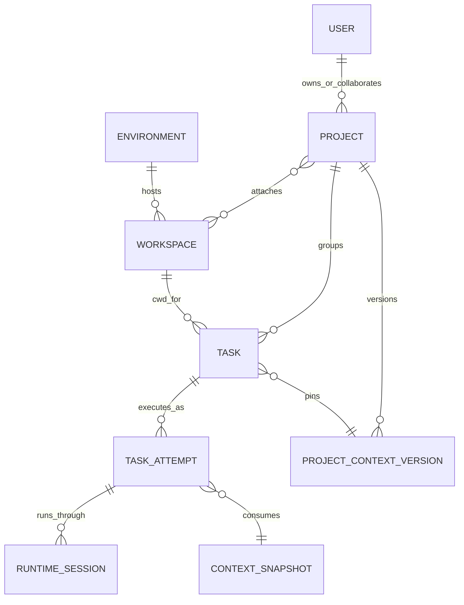

# Project、Task 与 Workspace 领域设计

**Status:** Accepted domain design — 核心定义、关系、Context 首期、人工沉淀、任务关系、权限、移动和归档语义已确认
**Date:** 2026-07-11
**Scope:** Project、Task、Workspace、Environment 的职责、关系、生命周期、上下文层级与页面信息架构
**Related:** WebUI 外壳与页面原型见 [`2026-07-11-openscience-console-design.md`](2026-07-11-openscience-console-design.md)
**Supersedes:** 本文取代已归档的 [`Task Retry`](archived/2026-06-02-task-retry-design.md)、[`Task Retry E2E`](archived/2026-06-03-task-retry-e2e-design.md)、[`Session Chain`](archived/2026-05-17-ainrf-session-chain-design.md) 和 [`旧权限规范`](archived/2026-06-15-permission-and-visibility-management.md) 中与当前 Task/Attempt、角色、归档和 Workspace 关系冲突的契约

## 1. 已确认的核心定义

### 1.1 Project

Project 是多个 Task 的组织视图和共享研究上下文边界。

首期职责：

- 将属于同一研究目标的 Task 聚合在一起；
- 提供任务列表、关系图、近期活动和默认执行选择；
- 作为协作者权限和可见性的主要边界；
- 关联完成该研究所需的 Workspace。

未来职责：

- 保存多个 Task 可共享的 memory、目标、约束、决策和参考资料；
- 为新 Task 或 Task 的新执行回合提供可追踪的 Project context；
- 接收从 Task 结果中显式沉淀的研究结论。

Project 不是文件目录，也不是 agent 进程或单次对话。

### 1.2 Task

Task 是用户可见的、持久化的 coding agent 工作会话。

- 一个 Task 对应一个明确目标、对话历史和 agent session 身份；
- Task 必须属于一个 Project；
- Task 必须绑定一个 Workspace，作为允许执行的文件系统根和初始 cwd；
- Task 的暂停、恢复、失败和重试不应改变其用户可见身份；
- 运行时重新启动、引擎重连或重试属于 Task 下的 Attempt，不应因为引擎能力差异暴露成不同产品语义。

Task 不是一次性的后台 job。一个 Task 可以包含多个有序 Attempt，但它们共享同一用户会话、目标和历史。

### 1.3 Workspace

Workspace 是 OpenScience 注册的文件系统工作根：一个目录，或以 Git 仓库为主要内容的目录。

- Workspace 记录稳定 ID、显示名称、规范路径、所在 Environment、Git 元数据和所有者；
- Workspace 本身不等于 Project，可以被 Project 引用；
- Task 绑定 Workspace 后，以其根目录作为初始 cwd，并被限制在允许的文件边界内；
- Workspace prompt 只描述仓库结构、构建、测试和本地操作约束，不承载 Project 的研究目标或 Task 的具体请求。

删除 Workspace 注册默认不删除磁盘目录或 Git 仓库。文件删除必须是独立、明确且高风险的操作，不属于首期默认能力。

### 1.4 Environment

Environment 是 Workspace 实际存在并可执行 agent 的计算环境，例如本机、容器或远程主机。

按“Workspace 是实际目录”的定义，Workspace 必须具有明确的 Environment 位置。Task 选择 Workspace 后，默认继承其 Environment，避免产生“路径存在于 A 环境、任务却在 B 环境执行”的无效组合。

## 2. 推荐关系模型



已确认基数：

- 一个 Task 在任一时刻属于且只属于一个 Project；
- 一个 Task 绑定且只绑定一个 Workspace；
- 一个 Workspace 位于且只位于一个 Environment；
- 一个 Project 可以关联多个 Workspace；
- 一个 Workspace 可以被多个 Project 关联；
- 一个 Task 可以有多个 Attempt；
- 每个 Task 固定一个 Project Context Version；每个 Attempt 记录实际使用的 ContextSnapshot。

每个用户保留一个不可删除的默认 Project，用于快速创建或迁移期尚未归类的 Task；它不是特殊执行环境，也不拥有特殊文件路径。

数据模型允许 Project 与 Workspace 多对多，但产品默认路径引导一对一使用：

- 每个 Project 选择一个 Primary Workspace；
- 新建 Project 时优先创建或关联一个尚未被其他 Project 使用的 Workspace；
- 一个 Workspace 已关联其他 Project 时，新增关联是显式的高级操作，需要说明文件变化会被多个 Project 共同看到；
- Project 可以按需关联额外 Workspace，但 Task 每次仍只绑定其中一个；
- 多对多是必要扩展能力，不应成为新用户创建流程的默认复杂度。

Primary Workspace 是 Project 级推荐值，不是共享授权。若当前用户不是该 Workspace owner，界面可以展示它但不能自动用于执行；Project editor 必须选择或关联自己拥有的 Workspace。

## 3. 三层 Context

上下文必须按职责分层，不能继续将所有说明拼成一段不可追踪的 prompt。

### 3.1 Project Context：为什么做

包含：

- 研究目标和范围；
- 已确认决策；
- 跨 Task 可复用的事实与结论；
- 术语、限制和评价标准；
- 关联参考资料。

Project Context 必须版本化。Task 固定版本，Attempt 记录实际使用的 ContextSnapshot；更新 Context 不修改已经发生的历史对话。

这里的版本记录用于解释一次 Task/Attempt 在什么约束和共享信息下运行，不承诺 agent 对话逐 token 可复现。OpenScience 对“可复现”的核心要求是：输入数据、代码版本、配置、产物和运行步骤可追踪、可重新执行；Context 版本则提供必要的审计与解释能力。

### 3.2 Workspace Context：在哪里、如何做

包含：

- 目录和仓库说明；
- 构建、测试、运行入口；
- AGENTS.md 等局部工程约束；
- Git 状态、默认分支和文件边界；
- Environment 与 cwd 信息。

Workspace Context 与实际文件状态相关，不应被复制成 Project memory。

### 3.3 Task Context：这次具体做什么

包含：

- 用户提示和后续消息；
- Task 自己的历史与工具结果；
- 当前 Attempt 状态；
- 创建时绑定的 Project、Workspace、agent profile 和配置快照。

启动 Attempt 时的上下文顺序为：平台安全与权限约束 → Project Context → Workspace Context → Task 对话与当前请求。

## 4. Project Memory 的演进原则

Project memory 首期不自动吸收所有 Task 输出。自动写入会快速积累错误、重复和临时信息。

推荐流程：

```text
Task 产生结果
  → 提取候选结论
  → 用户确认或规则化审核
  → 写入新的 Project Context 版本
  → 新建 Task 自动固定新版本；已有 Task 由用户手动同步后才使用新版本
```

未来可提供自动摘要和候选 memory，但必须保留来源 Task、消息范围、生成模型、时间和审核状态。删除或编辑 memory 不回写 Task 历史。

### 4.1 首期 Project Brief

首期不实现复杂 memory 检索或自动知识库，只实现一个简单、可编辑、版本化的 Project Brief：

- Objective：研究目标；
- Scope：范围与非目标；
- Constraints：约束和必须遵守的决策；
- Shared Instructions：所有 Task 共用的工作方式；
- References：少量明确参考链接或文档标识。

Brief 保存为不可变版本。用户编辑的是 Draft，发布后生成新的 Active Version；旧版本继续可查，不能被原地覆盖。

### 4.2 解耦的 Context 构建

即使首期只有 Project Brief，也不能把它直接拼接进 Task prompt。Context 构建通过独立契约完成：

```text
ContextSource
  → 产生带来源、类型、版本和优先级的 ContextFragment
  → ContextAssembler 按确定顺序和预算组合
  → 生成 ContextSnapshot
  → Task 固定 Project Context Version，Attempt 引用本次运行的 snapshot ID
```

首期 Project Context 只有 `ProjectBriefSource`。未来可以增加 `AcceptedMemorySource`、`ProjectReferenceSource` 或检索来源，而不修改 Task 创建、引擎或对话存储模型。

每个 ContextFragment 至少记录：

- source kind 与 source ID；
- source version；
- 内容指纹；
- 创建时间和作者；
- 注入顺序与截断状态。

Task 创建时固定当前 Active Project Context Version。Task 后续 conversation 和 Attempt 默认继续使用该版本；Project 发布新版本不会静默改变已有 Task。用户可以显式执行“更新 Task Context”，查看版本差异并让之后的 conversation 与 Attempt 使用新版本。若用户希望天然继承最新 Project Context，也可以创建一个新 Task。移动 Project 时必须显式选择目标 Project 的某个 Active Version，未确认前不得启动新的 Attempt。

### 4.3 人工确认沉淀

首期只允许人工确认写入 Project Context：

- 用户可以从 Task 消息或结果中选择内容，创建 Context Candidate；
- Candidate 必须保留来源 Task、消息/输出范围和提出者；
- Candidate 状态为 `proposed`、`accepted` 或 `rejected`；
- 只有 Project owner/editor 可以接受；
- 接受 Candidate 不直接修改 Active Version，而是写入 Draft，由用户审阅并发布新版本；
- 拒绝 Candidate 保留审计记录，但不进入 Context。

系统不得在后台自动接受或静默写入 memory。未来即使增加 LLM 提取，也只能产生 `proposed` Candidate。

## 5. Task、Session 与 Attempt

为避免与管理员侧运行会话混淆，产品术语保持：

- **Task**：研究者看到的 agent 工作会话；
- **Attempt**：Task 的一次运行或恢复尝试；
- **Runtime Session**：引擎、tmux、SDK 或容器层的技术会话，仅在管理和排障界面出现。

Retry 的统一语义是“在同一 Task 下创建或恢复 Attempt”。底层引擎可以恢复原 session，也可以启动新的 runtime session，但不能因此把用户的 Task 拆成另一个无关 Task。若需要从旧 Task 派生新目标，应使用“Fork Task”，并记录来源关系。

### 5.1 唯一权威模型

系统只保留一套用户任务权威模型：

```text
Task（用户会话、目标、Project、Workspace、固定 Context Version）
  └─ TaskAttempt（一次运行、恢复或重试）
       └─ RuntimeSession（引擎、tmux、SDK 或容器技术会话）
```

- AgenticResearcher 的 `tasks` 是 Task 的唯一权威记录；
- 在同一领域数据库中建立正式的 `agent_task_attempts`，作为 Attempt 的唯一权威记录；
- Runtime Session 保存引擎 session ID、tmux/container 标识、开始/结束时间和诊断状态，可按一次 Attempt 关联一个或多个底层 session；
- 管理侧 Sessions 页面只是 TaskAttempt/RuntimeSession 的查询投影，不再创建独立的用户 Session；
- 现有 `sessions.sqlite3` 中的 `task_sessions` / `task_attempts` 视为旧管理模型：可唯一映射到现有 Task 的记录迁入新 Attempt/RuntimeSession；无法可靠映射的记录作为只读 legacy audit 保留，迁移完成后停止双写并退役旧服务；
- API、成本统计、Retry、Timeline 和审计都从同一 Task/Attempt 权威模型读取，禁止通过引擎差异维护第二套任务生命周期。

TaskAttempt 至少固定 `task_id`、顺序号、触发原因、状态、ContextSnapshot、运行配置指纹、代码/数据引用、产物清单和 Runtime Session 关联。Task 的 conversation 属于 Task；Attempt 只引用自己消费的消息范围和本次新增输出，避免复制整段对话。

## 6. Project 之间移动 Task

Task 可以移动到另一个 Project，因为 Project 首先是组织与共享上下文边界。但移动必须遵循：

- 不修改 Task 已有对话、Attempt 或历史 context 版本；
- 移动时显式选择目标 Project 的某个 Active Context Version；确认后只影响后续 conversation 与 Attempt；
- UI 明确提示该 Task 的早期历史来自原 Project；
- 若绑定 Workspace 未关联目标 Project，移动操作需要同时关联 Workspace 或要求用户重新选择；
- 移动记录进入审计历史。

移动 Task 时，其 Workspace 不自动改变。若目标 Project 尚未关联该 Workspace，用户必须明确选择：将 Workspace 关联到目标 Project，或为后续 Attempt 选择目标 Project 已关联的其他 Workspace。后者相当于改变执行根，只允许通过 Fork Task 创建新会话，不允许在原 Task 中静默切换 cwd。

Project 页面上的任务关系边必须有类型：

- `derived_from`：由 Fork Task 自动创建，记录来源；
- `depends_on`：用户明确设置，表示理解或工作顺序上的依赖；
- `related_to`：用户设置的一般关联，不表达执行顺序。

首期 `depends_on` 只用于表达和筛选，不自动调度 Task。自动依赖执行必须在未来另立设计，不能从一条连线推断后台行为。旧无类型边迁移为 `related_to`。

## 7. 生命周期与删除语义

### 7.1 Project

- 只提供 Archive/Unarchive，不提供永久删除；
- 每个用户不可删除的默认 Project 同时禁止 Archive；未来若允许更换默认 Project，必须先原子切换默认值，再处理旧 Project；
- Archive 后不再作为新 Task 的默认选择，但历史 Task、Context 和 Workspace 关联仍可查看；
- 归档不删除 Task、Context、Workspace 关联或任何磁盘文件；
- 归档 Project 中已经运行的 Attempt 可以继续完成；尚未启动的 `queued`、等待中和暂停 Task 立即停止调度并记录 `stopped_by_project_archive` 原因；
- 归档 Project 不允许创建 Task、开始新 Attempt、恢复、重试或继续 conversation。必须先 Unarchive，之后由用户显式恢复或 Retry，系统不能自动重新排队。

### 7.2 Task

- 完成、失败、取消属于状态，不自动删除；
- Archive 从默认列表隐藏，但保留对话、Attempt 和审计记录；
- Archive Task 时，尚未启动的 queued 工作直接停止；运行中的 Attempt 必须先完成取消流程，不能仅隐藏 Task；
- 已归档 Task 不能继续 conversation、恢复或 Retry；用户必须先显式 Unarchive；
- 永久删除是单独的高风险动作，并受保留策略限制。

### 7.3 Workspace

- 删除注册前必须确认没有运行中或排队 Task；
- 默认只解除注册和 Project 关联，不删除目录；
- Git 仓库、未提交文件和产物的处理必须显式展示。

## 8. 页面信息架构

### 8.1 Projects：研究上下文入口

Projects 首页显示项目列表、近期活动、运行中 Task 和需要注意的项目。进入 Project 后使用：

```text
ProjectHeader：名称、目标摘要、活动状态、[新建 Task]

Overview | Tasks | Workspaces | Context | Settings
```

- Overview：目标、近期 Task、重要结论、关联 Workspace 和活动；
- Tasks：列表/关系图切换；现有 React Flow Canvas 成为 Tasks 的一个视图，不再独占整个 Project 页面；
- Workspaces：关联、解除和选择默认 Workspace；
- Context：编辑 Project Brief Draft、查看 Active Version、版本差异、Candidate 和发布历史；
- Settings：名称、说明、默认值、协作者和归档。

Project 创建流程保持简短：

1. 输入名称和可选目标说明；
2. 选择“关联现有 Workspace”“创建 Workspace”或“稍后设置”；
3. 若选择 Workspace，将其设为 Primary Workspace；
4. 创建完成后进入 Project Overview。

Project 可以在没有 Workspace 时存在，但不能创建会执行文件操作的 Task。此时新建 Task 动作先引导用户关联 Workspace。

### 8.2 Tasks：跨 Project 的会话入口

Tasks 页面继续提供所有可见 Task 的全局列表，并支持按 Project、Workspace、状态和更新时间筛选。Task 详情明确显示所属 Project、绑定 Workspace 和运行 Environment。

Task 创建有三个入口，但使用同一表单契约：

- 从 Project 创建：Project 固定，默认选择 Primary Workspace，可改为其他已关联 Workspace；
- 从全局 Tasks 创建：先选择 Project，再从其关联 Workspace 中选择；
- 从 Workspace 创建：Workspace 固定，默认选择其推荐 Project；若 Workspace 未关联 Project，先建立关联。

选择 Workspace 后 Environment 自动确定，表单不再提供一个可以与 Workspace 冲突的独立 Environment 选择器。Environment 只读显示，并在不可用或用户无权限时阻止提交。

### 8.3 Workspaces：文件资源入口

Workspaces 页面是用户可访问文件根的注册表，不按 Project 分割为独立副本。条目显示：

- 名称、路径和所在 Environment；
- Git 仓库、分支和工作区脏状态；
- 关联 Project；
- 运行中/等待 Task；
- 最近使用时间。

Workspace 详情提供文件浏览、关联 Task、关联 Project、终端入口和安全的注册信息修改。文件浏览不再作为一级全局导航。

Workspace 创建/注册流程：

1. 选择有权限的 Environment；
2. 选择或输入该 Environment 上的目录；
3. 验证目录存在性、访问权限和 Git 状态；
4. 设置显示名称与可选 Workspace Context；
5. 可选关联一个 Project，默认将其作为该 Project 的 Primary Workspace。

同一用户在同一 Environment 上不得重复注册相同规范路径。符号链接和相对路径在入口处解析为稳定规范路径，但实际执行仍遵守租户权限边界。

## 9. 权限与共享边界

Project 与 Workspace 的关联不自动授予文件或 Environment 权限。首期支持 Project 协作，但不实现 Workspace 共享：Workspace 只有 owner 可以用于创建和运行自己的 Task；Project 协作者如需执行，应关联自己拥有且有权使用的 Workspace。

用户创建或运行 Task 必须同时满足：

- 可以查看并使用目标 Project；
- 可以查看并使用目标 Workspace；
- 可以在 Workspace 所属 Environment 中启动 Task；
- 对 Workspace 目录具有该 Task 所需的文件权限。

Project 协作者如果没有 Workspace/Environment 权限，只能查看被授权的 Project 元数据和历史内容，不能借由 Project 关联绕过 Linux 用户隔离或环境访问控制。UI 必须区分“已关联但无执行权限”和“可用于新 Task”。

Project Context 权限分级：viewer 可查看 Active Version 和历史；editor/owner 可编辑 Draft、接受或拒绝 Candidate；只有 owner 或明确拥有发布权限的 editor 可以发布新 Active Version。

### 9.1 权限能力表

| 操作 | Project viewer | Project editor | Project owner | Task owner | Workspace owner | Admin |
| --- | --- | --- | --- | --- | --- | --- |
| 查看 Project、Active Context、历史版本 | 是 | 是 | 是 | 按 Project 角色 | 不因 Workspace 自动获得 | 是 |
| 查看 Project 内 Task 元数据、对话、持久输出和产物索引 | 是，敏感凭据始终脱敏 | 是，敏感凭据始终脱敏 | 是，敏感凭据始终脱敏 | 是 | 不因 Workspace 自动获得 | 是 |
| 创建 Task | 否 | 是，但只能选择自己拥有的 Workspace | 是，但只能选择自己拥有的 Workspace | 不单独授权 | 必须同时具备 Project editor/owner | 是，仍需遵守租户执行边界 |
| 向已有 Task 继续 conversation、取消、暂停、恢复、Retry、Archive | 否 | 仅自己拥有的 Task | 仅自己拥有的 Task | 是 | 不因 Workspace 自动获得 | 是 |
| Fork Task | 否 | 是，在自己可执行的 Workspace 中创建新 Task | 是，在自己可执行的 Workspace 中创建新 Task | 是，但仍需目标 Project/Workspace 权限 | 不单独授权 | 是 |
| 编辑 Project 基本信息、Task 关系 | 否 | 是 | 是 | 否 | 否 | 是 |
| 编辑 Draft、接受/拒绝 Candidate | 否 | 是 | 是 | 可提出 Candidate | 否 | 是 |
| 发布 Active Context | 否 | 仅具有显式 publish 能力时 | 是 | 否 | 否 | 是 |
| 管理 Project 成员、角色、Archive/Unarchive | 否 | 否 | 是 | 否 | 否 | 是 |
| 注册、修改或注销 Workspace | 否 | 否 | 否 | 否 | 是 | 是 |
| 将 Workspace attach/detach 到 Project | 否 | 需要同时是该 Workspace owner | 需要同时是该 Workspace owner | 否 | 还需 Project editor/owner | 是 |
| 设置 Primary Workspace | 否 | 需要同时是该 Workspace owner | 需要同时是该 Workspace owner | 否 | 还需 Project editor/owner | 是 |
| 在 Environment 中执行 | 否 | 不因 Project 角色自动获得 | 不因 Project 角色自动获得 | 需要 Task/Workspace/Environment 联合授权 | 还需 Environment 与 Linux 文件权限 | 是，但不得绕过租户隔离 |

Task 的 Project 可见内容不包含 API key、环境变量秘密值、认证材料或未脱敏的系统诊断。Project 角色赋予的是产品数据可见性，不等于 Linux 用户、Workspace 或 Environment 的执行授权。

### 9.2 Project–Workspace 关联不变量

关联表必须把原子性和幂等性作为数据库契约：

- `(project_id, workspace_id)` 唯一，重复 attach 返回现有关联；
- 每个 Project 最多一个 Primary Workspace，并且 Primary 必须是有效关联；数据库使用以 `project_id` 为范围的条件唯一约束保证单一 Primary；
- attach、detach、设置 Primary 均接受幂等请求键，同一用户和同一操作范围内重复提交返回首次结果；
- 切换 Primary 在一个事务内完成：验证权限和目标关联 → 清除旧 Primary → 设置新 Primary → 写审计记录；任何一步失败都不得留下零个意外 Primary 或两个 Primary；
- detach Primary 时必须在同一请求中指定替代 Primary，或明确将 Project 变为无 Primary 状态；
- 被现有 Task 引用的 Workspace 关联不得硬删除，只能停止作为新 Task 选择并保留历史关联；
- Archive Project 保留全部关联和 Primary 标记，但这些 Workspace 不再用于创建或启动新 Task；
- Workspace 注销只解除注册与可选关联，不修改历史 Task 的 Workspace ID、路径快照或产物记录；
- 所有关系变化记录操作者、时间、幂等键、旧值和新值。

Project Archive/Unarchive 同样使用幂等请求和单事务更新。Archive 事务必须同时写入 Project 状态、停止尚未启动的 Task 调度、记录停止原因和审计事件；如果事务失败，Project 与 queued Task 状态必须一起回滚，不能出现 Project 已归档但旧队列仍会启动的状态。

## 10. 与当前实现的差异

当前实现已经具备 Task 必填 `project_id`、`workspace_id`、`environment_id`，Project 默认 Workspace/Environment、Task 移动和项目任务关系图。

需要调整的主要差异：

1. Workspace 当前直接拥有单个 `project_id`，需要迁移为独立资源加 Project-Workspace 关联；
2. Workspace 当前没有稳定 `environment_id`，Task 可以组合出无效位置；
3. Project 当前同时保存 default Workspace 和 default Environment；新模型只保留 Primary Workspace，Environment 从它派生；
4. Retry 在部分引擎上会创建新 Task，需要统一为同一 Task 下的 Attempt；
5. Project Canvas 当前占据整个页面，需要降为 Project 的 Tasks 子视图；
6. Workspace 和 Project 删除目前缺少完整的关联与文件保留语义；
7. 管理侧 `task_sessions` / `task_attempts` 与 AgenticResearcher `tasks` 重叠，需要迁移为唯一 Task/Attempt/RuntimeSession 模型。

### 10.1 数据迁移

迁移采用版本化、可重跑步骤：

1. 为 Workspace 补充 `environment_id`；根据现有 Task、默认 Environment 和路径探测生成候选，无法唯一确定的 Workspace 标记为 `attention_needed`；
2. 新建 Project-Workspace 关联表，将现有 `workspace.project_id` 转成 Primary 关联；
3. Project 的 `default_workspace_id` 转成 Primary link，`default_environment_id` 仅用于迁移校验后退役；
4. Task 保留现有 Project/Workspace，Environment 与 Workspace 不一致的记录进入可见修复队列，不能静默改写历史；
5. API 兼容期仍返回旧字段，但写入只经过新关联服务；调用方迁移完成后删除旧字段。
6. 在 AgenticResearcher 领域数据库建立 `agent_task_attempts` 与 Runtime Session 关联；迁移可可靠映射的旧 Session/Attempt，未映射记录进入只读 legacy audit；停止旧 SessionService 双写。
7. 旧 Retry 形成的 Task 链保持历史 Task 不变，并将可识别的 retry edge 迁为审计来源；迁移后新的 Retry 只在同一 Task 下创建 Attempt。
8. 为 `project_collaborators` 补充 `viewer` / `editor` 角色和可选 publish 能力；旧无角色 collaborator 默认迁为 `viewer`，避免迁移后静默获得写权限。

迁移必须是普通 schema/service 版本演进，不把一次性判断永久留在 Task 创建或运行热路径。

## 11. 统一领域写入契约

### 11.1 标准 Task 创建

所有入口——全局 Tasks、Project、Workspace、Literature 或未来 Command Palette——都调用同一个 Task application service。正式 API 接受：

```text
POST /api/tasks

project_id
workspace_id
title
prompt 或 task_preset + source payload
agent/runtime 配置
idempotency_key
```

新契约不接受独立 `environment_id`。服务在一个事务中：

1. 验证 Project 活跃且用户至少为 editor；
2. 验证 Workspace 已关联 Project、属于当前用户且 Environment/文件权限有效；
3. 从 Workspace 派生 Environment；
4. 固定 Project 当前 Active Context Version；
5. 创建 Task、初始 queued Attempt、幂等请求记录和待调度工作；
6. 提交后再通知执行层。

同一用户和 `idempotency_key` 的重复请求返回同一个 Task。通知执行层失败不回滚已经创建的 Task/Attempt，而由持久待调度记录恢复；不得因为客户端重试创建第二个 Task。

### 11.2 Retry、Context 更新与归档

- `POST /api/tasks/{task_id}/retry` 创建或复用同一 Task 下的 Attempt，接受幂等键，不返回 `new_task`；
- `POST /api/tasks/{task_id}/context` 显式更新 Task 固定的 Context Version，返回版本差异和只影响后续 conversation/Attempt 的确认结果；
- `POST /api/projects/{project_id}/archive` 与 `/unarchive` 使用明确动作端点和幂等键，不再用永久删除语义表达归档；
- `POST`/`DELETE` Project–Workspace 关联和 Primary 切换均通过统一关联服务执行，不允许路由分别修改 Project 默认字段和 Workspace 字段。

## 12. Project Context API 边界

首期提供统一的 Project Context 接口组：

- 查询 Active Version 与当前 Draft；
- 保存 Draft；
- 发布 Draft 为新版本；
- 查询版本历史与差异所需数据；
- 从 Task 内容创建 Candidate；
- 接受或拒绝 Candidate；
- 为 Task 显式更新固定的 Project Context Version。

发布、接受 Candidate 和同步 Task 都必须使用幂等请求记录。ContextAssembler 是后端领域服务，前端不能自行拼接 Brief、Workspace prompt 和 Task prompt。

## 13. Context 验收

- 相同来源版本和构建配置可重复生成内容指纹一致的 ContextSnapshot；
- 已运行 Attempt 能证明自己使用了哪个 Project Context Version 和各来源版本；
- 更新 Project Brief 不改变既有 Task 历史或已完成 Attempt；
- 未确认 Candidate 永远不会进入 Active Context；
- Workspace Context 与 Project Context 分开保存和展示；
- Task 更新 Context 前可以看到版本差异，并且更新只影响后续 conversation 与 Attempt；
- 验收不要求 agent 对话逐 token 重现，但必须能追踪并重新运行代码、数据、配置、步骤和产物链。
