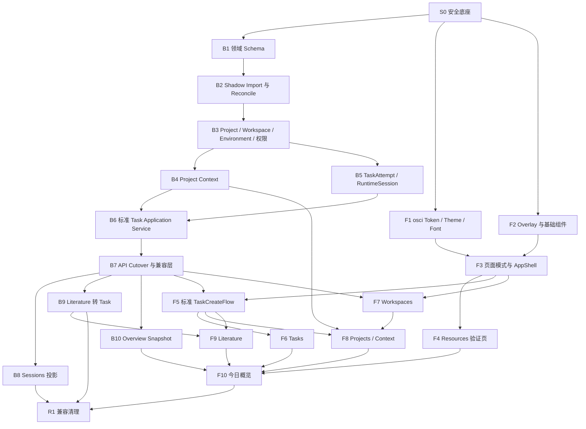

# OpenScience 领域与 Console 重构执行规范

**Status:** Accepted execution specification
**Date:** 2026-07-12
**Scope:** Project、Workspace、Task、Attempt、Runtime Session、Project Context、权限、Literature 转 Task、`osci` 设计系统、Console 页面迁移、数据迁移、验证、发布与旧模型退役
**Domain contract:** [`2026-07-11-project-task-workspace-domain-design.md`](2026-07-11-project-task-workspace-domain-design.md)
**Console contract:** [`2026-07-11-openscience-console-design.md`](2026-07-11-openscience-console-design.md)
**Design system contract:** [`2026-07-11-osci-design-system-design.md`](2026-07-11-osci-design-system-design.md)
**Literature contract:** [`2026-07-11-literature-tracking-service-redesign-design.md`](2026-07-11-literature-tracking-service-redesign-design.md)
**CI contract:** [`2026-07-11-five-layer-hybrid-ci-design.md`](2026-07-11-five-layer-hybrid-ci-design.md)

## 1. 目的

本文将已经接受的产品和领域设计转化为一套可分批执行、可验证、可回滚的工程规范。它回答：

- 从当前实现开始，第一项工作是什么；
- 数据、后端、前端和发布各阶段如何排序；
- 哪些工作可以并行，哪些必须等待前置阶段；
- 每个阶段完成到什么程度才允许进入下一阶段；
- 如何迁移真实数据而不形成长期双写或两个权威来源；
- 如何保持旧前端、旧 API 和旧状态在兼容窗口内可用；
- 如何验证权限、原子性、幂等、恢复和多租户文件权限；
- 在什么条件下才能删除旧 JSON、旧 SessionService 和旧字段。

本文是长期执行契约，不替代每个工作批次的具体 implementation plan。实施计划仍放在 `docs/superpowers/plans/`，不提交；本文作为所有批次共同引用的范围和顺序依据，应提交并持续维护。

## 2. 当前基线与首要约束

### 2.1 当前权威状态分散

当前主要状态位于不同文件：

| 领域 | 当前权威位置 | 主要问题 |
| --- | --- | --- |
| Project | `runtime/projects.json` | 无数据库约束，不能与 Task 原子更新 |
| Task Edge | `runtime/task_edges.json` | 无类型关系仍存在历史兼容问题 |
| Workspace | `runtime/workspaces.json` | 单 `project_id`、无稳定 `environment_id` |
| Environment | 运行进程内 `InMemoryEnvironmentService`，仅 detection 持久化 | 非 seed Environment 无稳定重启恢复，Workspace 无法可靠绑定位置 |
| Task | `runtime/agentic_researcher.sqlite3` | 仍保存独立 `environment_id`，没有正式 Attempt |
| Session / Attempt | `runtime/sessions.sqlite3` | 与 Task 形成第二套用户会话模型 |
| Project collaborator | `runtime/auth.sqlite3` | role 存在，但多数权限只判断是否为 collaborator |
| Literature | `runtime/literature.sqlite3` | 独立领域数据库，转 Task 必须使用可恢复 saga |

新领域契约要求 Project Archive、停止未运行 Task、写审计记录在一个事务中完成，也要求 Task 创建同时固定 Context、创建 Attempt、记录幂等请求和调度工作。当前跨 JSON/SQLite 的结构无法满足这些原子性要求。

### 2.2 推荐权威数据库

本轮不重命名数据库文件。扩展现有 `agentic_researcher.sqlite3`，使其成为 Project / Workspace / Environment Registry / Task / Attempt / Context 控制面的唯一领域数据库。

这样做的原因：

- Task 已经在该数据库中，避免先迁移全部 Task 到一个新文件；
- Project Archive 与 queued Attempt 可以使用同一 SQLite 事务；
- Workspace 可以绑定可重启恢复的稳定 Environment ID，而不是依赖进程内对象；
- Task 创建可以原子写入 Task、Attempt、Context pin、幂等记录和 dispatch outbox；
- 文件名仍是兼容内部名称，不影响 OpenScience 对外品牌；
- 将来如需重命名数据库，应另立迁移，不与本轮领域重构叠加。

`auth.sqlite3` 继续保存用户身份和 Environment grant；`literature.sqlite3` 继续保存文献领域权威数据。跨数据库操作不得假设原子事务，必须使用持久幂等工作和可恢复协调流程。

### 2.3 当前备份缺口

BackupService 当前备份 `projects.json` 和 `task_edges.json`，但遗漏 `workspaces.json`。任何真实迁移前必须先修复完整备份、校验和恢复演练。没有通过 restore round-trip，不得进入 v2 数据切换。

### 2.4 当前前端基础

前端已经存在 `frontend/src/design-system/`，但仍有以下分裂：

- 运行时主要消费旧 Prism token；
- token CSS 存在多个来源；
- Modal、Drawer、Toast、菜单和部分 overlay 行为仍是各页面自维护；
- App Shell 仍是较大的单体组件，并持续轮询完整 Task 列表；
- Task 创建仍独立提交 `environment_id`；
- Workspace 类型仍是单一 `project_id`；
- Literature 的转换对话框仍建立在旧 Task 创建契约上；
- 今日概览尚未具备持久化快照后端。

因此前端不能直接从页面视觉重做开始，必须先建立 token、基础组件和统一 Task 创建流程。

## 3. 执行原则

### 3.1 安全优先于页面

第一批工作必须解决备份、恢复、迁移和统一权威存储。任何页面重做都不能成为领域迁移的前置条件。

### 3.2 Expand → Import → Reconcile → Cut over → Contract

采用以下迁移节奏：

1. **Expand**：只增加新表、列、索引和兼容接口；
2. **Import**：从旧状态导入新模型，不改变用户写入路径；
3. **Reconcile**：生成差异报告，处理 `attention_needed`；
4. **Cut over**：短暂停写，最终增量导入，一次切换唯一写入源；
5. **Contract**：经过兼容窗口后删除旧写入、字段和表。

### 3.3 不长期双写

不得让 JSON、旧 SessionService 和新领域数据库长期同时接收用户写入。双写会重新制造两个权威来源，并使恢复和故障判断失去可信依据。

允许短期存在：

- 旧模型继续权威写入；
- 新模型做 shadow import 和只读核对；
- 切换后旧文件只读保留。

不允许：

- 同一业务请求同时独立写 JSON 和 SQLite；
- 新旧服务分别决定 Task 状态；
- 失败时静默选择其中一个结果。

### 3.4 旧客户端先兼容，前端后切换

后端 v2 必须先兼容当前前端。发布时先上线后端并使用旧前端验证，再切换新前端。首次 v2 发布不得同时删除旧 HTTP 字段或兼容路由。

### 3.5 每批次单一职责

每个分支、commit 和 PR 只处理一个清楚的工作批次。不得在同一提交中同时完成数据库迁移、全局 UI Shell 和多个页面重写。

### 3.6 不引入 Workspace 锁

本轮明确不实现 Workspace single-writer lease。实现不得顺手加入 Workspace 调度锁、强制接管或 Git worktree 自动隔离。并发写风险作为已知限制保留，未来另立专项设计。

## 4. 总体阶段和并行关系



允许从 S0 完成后同时启动：

- 后端 B1/B2 数据线；
- 前端 F1 token/theme/font；
- 前端 F2 overlay primitives。

三个关键合流点：

1. F1 + F2 合流后才能实施 AppShell；
2. B7 + F3 合流后才能实施标准 TaskCreateFlow；
3. B10 与各领域页面稳定后才能实施并切换今日概览。

## 5. 临时运行模式与能力声明

### 5.1 单一模式开关

使用一个临时后端枚举，不使用多个散落布尔值：

```text
OPENSCIENCE_DOMAIN_MODEL_MODE=legacy|validate|v2
```

| 模式 | 行为 |
| --- | --- |
| `legacy` | 旧 Project/Workspace/Session 服务继续权威运行；新 schema 可以存在但不接收用户领域写入 |
| `validate` | 允许 shadow import、dry-run、差异报告和只读比较；用户写入仍只走旧模型 |
| `v2` | 新领域数据库成为唯一权威；旧 HTTP 路由只作为兼容 adapter |

该开关是迁移工具，不是永久产品配置。旧模型退役后删除 `legacy/validate` 分支，避免一次性迁移判断长期留在热路径。

环境变量不能单独决定权威模式。领域数据库增加单调递增的 `domain_cutover_state`：

- 保存 contract version、cutover epoch、首次 v2 写入时间和执行者；
- 一旦提交 v2 cutover epoch，不允许通过配置降回 `legacy`；
- legacy/validate binary 连接到已 cutover 数据库时必须 fail closed，不得继续启动领域写服务；
- v2 首次写入前再次验证数据库 cutover state；
- 保存完成导入的 `cutover_run_id`、不可变 source manifest、schema/code version、reconciled_at、blocking issue count 和 `cutover_ready`；
- release controller 必须验证当前 artifact 支持数据库声明的 contract/schema 版本；
- v2 只有在指定 run 完整成功、来源一致、约束就绪且 blocking issue 为 0 时才能启动；
- cutover 后旧 JSON 文件物理改为只读，并由监控检查其 mtime/hash 不再变化；
- 回到 legacy 只能通过停机恢复 cutover 前完整备份，不是修改环境变量。

这道数据库 fuse 防止误启动旧 binary 或错误环境变量后重新写 JSON，造成 split-brain。

### 5.2 后端 Capability

后端提供运行时能力声明，前端不依赖构建期 Vite flag：

```json
{
  "domain_contract_version": 2,
  "standard_task_create": true,
  "project_context": true,
  "workspace_links": true,
  "task_attempts": true,
  "literature_research_task": true,
  "overview_snapshot": true
}
```

旧前端忽略未知字段；新前端在能力不足时保持旧入口或明确显示不可用，不猜测后端版本。每个 capability 根据当前 mode、schema readiness、cutover fuse 和对应服务真实状态逐项计算，不能仅因为 contract version 为 2 就全部返回 true。

## 6. S0：安全底座

### 6.1 范围

S0 是唯一允许在领域 schema 之前执行的代码阶段，不改变用户领域行为。

实施内容：

1. 把 `workspaces.json` 和所有当前领域状态加入备份清单；
2. 备份 manifest 保存大小、SHA-256、schema/version 和来源相对路径；
3. restore 时重新计算 SHA-256，拒绝损坏或缺失成员；
4. 增加 scratch state root 的完整 backup → restore round-trip；
5. 增加领域停写/维护模式：禁止新建、Retry、继续 conversation、移动、归档等写操作；
6. 建立 migration CLI：`dry-run`、`apply`、`reconcile`；
7. 建立最小隔离 L2 migration cell，使用独立临时卷、端口和状态目录；
8. 建立旧状态 fixture，覆盖正常数据、空文件、缺字段、重复路径、owner 异常和 Session 无法映射。

维护模式必须是持久化 write barrier，而不只是 HTTP 判断：

1. 原子增加 maintenance epoch；
2. 新 API mutation 在进入 application service 前后都检查 epoch；
3. dispatcher、Literature worker/planner、Overview planner、terminal/session reconciler 和管理脚本停止领取会产生领域写入的新工作；
4. 等待 in-flight mutation 计数归零；
5. 首次 cutover 要求 `starting/running/pausing/cancelling` Attempt、pending runtime launch 和 unflushed task output 全部为 0；
6. 验证来源数据库和 JSON 的 generation/mtime 在稳定窗口内不再变化；
7. 任一条件不满足则 abort，不进入备份和最终导入。

恢复不直接逐文件覆盖当前 state root。先恢复到新的 state root/volume，完成 checksum、SQLite `integrity_check`、`foreign_key_check`、schema 和 reconciliation 验证，再原子切换目录/volume；原 state 保留到验收完成。

备份 manifest 必须明确 `includes_workspaces` 和 `includes_tenants`。控制面迁移默认不覆盖用户 Workspace 文件；首次 cutover 因 active Attempt 为 0，不应修改这些文件。若 v2 开放执行后再恢复控制面备份，必须生成可能的 orphan artifact/Git change 报告；恢复 Workspace/tenant 文件是另一个显式高风险选项，不能被数据库恢复静默覆盖。

### 6.2 非目标

- 不创建 v2 用户数据；
- 不修改 Project/Workspace API；
- 不切换前端；
- 不运行或操作生产容器；
- 不把共享 staging 当作 L2 证据。

### 6.3 退出条件

- L1 完整通过；
- backup/restore round-trip 后所有文件校验和一致；
- Project、Workspace、Task、Session、Literature 计数和引用检查通过；
- dry-run 对源数据零写入；
- 维护模式有 API 和并发测试；
- maintenance epoch 跨进程/重启生效，所有状态写入者能被 drain；
- staged restore 完成 integrity/foreign-key/reconciliation 后才能切换；
- L2 migration cell 可以从空状态启动、执行、销毁且不接触共享 Docker 资源。

## 7. B1：扩展统一领域 Schema

### 7.1 表和字段

在 `agentic_researcher.sqlite3` 中以 additive migration 新增或扩展：

| 领域 | 推荐表/字段 |
| --- | --- |
| Project | `projects`：owner、status、is_default、archive metadata |
| Environment | `environments`：稳定 ID、连接配置、状态、seed 标识、创建/更新时间；秘密只保存引用，不进入普通响应 |
| Workspace | `workspaces`：owner、environment_id、canonical_path、status、context metadata、只读兼容用 legacy_project_id |
| 关联 | `project_workspace_links`：is_primary、状态、操作者、时间 |
| Project 成员 | `project_members`：viewer/editor、can_publish；Project owner 由 Project 表唯一决定 |
| Task 关系 | typed `task_relationships`：derived_from/depends_on/related_to |
| Context | drafts、versions、candidates、fragments、snapshots |
| Attempt | `agent_task_attempts` |
| Runtime | `agent_runtime_sessions` |
| 幂等 | `domain_idempotency_requests` |
| 调度 | `task_dispatch_outbox` |
| 审计 | `domain_audit_events` |
| 迁移/切换 | `domain_migration_runs`、`domain_migration_issues`、`legacy_domain_records`、`domain_cutover_state` |

现有 `tasks` 扩展：

- `project_context_version_id`；
- `archived_at`；
- `archive_reason`；
- `stop_reason`；
- 可选最新 Attempt 查询投影字段；
- 运行配置和来源指纹需要的稳定字段。

`tasks.environment_id` 首次迁移仍保留，作为历史执行位置快照和兼容返回；新创建流程不再接受它作为独立权威输入。

同一阶段对 `auth.sqlite3.environment_access` 做 additive migration，补充 grant version、active/revoked 状态和更新时间，使 Task 创建与 dispatcher 可以证明自己验证了哪个授权版本。旧 `project_collaborators` 只作为 importer 来源，v2 Project member 写入迁到领域数据库。

### 7.2 数据库约束

必须落到数据库，而不是仅靠 UI：

- `(project_id, workspace_id)` 唯一；
- 每 Project 最多一个 active Primary 的条件唯一索引；
- Primary link 必须同时是 active link；
- `(owner_user_id, environment_id, canonical_path)` 唯一；
- `(task_id, attempt_seq)` 唯一；
- 每个用户最多一个 active default Project；
- idempotency scope 与 key 唯一；
- 每个 Attempt 最多一个未取消的 dispatch intent；
- 不允许未知 Project role；
- Task relationship 类型只能是 accepted enum；
- immutable Context Version 不允许原地更新正文。

`projects.owner_user_id` 是 Project owner 的唯一权威来源；`project_members` 不重复保存 owner role。所有权转移使用独立事务，验证目标用户、更新 owner、调整成员投影并写审计；default Project 首期不允许转移。

所有新关系表直接使用 FK 与 `ON DELETE RESTRICT`：link → Project/Workspace、Attempt → Task/Snapshot、RuntimeSession → Attempt、outbox → Attempt/Task、Task relationship → Task。现有 `tasks` 表无法通过简单 `ALTER TABLE` 增加完整 SQLite FK，因此采用分阶段约束：

1. legacy/validate 阶段由 importer 和 reconciliation 检查现有引用；
2. final cutover 在停写状态下重建 `tasks` 表或安装等价 guard trigger；
3. `domain_cutover_state.constraints_ready=true` 前禁止 v2；
4. 所有删除保持 RESTRICT/软归档，不通过 cascade 抹掉历史。

### 7.3 退出条件

- fresh DB 建库通过；
- 所有历史 schema fixture 可升级；
- migration 重跑零副作用；
- 单一 Primary 并发竞争只能成功一个；
- 相同 idempotency key 并发写入只产生一条记录；
- 旧代码在 `legacy` 模式下忽略新增结构并继续通过 L1；
- 新表 FK/RESTRICT 测试通过，并有 cutover 时重建现有 Task 约束的 fixture。

## 8. B2：Shadow Import 与 Reconciliation

### 8.1 Importer 边界

外部 JSON 导入不能伪装成普通 SQLite DDL migration。DDL migration 无法可靠访问 `state_root`、文件哈希和重跑 checkpoint。

建立应用级 importer：

```text
读取旧文件与数据库
  → 计算来源哈希
  → 创建 migration run
  → 分批导入/更新
  → 记录 issue
  → 生成 reconciliation report
```

每个 importer run 保存：

- run ID；
- mode 与代码版本；
- 来源文件/数据库哈希；
- 开始、结束和状态；
- imported/skipped/attention_needed 数量；
- 每类问题和受影响 ID；
- 是否允许进入 cutover。

来源一致性规则：

- SQLite 来源使用 `sqlite3.Connection.backup()` 或稳定只读 snapshot，不能只哈希主 `.sqlite3` 文件而遗漏 WAL；
- JSON 在读取前后记录 inode/mtime/size/hash，发生变化则本次 run 标记 stale；
- validate 模式允许报告 stale，但不能标记 cutover ready；
- final cutover 为所有 SQLite snapshot 和 JSON 生成一个不可变 source manifest；
- 分批 importer 中途失败可以保留 checkpoint，但只有完整 run 才能写 `cutover_ready=true`。

### 8.2 迁移规则

#### Project

- 保留旧 Project ID；
- 用户默认 Project 标记为 `is_default`；
- 无 owner、username owner、字面量 `admin` 等历史值必须映射到真实 user ID；
- 无法唯一映射时进入 `attention_needed`，不能自动授予访问权；
- 旧 default Workspace 转成 Primary link；
- 旧 default Environment 只用于校验，随后退役。

#### Workspace

- 保留 Workspace ID；
- 规范化绝对路径；
- 根据现有 Task、Project default、Environment registry 和路径可达性推断 `environment_id`；
- 无法唯一推断时进入 `attention_needed`；
- 旧 `project_id` 转成 active link；
- 同一用户、Environment、canonical path 重复时不静默合并，生成冲突报告。

#### Environment

- 固定 seed Environment `env-localhost`；
- 将切换时仍存在的非 seed Environment 注册信息导入持久表；
- 历史 Task 引用但无法找到注册信息的 Environment 建立 disabled legacy placeholder，并进入 `attention_needed`；
- identity file、credential profile 等保存稳定引用，不把秘密值复制到普通领域表或 reconciliation 报告；
- Environment ID 一经被 Workspace/Task 引用不得复用给另一台主机；
- detection snapshot 仍是观察数据，不替代 Environment registry。

#### Project member

- 旧 owner 迁入 `projects.owner_user_id`；
- 旧 `member` 和未知 collaborator role 默认降为 viewer；
- editor 必须由显式数据或后续管理员确认产生；
- publish 能力默认 false。

#### Task 与 Context

- 保留 Task ID、Project、Workspace 和历史 Environment；
- 每个 Project 创建空 initial Active Version；
- 旧 Task 固定到专门的 `legacy-empty` Context Version，不反向绑定迁移时最新 Brief；
- Project/Workspace/Environment 不一致的 Task 保留历史并进入修复报告，不静默改写。

#### Session / Attempt

按以下顺序映射：

1. 使用旧 attempt 的 `task_id`；
2. 同一 Task 按时间生成稳定 Attempt sequence；
3. 没有旧 attempt 的已运行 Task，根据 started/completed/status 合成 legacy Attempt；
4. queued Task 生成 queued Attempt；
5. 无法映射的 Session/Attempt 写入 `legacy_domain_records`；
6. 旧 Retry 已产生的新 Task 保持不变，只迁移可识别的来源关系。

### 8.3 Reconciliation 报告

报告至少包括：

- Project、Workspace、Task、Attempt 数量；
- default Project 数量和冲突；
- Primary Workspace 选择；
- Workspace Environment 推断；
- Environment registry 与 legacy placeholder 数量；
- canonical path 冲突；
- owner 映射结果；
- collaborator role 迁移；
- Task Project/Workspace/Environment 不一致；
- Session/Attempt mapped 与 legacy 数量；
- 每个 Task 的 Context pin；
- orphan relationship 和 orphan Task；
- 是否达到 cutover 门禁。

### 8.4 Cutover 硬阻断项

以下 issue 数量必须为 0，migration CLI 才能生成 `cutover_allowed=true`：

- Project/Workspace/Task owner 无法映射；
- default Project 缺失、重复或可归档；
- 同 Project 多个 Primary 或 Primary 不属于 active link；
- Workspace 缺失/无效 Environment 且仍被 active/queued Task 使用；
- Task 引用不存在的 Project 或 Workspace；
- Task 的 Workspace/Environment 明确冲突且仍可能执行；
- orphan queued/running work；
- idempotency key 冲突指向不同业务结果；
- active collaborator role 无法规范化；
- backup manifest 不完整或 restore 未验证；
- importer 来源哈希与停写后最终状态不一致；
- Task 缺少 Context pin 或可解释 Attempt；
- SQLite `integrity_check` 或 `foreign_key_check` 失败；
- schema/code version 与 cutover artifact 不兼容。

允许非零但必须显式列出的非阻断项仅限：

- 无法映射、且不会参与运行的 legacy Session/Attempt；
- 已完成历史 Task 的 legacy Environment placeholder；
- 不影响权限和执行的历史 orphan relationship。

CLI 在 blocking issue 非零、计数不一致、来源文件继续变化或 active writer 未停止时必须自动 abort，不能依靠操作者忽略 warning。

### 8.5 退出条件

- 相同来源哈希重复导入不新增数据；
- 来源变化后只处理增量和冲突；
- 每条旧记录都有 imported、skipped 或 attention_needed 结果；
- 损坏输入快速失败并保留可定位错误；
- validate 模式不改变用户写入路径；
- 对隔离旧状态副本完成导入、重启、再导入和 restore 验证。

## 9. B3：Project、Workspace、Environment、关系与权限

### 9.1 Repository 和 Service

建立清晰分层：

```text
Route
  → Application Service
  → DomainAuthorizationService
  → SQLite Repository
```

所有 Project、Workspace、Environment registry 和关系写入必须经过 application service；路由不得直接分别修改 Project 默认字段、Workspace `project_id` 或 auth collaborator 表。

Environment service 从纯进程内注册表迁为持久 repository。Create/Patch/Delete 必须重启可恢复；删除被 Workspace 或历史 Task 引用的 Environment 时拒绝硬删除，只能禁用并引导修复引用。Environment detection 继续独立保存观察结果，不在读取列表时隐式触发探测。

### 9.2 首期权限

严格实现领域设计中的权限能力表：

- viewer：查看 Project、Context、Task 对话和脱敏持久输出；
- editor：编辑 Project、关系和 Draft；只能用自己拥有的 Workspace 创建自己的 Task；
- owner：由 `projects.owner_user_id` 决定，管理成员、角色、发布、Archive/Unarchive；仍不能代替其他用户执行 Workspace；
- Task owner：admin 之外唯一可以继续 conversation、Retry、取消和 Archive Task 的用户；
- Workspace owner：首期唯一可以注册、修改、注销和执行该 Workspace 的用户；
- admin：可以管理产品数据，但运行 Task 时不能绕过 Linux tenant 权限。

Project 关联不授予 Workspace 或 Environment 权限。

### 9.3 Project–Workspace 原子操作

实现：

- attach；
- detach；
- set Primary；
- replace Primary；
- unregister Workspace；
- Project archive 状态和 default guard repository primitive；完整生命周期编排留到 B6。

每个写操作接受 idempotency key 并写审计。切换 Primary 必须在单事务完成权限校验、清旧值、设新值和审计。

### 9.4 退出条件

- 权限表每一行都有 API 测试；
- viewer 无法创建 Task、attach Workspace、编辑 edge 或发布 Context；
- editor 只能使用自己的 Workspace；
- Project 关联不能带来文件或 Environment 执行权；
- Environment 创建/更新后服务重启仍保持同一 ID 和配置；
- 被 Workspace/Task 引用的 Environment 不能硬删除或 ID 复用；
- API key 不形成跨租户 Task stream 无条件旁路；
- 拒绝操作使用稳定 403/404 策略，不泄漏不可见资源；
- detach Primary 必须指定替代 Primary 或显式转为无 Primary；
- 被历史 Task 引用的 link 不硬删除；
- running/queued Task 阻止 Workspace unregister；
- unregister 不修改历史 Task 的 path/Environment snapshot；
- Project archive 字段与 default guard 可用，但停止 Attempt、撤销 dispatch 和 create/retry race 线性化留到 B6。

## 10. B4：Project Context 首期闭环

### 10.1 数据和服务

实现：

- Project Brief Draft；
- immutable Context Version；
- Active Version；
- Context Candidate；
- Context Fragment；
- Context Snapshot；
- `ContextSource → ContextAssembler`。

首期 source 仅包括 Project Brief 和稳定 Workspace Context，不实现复杂 memory 检索、自动知识吸收或后台自动接受 Candidate。

### 10.2 运行规则

- 新 Task 固定创建时的 Active Context Version；
- Task 后续 conversation 和 Attempt 默认继续使用固定版本；
- Project 发布新版本不改变已有 Task；
- 用户手动更新 Task Context 前必须看到差异；
- 更新只影响后续 conversation/Attempt；
- Attempt 保存实际 ContextSnapshot；
- Context 的可追踪性用于审计和运行解释，不承诺 agent 对话逐 token 复现。

### 10.3 退出条件

- Publish 创建新版本，不修改旧版本；
- 未确认 Candidate 永远不进入 Active Version；
- ContextAssembler 顺序、预算、截断和指纹测试通过；
- 新 Task 固定当前 Active Version；
- 已有 Task 不自动漂移；
- 手动更新具有幂等和权限测试；
- 相同来源版本和配置生成相同 snapshot 指纹。

## 11. B5：唯一 TaskAttempt 与 RuntimeSession

B5 分两段交付：B5a 的 schema、legacy migration 和 RuntimeSession repository 可与 B4 开发并行；B5b 的运行时 Attempt integration 必须基于 B4 已冻结的 ContextSnapshot contract，不能在没有 snapshot 的情况下独立完成。

### 11.1 权威模型

```text
Task
  └─ TaskAttempt
       └─ RuntimeSession
```

Task 是用户会话；Attempt 是一次运行、恢复或 Retry；Runtime Session 是 tmux、SDK、CLI、container 等技术会话。

### 11.2 Attempt 内容

每个 Attempt 至少保存：

- task_id 和 attempt_seq；
- trigger：initial/retry/resume/continue/legacy；
- queued/running/succeeded/failed/cancelled/stopped 状态；
- ContextSnapshot；
- 运行配置指纹；
- 消费的消息范围；
- 本次输出范围；
- 代码、数据和 artifact 引用；
- started/finished/duration/token/cost；
- Runtime Session 关联；
- 失败和停止原因。

Task.status 可以保留为最新 Attempt 的查询投影，但不能继续替代运行历史。

### 11.3 持久调度

Task 创建和 Retry 写入 `task_dispatch_outbox`。提交数据库事务后再通知执行层。通知失败、API 重启或 worker 崩溃后，从 outbox 恢复；不能依赖 API 进程内 `asyncio.create_task` 作为唯一调度事实。

本轮只解决持久调度恢复，不加入 Workspace lock。

Dispatcher 必须使用数据库 claim/CAS：

1. 从 pending work 原子更新为 claimed，写入 claim token、dispatcher ID 和 claim 到期时间；
2. 只有持有当前 claim token 的 dispatcher 可以推进该工作；
3. 启动 Runtime Session 前写入确定性的 `runtime_launch_key` 和 `starting` 记录；
4. 如果进程在外部 runtime 已启动、但确认 dispatched 前崩溃，下一 dispatcher 必须先按 launch key 探测并接管已有 runtime，不能再次启动；
5. Attempt/RuntimeSession 上设置唯一约束，拒绝同一 launch key 的第二个 active runtime；
6. 完成、失败、取消和 Project Archive 都通过条件更新使旧 claim 失效；
7. Project Archive 在停止 queued Attempt 的同一事务中将相关 pending/claimed-but-not-started dispatch 标记 cancelled；
8. 重复通知、重复消息、claim 超时和两个 dispatcher 竞争必须有 race test。

对无法提供幂等启动/可靠探测的 engine，dispatcher 在未知启动结果时不得盲目重启；工作进入可见 `launch_unknown` 状态，等待有界 reconcile 或人工处理。

### 11.4 Retry

- 所有引擎保持同一 Task ID；
- 可恢复引擎可以继续原 Runtime Session；
- 不可恢复引擎创建新的 Runtime Session；
- 无论底层路径如何，产品层创建或复用同一 Task 下的 Attempt；
- Retry 使用 idempotency key；
- Fork 才创建新的 Task 和 `derived_from` 关系。

Attempt 边界固定为：向仍存活且可继续的 Runtime Session 发送后续消息属于当前 Attempt；只有需要重新进入调度、重新启动或重新恢复执行时才创建新 Attempt。暂停后恢复同一仍存活进程继续当前 Attempt；暂停期间进程丢失、需要重新启动时创建新 Attempt。重复 resume/retry 请求通过幂等记录复用同一个目标 Attempt。

### 11.5 退出条件

- 每个 Task 至少有一个可解释 Attempt；
- `(task_id, attempt_seq)` 并发约束通过；
- 所有引擎 Retry 返回原 Task ID；
- Runtime Session 消失只终止对应 Attempt；
- 服务重启后 pending dispatch 可恢复；
- API/dispatcher 在 runtime 启动与确认之间崩溃不会启动第二个 runtime；
- outbox repository 提供按 Project/Task/Attempt 条件失效尚未启动 dispatch 的事务 primitive；完整 Archive 编排由 B6 验收；
- Timeline、cost、usage 和状态可以只从新模型计算；
- 新 Task 运行不再写入旧 SessionService。

## 12. B6：标准 Task Application Service

### 12.1 唯一写入入口

所有来源统一调用同一服务：

- 全局 Tasks；
- Project；
- Workspace；
- Literature；
- 未来 Command Palette 或其他自动化入口。

### 12.2 标准创建事务

```text
validate project + role
  → validate workspace owner + link
  → resolve and validate environment
  → pin context and build snapshot
  → create task
  → create initial attempt
  → create idempotency record
  → create dispatch outbox
  → commit
  → notify dispatcher
```

API 正式请求不接受独立 `environment_id`。兼容期旧字段可以存在，但只能验证其等于 Workspace 派生值。

Environment grant 位于 auth 数据库，不能伪装成领域 SQLite 内的同一原子事务。标准流程在领域事务前读取 grant 并保存 authorization snapshot/version；dispatcher 真正启动 Runtime Session 前再次验证 Environment grant、Project/Workspace 状态和 Linux 文件权限。授权在排队期间撤销时，Attempt 标记 `stopped_permission_revoked`，不得启动 runtime。

用户注册与 default Project provisioning 同样使用幂等 provision/reconcile，不假设 auth 用户事务可以跨库原子创建 Project。

幂等记录保存规范化 request hash：同 key、同 hash 返回首次结果；同 key、不同 Project/Workspace/prompt/config hash 稳定返回 409；并发请求只允许一个创建者。

### 12.3 统一生命周期写入

迁入 application service：

- create；
- continue conversation；
- pause/resume/cancel；
- retry；
- archive/unarchive Task；
- archive/unarchive Project；
- update Task Context；
- move Task；
- fork Task。

### 12.4 Archive/Unarchive

- default Project 永远不能 Archive；
- Archive 不删除 Task、Context、link 或文件；
- queued Attempt 和尚未启动的 dispatch 在同一事务直接变为 stopped/cancelled；
- paused Attempt 在事务内写 `stop_requested`，由 runtime reconciler 确认进程终止后变为 `stopped_by_project_archive`；
- running Attempt 按领域契约允许完成，但不能创建后续 Attempt；
- Project 可以先进入 archived 状态并显示仍在完成的 running Attempt，不能把外部进程终止伪装成数据库原子操作；
- Unarchive 不自动恢复或重新排队；
- 已归档 Project 不允许新建、Retry、继续 conversation 或开始新 Attempt；
- Task Archive 对 running Attempt 必须先执行取消协议，完成前返回进行中状态。

### 12.5 Move 与 Fork

- Move 保留 Task ID、Workspace 和历史；
- Move 必须显式选择目标 Project Context Version；
- Workspace 未关联目标 Project时，必须显式 attach；
- 改变 Workspace/cwd 只能 Fork 新 Task；
- Fork 自动写 `derived_from`；
- `depends_on` 和 `related_to` 不触发自动调度。

### 12.6 退出条件

- 相同用户、idempotency key 和 request hash 永远返回同一 Task；同 key 不同 hash 返回 409；
- dispatch 通知失败不丢 Task；
- Archive Project 与停止未运行 Attempt 在同一事务；
- 同一 Archive 事务取消或失效 pending/claimed-but-not-started dispatch；
- Archive 与并发 Task create/retry/dispatch claim 的 race test 通过；
- paused runtime 未确认停止前不会被标成最终 stopped；
- Unarchive 不自动重排队；
- Task Archive 与 cancelled 分离；
- `include_archived` 具有真实语义；
- 默认 Project Archive 恒定失败；
- Move/Fork/Context 规则全部有业务和权限测试。

## 13. B7：API Cutover 与兼容层

### 13.1 Cutover

进入 `v2` 后：

- Project/Workspace/Task/Attempt/Context 所有写入只经过新 application service；
- JSON 文件停止变化，作为只读迁移来源保留；
- 旧 SessionService 停止写入；
- 旧路由内部调用新服务，不保留旧后台逻辑。

### 13.2 兼容矩阵

| 旧契约 | v2 兼容行为 | 最终契约 |
| --- | --- | --- |
| Project `DELETE` | 映射为 Archive，返回 deprecation 信息 | 明确 `/archive`、`/unarchive` |
| Project `default_workspace_id` | 从 Primary link 计算 | `primary_workspace` / links |
| Project `default_environment_id` | 从 Primary Workspace 计算 | 不再独立保存 |
| Workspace `project_id` | 返回迁移时固定的只读 `legacy_project_id`，不得从多条当前 link 任意猜测；旧写入只执行显式 attach，不隐式 detach 其他 links | `project_links` |
| Workspace `DELETE` | unregister，不删除磁盘目录 | 明确 unregister |
| Task create `environment_id` | 验证等于派生值 | 请求移除 |
| Retry `new_task` | 兼容返回原 Task，标记 deprecated | 返回 Task + Attempt |
| `/sessions` 写接口 | v2 固定返回 405 或 410，不映射为 Task 操作 | 只读投影 |
| Literature `/convert` | 调用新 saga，不接受任意未验证 task ID | `/research-task` 标准入口 |

兼容响应增加 Deprecation/Sunset 信息和调用指标。至少观察一个完整发布周期且调用量归零后才能删除。

### 13.3 退出条件

- 新旧 response parity 测试通过；
- 旧前端可以完整运行在 v2 后端；
- JSON 和 sessions DB 无新增写入；
- capability endpoint 准确反映能力；
- deprecated 路由有指标、日志和稳定告警阈值；
- L1 和隔离 L2 v2 smoke 通过。

## 14. B8：Sessions 与 Timeline 降级为投影

### 14.1 Sessions

- `/sessions` 查询 TaskAttempt 和 RuntimeSession；
- 不再创建独立用户 Session；
- Session 标题和聚合来自 Task/Attempt；
- admin 可以查看 legacy audit，但不能从 legacy 记录触发 Task 操作。

### 14.2 Timeline 与成本

- Project cost summary、Timeline、token usage 和运行状态统一读 Attempt；
- Runtime Session 技术信息只在管理/排障界面展示；
- Task 页面不再暴露“Session 是另一层用户对象”的旧概念。

### 14.3 退出条件

- 新 Task 不写 `sessions.sqlite3`；
- Sessions、Timeline 和 cost 使用同一数据源；
- 删除/归档投影不会影响 Task；
- unmapped legacy 记录仍可只读查看；
- 旧 SessionService 无运行时写调用方。

## 15. B9：Literature 转标准 Task

### 15.1 跨领域 Saga

Literature 和 Task 位于不同 SQLite 文件，不使用跨库事务：

```text
create literature research-task intent
  → deterministic task idempotency key
  → call standard Task application service
  → receive/reuse task_id
  → persist literature link
  → mark completed
```

中间任一步骤崩溃后，重试必须使用同一个 task idempotency key，找到原 Task 并补写 link。

### 15.2 请求规则

- Project 必填；
- Workspace 可选；只有当前用户拥有且可执行的 Primary 才能自动采用；
- Environment 不由 Literature 请求传入；
- task preset 只生成 prompt/config，不绕过标准服务；
- 同一论文可以创建多个 Task，但同一 intent/idempotency key 只产生一个；
- 论文访问权限和 Task 创建权限分别验证。

### 15.3 退出条件

- 重复点击、HTTP timeout、API 重启和 link 写回失败只产生一个 Task；
- 无法使用 Primary 时明确要求选择 Workspace；
- 旧 `/convert` 不再接受任意未经验证的 task ID；
- LLM/摘要失败不触发 Task 重建；
- Literature work item/outbox 恢复测试通过。

## 16. B10：今日概览 Snapshot 服务

### 16.1 数据边界

每日上海时间 06:00 生成用户级持久快照。Snapshot 只读取：

- Project/Workspace/Task/Attempt 当前持久状态；
- Literature overview 和本地论文状态；
- Environment/Resources 已有快照；
- 稳定的 card ID、卡片数据、来源状态和数据截止时间。

Snapshot 不读取浏览器 localStorage，也不按用户展示顺序生成数据。CardGrid 顺序由前端使用 user-scoped 本地偏好应用；后端只返回稳定 card ID 和与顺序无关的数据。

不得触发：

- arXiv 或其他文献源；
- LLM 摘要或推理；
- Environment detect；
- Task 新建、Retry 或恢复；
- 高频资源采集。

### 16.2 刷新

- 自动刷新和手动刷新使用同一持久工作模型；
- 重复请求返回相同工作 ID；
- 单卡失败保留该卡最近成功内容；
- 整体失败保留最近成功 snapshot；
- 页面只在用户显式刷新时有界递减轮询。

### 16.3 退出条件

- 06:00 调度、时区和重启恢复测试通过；
- 手动刷新不调用昂贵外部 API；
- 同一用户重复刷新幂等；
- 多用户 snapshot 完全隔离；
- 每卡包含数据截止时间和来源状态；
- 失败不会清空最后成功结果。

## 17. F1：osci Token、主题、字体与设置迁移

### 17.1 Token

建立唯一运行时入口：

```text
palette
  → semantic tokens
  → component tokens
  → osci-light / osci-dark
```

- 新组件只消费 `--osci-*`；
- 旧 Prism/Apple/general token 只作为兼容 alias；
- 禁止新增旧 token 和未登记硬编码色；
- theme 由 `data-osci-theme` 应用；
- 业务组件不得判断主题 ID。

F1 先拆出一个最小 token-name/public-entry contract slice并优先合并，固定 `--osci-*` 名称、主题挂载点和 `@design-system` 公共 API。F2 可以并行实现组件行为和测试，但样式分支必须基于该 contract commit rebase，不能分别发明 token 或公共组件 API 后到 F3 才解决冲突。

### 17.2 设置迁移

- 设置文档版本升级；
- 支持 light/dark/system，默认 light；
- 主题采用两阶段启动：未认证的登录/启动表面先使用安全默认 light；认证拿到稳定 user ID 后，在渲染受保护 AppShell 前同步读取 user-scoped theme 并应用；
- 用户级 key 包含稳定 user ID；
- 旧 serif/sans 设置不再作为主题路径，保留有界迁移并最终退役。

### 17.3 字体和标识

- 本地 Noto Sans 拉丁子集 400/500/600/700；
- 附带 OFL、来源、版本和哈希；
- 中文使用系统中文字体；
- 无外部运行时字体请求；
- Open Orbit 用于 favicon、登录和 Shell 品牌位；
- 修正不存在或过时的 favicon 引用。

### 17.4 退出条件

- light/dark/system 切换不重挂载业务状态；
- 共享浏览器不会在认证前读取另一用户的 theme key；受保护页面首帧使用当前用户主题；
- 旧设置迁移测试通过；
- 无字体网络请求；
- 四个字重和 fallback 验证通过；
- 新 token 具有浅/深色对比度测试；
- 兼容 alias 有静态数量基线。

## 18. F2：shadcn-derived 基础组件

### 18.1 先于 Shell 的组件

第一族必须先完成：

- Dialog，保留旧 Modal adapter；
- Sheet；
- DropdownMenu；
- Popover；
- Tooltip；
- Select；
- Command；
- Toast。

AppShell 依赖这些组件。若先做 Shell，之后会产生第二次 overlay、焦点、键盘和样式迁移。

### 18.2 第二组件族

- Button；
- Input / Textarea；
- Checkbox / Radio / Switch；
- FormField / Form；
- Card；
- Badge / StatusBadge；
- Alert；
- Tabs。
- Skeleton；

Button 契约必须包含 icon-only size、可访问名称和 loading 时尺寸稳定规则。

### 18.3 边界

- 业务只能从 `@design-system` 公共入口导入；
- 增加精确 `@design-system` TS/Vite alias，将现有 `/primitives`、`/layout` 调用机械迁移到公共 barrel；
- ESLint `no-restricted-imports` 禁止业务直接引用 `@radix-ui/*`、`components/ui` 和设计系统内部路径；
- 不建立第二个长期 `components/ui`；
- 不直接依赖 Radix；
- 每个组件族先建 osci API 与测试，再迁调用方，最后删除旧实现；
- OpenScience 特有工作面继续自研。

兼容 adapter 必须覆盖现有 Modal、Drawer 和 Toast：旧 Modal API 包装 Dialog；旧 Drawer 在迁移期包装 Sheet/DetailDrawer；旧 ToastProvider/useToast 包装新 Toast。确认调用方为零后再删除 adapter，不能长期保留两套 overlay/provider。

### 18.4 退出条件

- 键盘、Escape、焦点恢复和 ARIA 测试通过；
- adapter 与新组件行为等价；
- 新业务 import 只能来自公共入口；
- 不存在嵌套伪按钮或 hover-only 核心动作；
- 每个组件族独立通过 lint、Vitest 和 build。

## 19. F3：页面模式与 AppShell

### 19.1 页面模式

稳定以下公共模式：

- PageShell：浅色主题使用纯白语义 canvas，所有主题消费 semantic canvas，并使用统一滚动边界；
- PageHeader：标题、状态、主操作槽位；
- ViewToolbar；
- EmptyState；
- DetailDrawer；
- ConfirmDialog；
- UpdateStrip；
- user-scoped CardGrid。

修复 CardGrid：

- 只保留一个持久化 owner；
- key 包含 user ID；
- 不使用动态 Tailwind class；
- 不支持尺寸调整；
- “需要注意”卡片不可隐藏；
- 指针拖拽不吞掉卡片内部交互。

PageShell 首次不能全局改变所有旧页面。F3 提供 legacy-compatible adapter 或显式 `variant="legacy|canvas"`：旧 consumer 默认保持原滚动/边框行为，新 Shell 和已迁移页面显式选择 canvas。每迁移一个页面就增加该路由的布局回归；全部 consumer 完成后才切换默认并删除 legacy variant。若选择一次全局切换，则同一批必须完成所有现有 PageShell consumer 的滚动、尺寸和浏览器 smoke，不得只用 Resources 证明安全。

### 19.2 AppShell

拆分为：

- route registry；
- Sidebar；
- TopBar；
- CommandPalette；
- AccountMenu；
- responsive navigation。

Sidebar、Command Palette、document title 和权限过滤共用同一 route registry。Workspace Browser 从一级导航移除但保留深链。TopBar 不重复页面标题，账户位于侧栏底部。

Command Palette 首版只支持导航，快捷键为 `Ctrl/Cmd+Shift+P`，文案跟随语言并兼容英文关键词。

Shell 不再每五秒拉完整 Task 列表，只消费轻量运行摘要或已有 query cache。

### 19.3 退出条件

- 宽屏、折叠、中屏和窄屏导航可用；
- Command Palette 键盘路径完整；
- Sidebar 偏好按用户隔离；
- TopBar blur 有实色和 reduced-transparency 回退；
- route registry 无重复定义；
- 旧深链和管理员入口权限保持；
- 真实浏览器完成 DOM、焦点和 computed style 验收。

## 20. F4：Resources 作为代表验证页

Resources 不依赖新领域写 API，适合在 Shell 后首先验证设计系统：

- 白色画布；
- PageHeader；
- CardGrid；
- 最近成功数据时间；
- visible 时刷新、隐藏时暂停；
- stale、partial failure 和单环境隔离；
- user-scoped 卡片顺序。

Resources 完成不代表领域迁移完成，但它必须证明 osci token、Shell 和观察型页面模式可用。

## 21. F5：唯一标准 TaskCreateFlow

### 21.1 流程

```text
select/fix Project
  → list attached and executable own Workspaces
  → derive read-only Environment
  → choose task preset/runtime options
  → submit idempotent request
```

F5 先上线 global、project、workspace 三个真实入口。它同时定义 literature source preset 的纯 contract/fixture，但不声称 Literature 端到端可用；真正的 Literature 提交、恢复和旧转换对话框删除留在 B9 + F9。所有来源最终共享同一个表单、校验和 submit service，不复制创建逻辑。

### 21.2 退出条件

- 不独立提交 `environment_id`；
- Project/Workspace 权限错误可解释；
- 没有可执行 Workspace 时引导关联/注册；
- 重复提交使用稳定 idempotency key；
- global/project/workspace 三个入口端到端通过；
- literature preset 的 payload contract fixture 与标准服务一致；
- Literature 真正提交和旧转换表单退役由 F9 验收。

## 22. F6：Tasks 工作台

- PageHeader 只有一个“新建任务”；
- 左侧紧凑列表、中央消息/执行流、按需 DetailDrawer；
- URL 保留 task ID 和 drawer 状态；
- Task 操作进入 DropdownMenu；
- Retry 显示原 Task 下新/恢复 Attempt；
- Attempt 历史展示 trigger、status、时间、成本、Context Version 和 Runtime Session 摘要；
- task stream 是实时状态主来源；断线后才使用有界刷新；
- 已归档 Task/Project 不显示可执行动作；
- archive、cancelled、failed、stopped 分开显示。

退出条件覆盖空态、加载、流断线、失败、Retry、归档、无权限和移动/Fork。

## 23. F7：Workspaces

等待 B3/B7 后实施：

- Workspace 注册表，不按 Project 复制；
- Environment、canonical path、Git 状态、owner、Project links、相关 Task；
- 创建/注册时验证实际路径和租户权限；
- 可选 attach Project 和设 Primary；
- 首期不提供 Workspace 共享 UI；
- 文件浏览从 Workspace 详情进入；
- unregister 不删除磁盘目录。

必须展示“已关联但当前用户不可执行”和“可用于新 Task”的差别。

## 24. F8：Projects 与 Context

等待 Workspace link/Primary 和 Context API 稳定后实施：

```text
Overview | Tasks | Workspaces | Context | Settings
```

- Project 列表显示近期活动、运行 Task 和 attention 状态；
- Tasks 支持列表/关系图，ProjectCanvas 降为子视图；
- Workspaces 完成 attach/detach/Primary；
- Context 完成 Draft、Active、历史、diff、Candidate 和 publish；
- Settings 完成成员角色和 Archive/Unarchive；
- default Project 禁用 Archive；
- Project 无 Workspace 时引导关联，不允许创建执行 Task。
- Project 的“新建 Task”必须调用 F5 TaskCreateFlow，不复制表单、权限判断或 submit service。

## 25. F9：Literature

- UpdateStrip 显示上次/下次检查和 partial/retrying/failed；
- URL 保存 view、filter、selected paper；
- PaperInbox 使用紧凑条目并聚合多个 topic；
- DetailDrawer 展示版本、摘要、用户状态和 Task links；
- “转研究任务”打开 F5 标准 TaskCreateFlow；
- 摘要/检查只在 active 状态有界递减轮询；
- 不使用 hover-only 核心动作；
- 删除旧独立转换对话框和死调用。

## 26. F10：今日概览与默认入口

只有 B10 和代表页面稳定后实施：

- 页面只读取 Overview Snapshot；
- 不并行请求所有领域权威 API；
- 不触发 arXiv、LLM 或 detect；
- CardGrid 顺序按 user ID 隔离；
- 每卡显示截止时间；
- 单卡失败保留旧结果；
- “立即刷新”幂等且有界轮询；
- 新用户只显示起步卡；
- 最后一步才把 `/` 和新用户默认入口切换到今日概览；
- 默认入口使用独立的版本化设置迁移：旧用户保留已有合法入口；missing/invalid 值迁为 today；Release A 的主题设置升级不得提前激活不存在的 today 页面；
- 旧技术健康 Dashboard 删除或归档，不直接改名冒充新概览。

## 27. 测试与 CI 门禁

### 27.1 每个工作批次

- 修改 Python：定向 pytest + Ruff + ty；
- 修改前端：定向 Vitest + lint + build/type-check；
- 修改 migration：fresh/upgrade/re-run、失败事务回滚和 backup restore fixture；不假设存在 down migration；
- 完成批次：`bash scripts/ci.sh l0`；
- 合并候选：`bash scripts/ci.sh l1`。

不得在共享主机上使用 `-n auto`；race/contention 测试进入现有串行 lane。

### 27.2 后端测试矩阵

必须覆盖：

- schema fresh/upgrade/re-run；
- importer 幂等和损坏输入；
- owner/role 规范化；
- 单一 Primary 并发；
- attach/detach/set Primary 幂等；
- default Project 禁止归档；
- Project archive 与 create/retry race；
- Task 创建幂等并发；
- dispatch outbox 恢复；
- Retry 保持 Task ID；
- Runtime Session crash；
- Context pin/manual update；
- Task Move/Fork；
- 多用户 Project 可见与 Workspace 私有；
- Linux tenant 文件权限；
- Literature saga 重复/超时/崩溃；
- Overview 不调用外部 API。

### 27.3 前端测试矩阵

- token/theme/settings migration；
- overlay 键盘与焦点；
- AppShell route registry 和权限；
- Command Palette；
- CardGrid user-scoped persistence；
- Resources stale/partial；
- TaskCreateFlow 四来源；
- Task/Attempt/Retry；
- Workspace links/Primary；
- Project Context；
- Literature 转 Task；
- Overview snapshot/refresh；
- light/dark、窄屏和 reduced motion/transparency。

### 27.4 L2

建立隔离容器 cell：

- 每 SHA 独立状态目录、卷、端口和凭据；
- 使用合成或脱敏旧状态 fixture；
- 执行 backup、migration、restart、reconcile、restore；
- 注入 importer 中途崩溃、重复 dispatcher、claim 超时和 runtime launch-after-crash；
- 使用上一生产版前端 artifact 验证旧客户端与新后端，而不只 mock 旧响应；
- 不复用 shared staging；
- 不挂接 production Docker daemon 给不可信代码。

### 27.5 L3/L4

L3 串行验证：

- 真实 Linux tenant 权限；
- SSH/tmux/SDK/CLI Runtime Session；
- backup/restore；
- Task dispatch 恢复；
- 并发和 SQLite contention；
- 性能和大型状态迁移。

L4 使用不可变 artifact、release staging、人工生产批准和只读 post-smoke。实际 rollback 演练在 release staging 完成；生产发布前只要求已验证的回滚 artifact、命令、权限和完整备份就绪，不为了验收主动回滚真实生产。

## 28. 可观测性

至少新增：

- 当前 domain model mode 和 contract version；
- migration run 状态和 issue 数；
- attention_needed 分类数量；
- deprecated endpoint 调用数；
- legacy JSON/Session 写入尝试数；
- dispatch outbox backlog/oldest age；
- orphan queued Attempt；
- idempotency reuse/conflict；
- permission denied 分类；
- Literature saga pending/failed；
- Overview snapshot age/failure；
- SQLite busy/lock/error。

结构化日志必须携带 user、project、workspace、task、attempt、runtime session、idempotency 和 migration run ID；秘密值始终脱敏。

## 29. 发布批次

### Release A：Expand / Validate

- S0；
- B1 schema；
- B2 importer/reconcile；
- mode 默认 `legacy` 或 `validate`；
- 不改变用户写入路径；
- 前端 F1/F2/F3/F4 可以独立发布，但不依赖 v2 API。

### Release B：v2 后端兼容切换

- B3–B9；
- mode 切换 `v2`；
- 旧前端完整兼容；
- JSON 与 sessions DB 只读保留；
- capability 和 deprecation metrics 开始统计。

### Release C：新领域前端

Release C 是 umbrella release，必须拆成可独立回滚的子批次：

- **C1**：F5 TaskCreateFlow + F6 Tasks；
- **C2**：F7 Workspaces + F8 Projects/Context；
- **C3**：F9 Literature，依赖 Release B 已包含的 B9 Literature saga。

每个子批次运行在同一兼容 v2 后端上，独立执行前端门禁并可单独回滚。整个 Release C 期间继续保留后端兼容接口。

### Release D：Overview

- B10 + F10；
- 生成和验证用户 snapshot；
- 最后切换默认入口；
- 不删除旧模型。

### Release E：Contract / Cleanup

- 兼容调用量经过完整发布周期为零；
- 删除旧 JSON 写/读、旧 SessionService、旧请求字段、旧 response；
- 删除迁移模式和 adapter；
- 旧数据进入版本化 archive/backup；
- 更新长期文档和 backup manifest version。

## 30. 生产 Cutover 顺序

1. 为精确 SHA 构建不可变后端镜像和独立前端目录；
2. L2 使用旧状态 fixture 执行完整迁移；
3. L3 验证 tenant 权限、Task 执行、backup/restore 和失败恢复；
4. release staging 使用同一组 artifact，不使用源码 bind mount；
5. 生产进入停写，确认无新的领域写入；
6. 要求 `starting/running/pausing/cancelling` Attempt、pending runtime launch 和 unflushed task output 数量全部为 0；不满足时 cutover 自动 abort。首次切换不支持运行中 handoff，不能用“受控处理”绕过；
7. 停止所有状态写入者；
8. 创建完整备份并在 scratch 位置验证可恢复；
9. 执行最终 importer 和 reconciliation；
10. 切换后端到 v2；
11. 使用旧前端完成只读兼容验证，并确认写请求被维护模式稳定拒绝；旧前端兼容写入必须已在 release staging 验证，生产停写期间不执行成功写 smoke；
12. 原子切换新前端静态目录；
13. 只读 post-smoke；
14. 观察 5xx、权限拒绝、SQLite lock、outbox、orphan Attempt、compat 调用；
15. 人工解除维护模式。

前后端配套发布始终先后端、后前端。不得直接把当前源码目录构建结果视为不可变 release artifact。

## 31. 回滚边界

| 状态 | 回滚方式 |
| --- | --- |
| 仅新增 schema，未导入/未写 v2 | 回滚后端 artifact；旧代码忽略新增表 |
| 已 shadow import，用户写仍是 legacy | 回滚 artifact；shadow 数据可丢弃或保留核对 |
| 已完成最终导入但尚未开放写入 | 回滚 artifact并恢复旧服务；必要时恢复切换前状态 |
| 已发生第一笔 v2 用户写入 | 不能只切回旧代码；优先前向修复，必要时停机恢复完整切换前备份，会丢失切换后写入 |
| 只切换新前端 | 可独立切回旧前端，因为 v2 后端保留兼容层 |
| 已删除旧字段/数据 | 只能恢复备份；因此 cleanup 必须延后独立发布 |

一旦 v2 开放写入，旧 JSON 和旧 Session DB 不包含新状态，简单回滚二进制是不安全的。

## 32. 分支、Commit 与 PR 建议

推荐批次：

1. `fix: complete domain state backup and restore`
2. `test: add isolated domain migration cell`
3. `refactor: add authoritative domain schema`
4. `refactor: import and reconcile legacy domain state`
5. `refactor: enforce project workspace authorization`
6. `feat: add versioned project context`
7. `refactor: unify task attempts and runtime sessions`
8. `refactor: centralize task lifecycle writes`
9. `refactor: cut over project workspace APIs`
10. `refactor: replace sessions with task attempt projection`
11. `refactor: create literature tasks through standard flow`
12. `feat: establish osci themes and fonts`
13. `refactor: migrate osci overlay primitives`
14. `refactor: rebuild openscience app shell`
15. `refactor: align resources with osci patterns`
16. `refactor: unify task creation experience`
17. `refactor: rebuild task attempt workspace`
18. `refactor: redesign workspace registry`
19. `refactor: redesign project workspace`
20. `refactor: align literature inbox task flow`
21. `feat: add persistent today overview`
22. `refactor: retire legacy domain compatibility`

所有实现使用最新 master 创建独立 worktree。后端 B4/B5 与前端 F1/F2 可以并行，但有共同文件冲突的组件迁移不应并行修改同一调用面。

## 33. 禁止事项

- 不先重做 Projects/Tasks/Literature 页面再改 API；
- 不先做 Shell 后再迁 Dialog/Sheet/Command 等依赖组件；
- 不一次性把全仓组件替换成 shadcn；
- 不长期双写 JSON 和 SQLite；
- 不在第一次 v2 发布删除旧字段、旧表或旧文件；
- 不静默猜测 owner、Environment、Primary 或 Context；
- 不把 shared staging 当作迁移/发布门禁；
- 不在生产机器的 self-hosted runner 执行公开 PR；
- 不在 Overview 刷新中调用 arXiv、LLM 或 Environment detect；
- 不在本轮顺手实现 Workspace lock、自动 Project memory 或自动 Task dependency 调度；
- 不让 admin 产品角色绕过 Linux tenant 文件权限；
- 不使用前端构建期 flag 决定后端领域能力。

## 34. 最终完成定义

本重构只有同时满足以下条件才算完成：

### 数据与迁移

- Project、Workspace、Task、Attempt、Runtime Session、Context 和关系具有单一权威模型；
- 旧状态迁移可重跑、可核对、无静默丢失；
- backup/restore 覆盖全部领域状态；
- JSON 和 `sessions.sqlite3` 不再接收运行时写入；
- 所有 `attention_needed` 有可见处理路径。

### 领域行为

- Task 创建只选择 Project/Workspace，Environment 自动派生；
- Retry 始终保持 Task ID；
- Context 创建时 pin，只有手动更新；
- Project/Workspace 权限符合能力表；
- Workspace 首期不共享；
- 单一 Primary、幂等和 Archive 原子性由数据库和服务共同保证；
- default Project 禁止归档；
- Project Archive 后 queued/paused 工作停止且不自动恢复；
- Literature 转 Task 可从任意中断点恢复且不重复创建。

### 前端

- 新组件只使用 `osci` token 和公共设计系统入口；
- Shell、Resources、Tasks、Workspaces、Projects、Literature 和今日概览达到 accepted spec；
- 所有 Task 创建入口复用同一 TaskCreateFlow；
- 今日概览使用持久 snapshot，不触发昂贵调用；
- light/dark/system、窄屏、键盘和焦点验收通过；
- 旧 dead UI、adapter 和 token 在兼容窗口后移除。

### 质量与发布

- L0/L1 完整通过；
- L2 migration/recovery 通过；
- L3 tenant/Task/backup 验证通过；
- release staging 使用不可变 artifact 通过；
- production cutover、只读 post-smoke 和回滚演练完成；
- deprecated 调用量归零后才完成 contract cleanup；
- 工作日志、设计文档、API 文档和部署说明与最终实现一致。

## 35. 第一项实际工作

实施从以下批次开始：

```text
fix: complete domain state backup and restore
```

该批次只解决完整备份、校验、恢复演练、停写能力和迁移 fixture，不修改 Project/Workspace/Task 用户行为。它通过全部 S0 退出条件后，才允许建立 B1 领域 schema。
