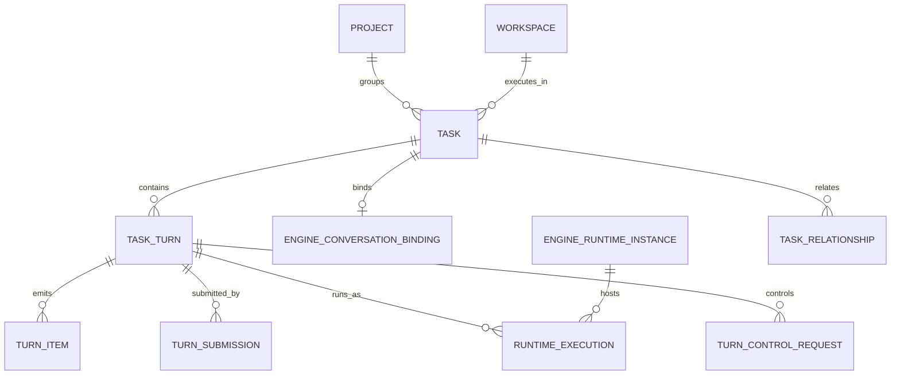
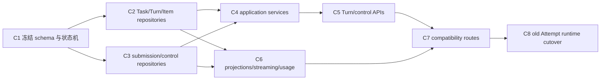

# Codex 对齐的 Conversation Domain 设计

**Status:** Accepted direction — 核心领域语义与兼容性策略已确认，等待实现
**Date:** 2026-07-17
**Scope:** Task、Turn、Item、steer、interrupt、fork、context transfer、运行状态投影与控制请求
**Depends on:** [`2026-07-11-project-task-workspace-domain-design.md`](2026-07-11-project-task-workspace-domain-design.md) 中的 Project、Workspace、Environment、Context 关系仍然有效
**Follow-ups:** [`2026-07-17-engine-runtime-and-credential-injection-design.md`](2026-07-17-engine-runtime-and-credential-injection-design.md)、[`2026-07-17-conversation-domain-standalone-migration-design.md`](2026-07-17-conversation-domain-standalone-migration-design.md)
**Supersedes:** 本文取代 [`2026-07-12-openscience-domain-refactor-execution-spec.md`](archived/2026-07-12-openscience-domain-refactor-execution-spec.md) B5 中 `Task → TaskAttempt → RuntimeSession`、`continue/retry/resume` 共用 Attempt，以及 Task 以最新 Attempt 终态作为生命周期的设计

## 1. 决策摘要

OpenScience 采用 Codex App Server 的 Thread、Turn、Item 与控制语义作为规范领域模型。Claude 不作为共同最小能力的定义者；Claude 缺失或不同的部分由 driver 明确标记为 native、emulated、degraded 或 unsupported，不得静默改变产品语义。

已确认的约束：

1. 产品继续使用 **Task** 名称，但 Task 的领域语义等同于 Codex **Thread**：持久化、可继续、包含多个 Turn 的 agent 工作对话。
2. Task 的业务状态与 runtime 状态分离。业务状态为 `open | completed | cancelled`；一次 Turn 的成功或失败不自动决定 Task 的业务状态。
3. 不再存在 `pause`。用户停止当前执行的唯一语义是 **interrupt/打断当前 Turn**；Task 默认仍为 `open`，后续输入创建新 Turn。
4. Turn 采用 Codex 四态：`in_progress | completed | interrupted | failed`。
5. 排队、claim、启动、投递未知等 OSci 可靠性状态属于 `TurnSubmission` 和 `RuntimeExecution`，不扩展或污染 Turn 状态。
6. 同一 Task 同时最多有一个 active Turn；不同 Task 可以并发运行。
7. `continue` 在 idle Task 上创建新 Turn；对 active Turn 的追加输入才是 steer。
8. 用户 Retry 创建新 Turn，并记录 `retry_of_turn_id`；worker 重试、进程接管和 transport 重连不是用户 Turn。
9. Task 创建后不得切换 engine。切换 engine 必须 Fork Task，并执行 transcript/context transfer preview 与二次确认。
10. session 身份必须持久化。active execution 丢失时当前 Turn 进入 `failed`，但 Task 与 engine conversation identity 仍保留，下一 Turn可以 resume。

## 2. 旧模型的内在冲突

旧模型把以下不同事实统一称为 Attempt：

- 用户第一次发起请求；
- 用户在一次回答完成后继续对话；
- 用户对失败结果执行 Retry；
- worker 重启后恢复 dispatch；
- runtime process 重启或重新连接；
- 引擎原生 session resume；
- 用户曾经看到的 pause/resume。

这些行为没有共同生命周期。一次 `continue` 是新的对话回合，一次 Retry 也是新的用户意图边界；而 worker recovery 只是同一执行的可靠性处理。把它们放进一个 Attempt 后，Task、Attempt、RuntimeSession 都会同时承担“用户对话”“任务结果”“进程状态”和“恢复记录”，最终导致 engine adapter 与 OSci worker 重复维护同一状态。

本文将这四层重新正交化：

```text
用户工作对象：Task
用户执行边界：Turn
对话内容：Item
可靠性与进程：TurnSubmission / RuntimeExecution / EngineRuntimeInstance
```

## 3. 规范术语

### 3.1 Task

Task 是 OSci 的持久化 agent conversation aggregate，对应 Codex Thread。

Task 至少固定：

- `task_id`；
- Project、Workspace、Environment；
- owner 和可见性；
- engine family；
- provider profile reference；
- researcher preset、skills、MCP 与 system instruction 来源；
- 当前 Project Context Version；
- `work_status`；
- archive metadata；
- engine conversation binding；
- 有序 Turn 集合。

Task 不是一次后台 job，也不因最后一个 Turn 失败而失去可继续性。

### 3.2 Turn

Turn 是一次用户发起的 agent execution，对应 Codex Turn。一个 Turn 可以包含多次模型请求、工具调用、命令执行、文件修改、审批和 reasoning cycle，但它们共同属于一次用户执行边界。

Turn 至少记录：

- `turn_id` 和 `task_id`；
- 起始 user input；
- `client_user_message_id` 或等价幂等键；
- `status`；
- `retry_of_turn_id`，若为用户 Retry；
- context snapshot/reference；
- engine/provider/model/config snapshot；
- native engine turn reference，若引擎提供；
- started/completed/duration/error；
- usage 和 cost provenance；
- 有序 Item 集合。

### 3.3 TurnItem

TurnItem 对应 Codex ThreadItem，是对话历史、流式展示和审计的基本单位。类型至少覆盖：

- user message；
- agent message；
- reasoning/thinking summary；
- command execution；
- file change；
- tool/MCP call 与 result；
- approval request/result；
- system notice；
- plan update；
- error。

Item 保存规范字段和经过脱敏的 native payload。不得继续把所有引擎事件压成只有 `kind + content` 的字符串流。

### 3.4 TurnSubmission

TurnSubmission 是 OSci 接受用户输入后、引擎正式接受 Turn 前的持久化调度对象。它解决 outbox、并发额度、claim、投递幂等和投递未知问题，不属于 engine conversation history。

### 3.5 EngineConversationBinding

EngineConversationBinding 保存 Task 与引擎原生持久化会话之间的关系：

```text
Codex: task_id ↔ thread_id
Claude: task_id ↔ session_id
```

它不是 RuntimeExecution，也不是 generic Session。一个 Task 在自己的 engine lineage 中只能有一个 active binding；Fork 会创建新 Task 和新 binding。

### 3.6 RuntimeExecution

RuntimeExecution 表示一个 Turn 在某个 EngineRuntimeInstance 上的实际执行与控制通道，包括 native turn/query reference、运行实例、transport generation、开始/结束和恢复结果。

它承担旧 RuntimeSession 与 Attempt 中真正属于运行可靠性的部分，但不保存用户 conversation 生命周期。

## 4. 聚合与关系



关键基数：

- 一个 Task 包含零到多个 Turn；
- 一个 Task 同时最多一个 `in_progress` Turn；
- 一个 Turn 可以有多个投递或恢复记录，但只有一个逻辑结果；
- 一个 RuntimeExecution 只能属于一个 Turn；
- Codex EngineRuntimeInstance 可以承载多个 Task；
- Claude Agent SDK EngineRuntimeInstance 通常只承载一个 Task 的 live client；
- RuntimeExecution 消失不会删除 Task、Turn 或 engine conversation binding。

## 5. Task 状态

### 5.1 业务状态

```text
open -> completed
open -> cancelled
completed -> open
cancelled -> open   # 仅显式 reopen
```

- `open`：仍可创建 Turn；
- `completed`：用户或产品工作流认为目标已完成，默认不再自动创建 Turn，但允许显式 reopen；
- `cancelled`：用户放弃该工作目标，保留全部历史，允许显式 reopen。

Turn `completed` 不自动把 Task 改成 `completed`。Turn `interrupted` 或 `failed` 也不自动把 Task 改成 `cancelled`。

### 5.2 Runtime status 投影

Task 的 runtime status 采用 Codex ThreadStatus 语义：

```text
not_loaded
idle
active(flags=[])
active(flags=[waiting_on_approval])
active(flags=[waiting_on_user_input])
system_error
```

这是查询投影，不是 Task 业务生命周期：

- `not_loaded`：没有 runtime 正在加载该 conversation，但可从持久化 binding 恢复；
- `idle`：conversation 已加载，没有 active Turn；
- `active`：存在 active Turn；
- `system_error`：runtime 或 reconciliation 无法建立可信状态。

Archive 与 runtime status 独立。归档 Task 前若存在 active Turn，应先请求 interrupt，并等待 Turn 到达终态或进入明确的 reconciliation 状态。

## 6. Turn 与投递状态机

### 6.1 TurnSubmission

```text
queued
  -> claimed
  -> delivering
  -> delivered

queued/claimed -> cancelled
delivering -> delivery_unknown
delivery_unknown -> delivered       # reconcile 证明原 Turn 已建立
delivery_unknown -> failed_delivery # reconcile 证明未建立或人工决议
```

约束：

- OSci 在接受请求时先持久化 user input、Turn identity 和 TurnSubmission；
- TurnSubmission 可以预留最终 `turn_id` 供 API/UI 关联，但在 `delivered` 前它仍是 submission identity，TaskTurn 不获得四态中的任何状态；
- `delivered` 表示引擎已接受该逻辑 Turn，并建立 native reference 或 driver-owned equivalent；
- delivery 在引擎明确拒绝前失败，只结束 TurnSubmission，不伪造一个 `failed` Turn；引擎已经接受 execution 后发生的错误才进入 Turn `failed`；
- 在跨越外部副作用边界后崩溃，不能把未知当作未投递；
- 对支持 native read/adopt 的 Codex，按 thread/turn ID reconcile；
- 对无法接管 active query 的 Claude，若 worker/runtime 丢失，Turn 最终为 `failed`，error code 为 `runtime_lost`。

### 6.2 Turn

```text
in_progress -> completed
in_progress -> interrupted
in_progress -> failed
```

Turn 只在 driver 已接受 execution 后进入 `in_progress`。`completed`、`interrupted`、`failed` 均为终态，不允许回到 `in_progress`。

若用户希望“继续失败的工作”，创建新 Turn；若语义是重试同一输入，新 Turn 设置 `retry_of_turn_id`。

### 6.3 RuntimeExecution

RuntimeExecution 可包含更细的内部状态：

```text
starting -> running -> completed
                  -> interrupted
                  -> failed
starting/running -> reconciling -> running/completed/interrupted/failed/unknown
```

这些状态不向用户伪装成新的 Turn。只有以下两种情况可以透明维持同一个 Turn：

1. 已证明外部 execution 尚未建立；
2. 已重新接管同一个 native Turn/query output channel。

除此之外不得自动重复用户输入。

## 7. steer、interrupt 与 approval

### 7.1 SteerRequest

Steer 只用于 active Turn，并强制携带 `expected_turn_id`：

```text
requested -> delivering -> accepted
                       -> rejected
                       -> delivery_unknown
```

- Codex driver 原生调用 `turn/steer(threadId, expectedTurnId, input)`；
- Agent SDK driver 在 live `ClaudeSDKClient` 上发送动态输入，由 OSci 在单一 turn owner 内对 `expected_turn_id` 做 CAS 和串行化；
- Claude 没有 native causal precondition，因此崩溃窗口必须允许 `delivery_unknown`，不得谎报 accepted；
- Claude CLI driver 不支持 same-turn steer。用户在 CLI Turn 活跃时发送的消息保存为 next-turn input，在当前 Turn 结束后创建新的 Turn；UI 必须明确显示“下一回合消息”，不能显示为 steer 已接受。

当前实现的 `send_input()` 仅把文本放进下一次 `start()` 队列却立即完成控制请求，不符合该契约，必须退役。

### 7.2 InterruptRequest

Interrupt 需要 `task_id + expected_turn_id`：

```text
requested -> accepted -> completed
         -> rejected
         -> delivery_unknown
```

- Codex 使用 `turn/interrupt(threadId, turnId)`；RPC `{}` 只表示请求已接受，必须等待 `turn/completed(status=interrupted)`；
- Agent SDK 使用 live client `interrupt()`；仍需等待 Result/terminal evidence；
- Claude CLI 可向 owned process 发送中断/终止，但结果可能是 `failed` 而不是原生 `interrupted`，driver 必须报告实际等级；
- interrupt 不自动清理 Codex background terminals。若产品需要清理，必须作为独立显式操作；
- 不再提供 pause/resume API、状态或按钮。

### 7.3 ApprovalRequest

审批属于 active Turn 的控制项：

```text
pending -> approved
        -> denied
        -> expired
        -> invalidated
```

OSci 持久化审批、展示给用户并将决定送回当前 runtime。runtime 丢失后旧审批进入 `invalidated`，不得把对旧 tool call 的批准应用到新 Turn。

## 8. Continue、Retry、Interrupt 与 Fork

| 用户动作 | 规范语义 |
|---|---|
| 在 idle Task 发送消息 | 创建新 Turn |
| 在 active Turn 追加纠偏 | SteerRequest |
| Agent SDK active Turn 追加输入 | same-turn steer，带 OSci causal guard |
| Claude CLI active Turn 追加输入 | 保存为 next-turn message，当前 Turn 结束后创建新 Turn |
| Interrupt | 打断当前 active Turn，Task 仍为 open |
| Retry | 新 Turn，设置 `retry_of_turn_id` |
| Reopen completed/cancelled Task | work status 改为 open；发送消息时再创建 Turn |
| Fork | 创建新 Task 和新 engine conversation binding |

### 8.1 同 engine Fork

- Codex 优先使用 native `thread/fork`；
- Claude 优先使用 native session fork；
- Fork 复制 conversation history，不承诺复制 Workspace 文件快照；
- Claude fork 不包含 file undo/checkpoint history；
- 若需要代码/数据隔离，应由 Workspace snapshot、Git worktree 或其他显式文件系统能力完成。

### 8.2 跨 engine Fork

Task 不允许原地更换 engine。跨 engine 只能执行两阶段 Fork：

```text
fork preview -> user confirmation -> target Task creation -> context transfer -> first Turn
```

Preview 至少返回：

- source/target engine；
- transcript message、Turn、Item 数量；
- 字符数和 UTF-8 byte 数；
- estimated token count，并标明 estimator；
- 已知 target model context window 时的占比；
- tool result、reasoning、binary/image reference 的数量；
- 选择的 transfer range/mode；
- 若配置了价格，给出输入成本估算；否则明确 `cost_unknown`。

用户必须二次确认。`full_transcript` 不能作为隐式默认值，也不能只靠一次普通 Fork 点击触发。首期支持：

- `selected_turns`：用户选择明确 Turn 范围；
- `recent_turns`：用户指定最大 Turn 数或 token budget；
- `full_transcript`：仅在 preview 后显式确认；
- `context_only`：只转移 Project/Task context、目标和显式 artifacts，不转移完整对话。

OSci 不自动用全量 transcript 恢复丢失 session，也不静默截断后声称完整迁移。任何截断必须出现在 preview 与最终 transfer receipt 中。

## 9. Context 所有权

OSci 与 engine 分别拥有不同层次的 context：

- OSci 拥有 Project Context、Workspace Context、Task configuration、Turn input、规范 Item 和 transfer policy；
- engine conversation 拥有原生 tool history、provider-specific compaction、prompt cache 与 native resume representation；
- native session 可用时，后续 Turn 必须 resume native conversation，不能每次重新注入全量 transcript；
- OSci 的规范 Item 用于 UI、审计、检索、迁移和降级恢复，不代表默认每次重新发送给模型；
- context snapshot 固定本 Turn 使用的 Project/Workspace/Task 约束与注入预算；
- engine 自己发生 compaction 时，OSci记录 compaction event/provenance，但不假设能逐 token 复现压缩结果。

session 丢失时不得静默“fresh start + 最近 100 条消息”。如果 native session 无法恢复，应将当前 Turn 标为 failed，并要求显式创建新 Turn或执行 context transfer；任何降级 transfer 都必须显示范围与截断。

## 10. Claude 兼容性

| Codex 规范能力 | Agent SDK | Claude CLI | OSci 策略 |
|---|---|---|---|
| durable Thread | native session | native session | 保存 `session_id` binding |
| explicit Turn ID | 无原生等价 | 无原生等价 | OSci 生成 Turn ID，按 user request/Result 边界映射 |
| active Turn steer | 支持动态输入 | 不支持 same-turn | SDK native-like；CLI 转为明确 next Turn |
| expectedTurnId | 无 | 无 | OSci 单 owner CAS；不隐藏 delivery unknown |
| interrupt | live client 支持 | process-level | SDK 规范实现；CLI 降级 |
| resume completed conversation | native | native | 直接映射 |
| adopt active Turn after worker loss | 不支持 | 不支持 | 当前 Turn failed，保留 session 供下一 Turn resume |
| fork history | native | native flag | 显式记录 undo/checkpoint 不随 fork |
| list/read history | SDK session APIs | transcript file | 作为 reconciliation 输入，不替代 OSci canonical projection |
| loaded/idle/active status | 无统一接口 | 无统一接口 | OSci 根据 owned runtime + Turn 推导 |
| typed Items | 部分原生 | stream-json 部分原生 | 规范化并保存 capability/completeness |

不影响核心功能的差异允许降级，但必须满足：

1. API capability 可查询；
2. UI 不把降级行为显示为 native；
3. session identity 不丢失；
4. active execution 丢失时状态收敛为 failed；
5. 不自动重复可能已产生副作用的输入。

## 11. API 方向

正式 API 以 Turn 和 control 为中心：

```text
POST /tasks/{task_id}/turns
POST /tasks/{task_id}/turns/{turn_id}/steer
POST /tasks/{task_id}/turns/{turn_id}/interrupt
GET  /tasks/{task_id}/turns
GET  /tasks/{task_id}/turns/{turn_id}/items
POST /tasks/{task_id}/fork-preview
POST /tasks/{task_id}/fork
POST /tasks/{task_id}/complete
POST /tasks/{task_id}/cancel
POST /tasks/{task_id}/reopen
```

约束：

- create Turn、steer、interrupt、fork 都需要 idempotency key；
- steer/interrupt 强制 `expected_turn_id`；
- control request 返回 request status，不把“已入队”伪装成 engine 已执行；
- streaming endpoint 从规范 TurnItem/event journal 输出；
- 旧 `/continue`、`/retry`、`/pause`、`/resume` 在兼容期分别映射为 create Turn、create retry Turn、410 Gone、410 Gone，并带 deprecation metadata；
- `/sessions` 只保留管理投影，不能继续作为用户 conversation 写接口。

## 12. Usage、token 与事件完整性

Usage 以 Turn 为主要统计边界，RuntimeExecution 保存来源：

```text
input_tokens
cached_input_tokens
output_tokens
reasoning_tokens
total_tokens
reported_cost
currency
provider_profile_id
model
source
completeness
```

- Codex 读取 turn completion 和 thread token usage 事件；
- Claude 读取 ResultMessage `usage`、`model_usage`、`total_cost_usd`；
- 第三方服务价格不一定与官方价格一致，未配置 price table 时不得推测 cost；
- `completeness` 至少区分 `complete | partial | unavailable`；
- thread cumulative usage 与 Turn delta 分开保存，避免重复累计；
- telemetry、日志、raw event 和 API response 不得包含 credential secret。

## 13. 实施任务与依赖



### C1：冻结领域 contract

- 定义 Task work status、runtime status、Turn、Item、Submission、Control、Binding 与 RuntimeExecution；
- 定义 invariant 和 error codes；
- 发布 engine capability vocabulary；
- 不做生产数据迁移。

### C2/C3：并行持久化基础

- C2 创建 TaskTurn、TurnItem、EngineConversationBinding；
- C3 创建 TurnSubmission、RuntimeExecution、ControlRequest；
- 两者共享同一 domain event/idempotency 约定；
- schema migration 只创建空结构，不转换生产历史数据。

### C4：唯一 application service

- create Turn、Retry Turn、steer、interrupt、Fork preview/confirm、work status；
- 事务内维护“每 Task 最多一个 active Turn”；
- 外部 engine side effect 通过 outbox/claim 执行。

### C5/C6：可并行产品面

- C5 提供正式 API 和 capability errors；
- C6 构建 Task/Turn/Item、usage、timeline、admin runtime 投影；
- WebUI 可以先基于 mock contract 开发，但不得复用旧 Attempt 状态映射。

### C7/C8：兼容与切换

- 旧 continue/retry 映射到新 Turn；
- 删除 pause/resume 产品语义；
- engine worker 切换到 Turn commands；
- 旧 Attempt 只读投影保留到 standalone migration 完成。

## 14. 验收标准

- Task 可以连续运行多个 Turn，前一个 Turn 的失败不阻止后续 Turn；
- 同一 Task 不会出现两个 active Turn；
- steer/interrupt 都使用 expected Turn causal guard；
- interrupt 后 Task 保持 open，后续消息创建新 Turn；
- Agent SDK steer 进入当前 Turn；Claude CLI 输入明确进入下一 Turn；
- runtime/worker 丢失使 active Claude Turn 变为 failed，但 `session_id` 不丢失；
- Codex client disconnect 不终止 Turn，重连后可按 native ID reconcile；
- Retry 创建新 Turn 并关联原 Turn，不创建新的用户 Task；
- engine 变化只能通过 Fork；
- 跨 engine Fork 显示 transcript 长度、token estimate 和 context 占比，并要求二次确认；
- full transcript 不会被隐式注入；
- Task/Turn/Item/usage 可以不依赖旧 SessionService 和 TaskAttempt 得出；
- API、event、telemetry 不暴露 credential material。

## 15. 非目标

- 不为所有 engine 设计共同最小能力；
- 不承诺跨 engine fork 保留 native tool state、undo history 或 prompt cache；
- 不在本 spec 中实现 credential storage、runtime process supervisor 或生产数据转换；
- 不在热路径自动总结或压缩全量 transcript；
- 不引入 pause 的别名或隐藏状态；
- 不把一次 engine failure 自动解释为 Task 业务失败。

## 16. 研究证据

本设计使用 OpenAI Codex 官方仓库快照 `315195492c80fdade38e917c18f9584efd599304` 校准术语和状态机：

- [App Server lifecycle、Thread/Turn/Item、steer 与 interrupt](https://github.com/openai/codex/blob/315195492c80fdade38e917c18f9584efd599304/codex-rs/app-server/README.md)
- [Thread 与 Turn 数据结构](https://github.com/openai/codex/blob/315195492c80fdade38e917c18f9584efd599304/codex-rs/app-server-protocol/src/protocol/v2/thread_data.rs)
- [TurnStatus、turn/start、turn/steer、turn/interrupt](https://github.com/openai/codex/blob/315195492c80fdade38e917c18f9584efd599304/codex-rs/app-server-protocol/src/protocol/v2/turn.rs)
- [ThreadStatus 与 active flags](https://github.com/openai/codex/blob/315195492c80fdade38e917c18f9584efd599304/codex-rs/app-server-protocol/src/protocol/v2/thread.rs)

Claude compatibility 基于本机安装的 Claude Code `2.1.207` 与 `claude-agent-sdk 0.1.77` 审计。实施开始时必须重新锁定并生成 capability/contract fixtures，不能假设未来版本保持完全相同。
