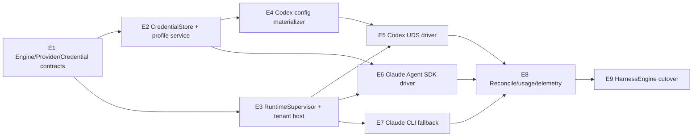

# Engine Runtime 与 Credential Injection 设计

**Status:** Accepted direction — runtime topology、driver 分层、compatible API 与 credential 边界已确认，等待实现
**Date:** 2026-07-17
**Scope:** Codex App Server、Claude Agent SDK、Claude CLI fallback、runtime supervision、Linux tenant isolation、provider profile、credential resolution、usage/telemetry
**Depends on:** [`2026-07-17-codex-aligned-conversation-domain-design.md`](2026-07-17-codex-aligned-conversation-domain-design.md)
**Follow-up:** [`2026-07-17-conversation-domain-standalone-migration-design.md`](2026-07-17-conversation-domain-standalone-migration-design.md)
**Related research:** [`../../projects/breakwater-agent-runtime.md`](../../projects/breakwater-agent-runtime.md)
**Supersedes:** 当前 `HarnessEngine.start()/send_input()/pause()/resume()/cancel()` 的 Task-scoped long-running contract，以及 Task 表直接保存 `api_key/codex_api_key` 的 credential override 方式

## 1. 决策摘要

1. 产品级 engine family 只有 `codex` 与 `claude`；`codex-app-server`、`agent-sdk`、`claude-cli` 是 driver/surface，不再作为彼此平级的业务 engine。
2. Codex 规范 driver 是长驻 Codex App Server；Claude 规范 driver 是 `ClaudeSDKClient` 双向模式；Claude CLI 是降级 fallback。
3. OpenScience 是开源 compatible-API 平台，不使用 OpenAI/Anthropic 官方 API、官方 OAuth、ChatGPT login、Claude subscription/keychain 或其他账号态作为运行契约。
4. 首期 provider protocol 只定义：
   - `openai_responses`；
   - `anthropic_messages`；
   - `openai_chat_completions`，保留给未来 driver，当前不强行接入 Codex/Claude。
5. 所有 provider 统一由 `base_url + api_key` 认证；driver 只负责把规范 credential 转译为目标 CLI/SDK 所需配置。
6. credential secret 不再复制到 Task、Turn、RuntimeExecution、event 或 telemetry；领域对象只保存 `provider_profile_ref` 与 version/fingerprint。
7. 初版使用最小本地 CredentialStore 即可，不引入 KMS、Vault、OAuth broker 或复杂加密体系；接口保留未来替换能力。
8. Linux user tenant isolation 继续保留。Agent SDK 的问题不是该隔离模型本身，而是 SDK 被放在 backend 用户进程内后尝试 `setuid`；新设计在 runtime host 启动边界执行 `sudo -u tenant`。
9. bubblewrap 可以继续用于 tenant 内部的 tool/bash sandbox，但不替代 Linux tenant identity。
10. engine version、provider configuration 和 credential 更新使用 generation + drain；不得在长 Turn 中途静默切换。

## 2. Engine 与 OSci 的职责

### 2.1 OSci control plane

OSci 负责：

- Task、Turn、Item 和 control 状态机；
- tenant、Project、Workspace、Environment 授权；
- provider profile 与 credential reference；
- runtime admission、global/per-tenant concurrency；
- runtime generation、drain、restart 与 orphan reconciliation；
- engine conversation binding 持久化；
- outbox、claim、idempotency 与 delivery unknown；
- approval routing；
- context snapshot/transfer policy；
- normalized event、usage、token 与 cost projection；
- capability/degradation 对用户的可见表达。

### 2.2 Engine driver

Driver 负责：

- 启动或连接原生 runtime；
- native protocol handshake；
- start/resume/fork conversation；
- start Turn、steer、interrupt 和 approval response；
- native event 到规范 Item/event 的翻译；
- 提供 native IDs、usage 和可验证的 runtime evidence；
- 声明 capability 与 completeness。

Driver 不负责：

- 决定 Task work status；
- 在内存中维护唯一 session truth；
- 把 raw credential 写入 Task；
- 自己创建另一套 Retry/Attempt 语义；
- 在 resume 失败时静默 fresh start；
- 根据 engine 名称要求上层 hardcode 行为。

## 3. 领域对象

### 3.1 EngineFamily 与 EngineDriver

```text
EngineFamily.CODEX
  Driver.CODEX_APP_SERVER

EngineFamily.CLAUDE
  Driver.CLAUDE_AGENT_SDK
  Driver.CLAUDE_CLI
```

Task 固定 `engine_family`。具体 driver 是 deployment/runtime policy，可以在不改变 conversation 语义的前提下选择；但若 driver capability 会改变用户可见行为，必须通过 capability API 和 UI 明示。

Agent SDK 是 Claude 的规范实现。CLI fallback 不得冒充完整 SDK 能力。

### 3.2 EngineRuntimeInstance

EngineRuntimeInstance 表示一个真实、可探测的 runtime：

- Codex app-server process；
- Claude Agent SDK runtime host/client；
- Claude CLI Turn process。

至少记录：

- `runtime_instance_id`；
- tenant Linux user；
- Environment；
- engine family/driver；
- engine binary/SDK version；
- runtime generation 和 config fingerprint；
- pid、socket/transport reference；
- lifecycle status；
- started/last_seen/draining/stopped；
- capability snapshot；
- health/reconciliation metadata。

它不保存 credential secret，也不代替 EngineConversationBinding。

### 3.3 ProviderProfile

ProviderProfile 是 tenant 可复用的非秘密配置：

```text
provider_profile_id
tenant_id
name
protocol
base_url
default_model
optional model aliases
credential_ref
profile_version
status
created_at / updated_at
```

规则：

- `base_url` 是完整 compatible API base；
- `protocol` 决定可用 engine family；
- Codex 只接受 `openai_responses`；
- Claude 只接受 `anthropic_messages`；
- `openai_chat_completions` 当前可以配置和校验，但没有 driver 时不得用于启动 Task；
- Task 固定 provider profile ID 与非秘密 config version；每个 Turn/RuntimeExecution 再固定实际解析到的 credential version；
- 首期 Task 创建后不切换 provider profile；credential rotation 可以在同一 profile 下发生。

### 3.4 CredentialRef 与 CredentialStore

领域层只处理 opaque reference：

```text
credential_ref
tenant_id
credential_version
secret_fingerprint
status
```

CredentialStore 最小接口：

```text
put(tenant_id, credential_id, api_key) -> credential_ref/version
resolve(credential_ref, expected_version?) -> api_key
rotate(credential_ref, new_api_key) -> new_version
delete/disable(credential_ref)
```

初版允许使用 `state_root` 下受权限保护的本地文件或独立 secret table：

- 文件/数据库权限为 backend-only；
- API key 明文落盘可以作为首期实现，前提是 mode/owner 正确且不进入普通领域表、backup report、日志和 API response；
- Web/API 创建和更新时 secret write-only，读取只返回 masked metadata；
- 未来可替换为加密文件、OS keyring、Vault/KMS，而不改变 Task/Turn schema。

本设计不为“以后可能接 KMS”预建复杂 secret broker、租约或动态 token 系统。

## 4. 新 driver contract

```text
capabilities() -> EngineCapabilities

ensure_runtime(RuntimeSpec) -> RuntimeHandle
probe_runtime(RuntimeHandle) -> RuntimeProbe
drain_runtime(RuntimeHandle)
stop_runtime(RuntimeHandle)

ensure_conversation(TaskBindingSpec) -> EngineConversationRef
read_conversation(EngineConversationRef) -> ConversationSnapshot
fork_conversation(ForkSpec) -> EngineConversationRef

start_turn(TurnStartSpec) -> NativeTurnReceipt
steer_turn(SteerSpec) -> ControlReceipt
interrupt_turn(InterruptSpec) -> ControlReceipt
respond_approval(ApprovalDecision) -> ControlReceipt

subscribe(RuntimeHandle, ConversationRef) -> EngineEventStream
reconcile(ReconcileSpec) -> ReconcileResult
```

Contract 约束：

- 方法 receipt 只表达 native request acceptance，不自动完成 OSci control request；
- terminal state 必须来自 native event、read/reconcile 或明确的 process exit evidence；
- driver 返回 native ref 和 capability grade；
- 不支持的能力返回 typed `unsupported`，降级能力返回 `degraded` 与原因；
- 所有 command 携带 Task/Turn/Runtime correlation，不以进程内 map 作为唯一身份来源。

## 5. Codex App Server runtime

### 5.1 Topology

在当前规模下，采用每个 `(tenant_linux_user, environment_id)` 一个 active Codex runtime generation：

```text
tenant + environment
  └─ stable CODEX_HOME
      └─ one active codex app-server
          ├─ Task/Thread A
          ├─ Task/Thread B
          └─ Task/Thread C
```

该实例承载 tenant 在该 Environment 中的多个 Task。不要按 Turn、Attempt 或 credential profile 启动独立 app-server。

原因：

- Codex app-server 原生支持多 Thread；
- stable `CODEX_HOME` 保存 rollout/thread history；
- client disconnect 不终止 Turn；
- backend 重启后可通过 Unix socket 重连；
- provider registry 可以在同一 config 中定义多个 provider，Thread start/resume 时选择 `model_provider`；
- 避免一个 Task/Turn 一个 Rust process 的启动和内存浪费。

同一 `CODEX_HOME` 不允许两个 active app-server generation 并行读写。升级和 provider registry 变更必须先 drain 旧 generation，再启动新 generation。

### 5.2 Spawn contract

RuntimeSupervisor 依次执行：

1. 解析 tenant、Environment、Codex binary version、stable `CODEX_HOME` 和 shared runtime socket path；
2. 以 tenant 用户创建/校验 `CODEX_HOME`、config 和 session 目录；
3. 根据 tenant ProviderProfile materialize `config.toml`，其中不写 secret；
4. resolve 当前 runtime generation 中所有可用 tenant ProviderProfile 的 credential，并映射为 config 中声明的独立 env key；
5. 通过 tenant execution boundary 启动 pinned binary：

```text
codex app-server --listen unix://<socket-path> --strict-config
```

6. 等待 socket ready，使用 WebSocket-over-Unix-socket 连接；
7. 每个 client connection 执行 `initialize` → `initialized`；
8. 持久化 pid、socket、CLI version、runtime generation 和 config fingerprint；
9. 调用 `thread/loaded/list`、`thread/read` 或 `thread/resume` reconcile 已绑定 Task；
10. 开始订阅 turn/item/status/usage/approval notifications。

不使用 Attempt-scoped stdio subprocess。stdio 可保留为开发测试 transport，正式本机运行使用 Unix socket。

不依赖 `codex app-server daemon bootstrap`：该 daemon 仍是 experimental，且 bootstrap 带自动 updater。OSci 自己 pin binary、管理 lifecycle，不允许后台自动升级并打断 autoresearch Turn。

### 5.3 Custom compatible provider 配置

仅设置 `OPENAI_BASE_URL` 不足以构成稳定的 Codex custom provider contract。OSci 为每个 ProviderProfile 生成：

```toml
model_provider = "osci-provider-default"

[model_providers.osci-provider-<profile-id>]
name = "<display name>"
base_url = "<base_url>"
wire_api = "responses"
env_key = "AINRF_PROVIDER_KEY_<stable-suffix>"
requires_openai_auth = false
supports_websockets = false
```

启动时只向 app-server process 注入对应 env key。Thread start/resume/fork 显式传入 `modelProvider` 和 model。

`AINRF_PROVIDER_KEY_*` 是后端 credential 注入的 canonical 环境变量命名。迁移期间如需读取既有 `OPENSCIENCE_PROVIDER_KEY_*`，只能将其作为兼容 alias，并优先解析对应的 `AINRF_*` 变量。

硬规则：

- `requires_openai_auth=false`；
- 不调用 `account/login/start`；
- 不创建或依赖官方 `auth.json`、ChatGPT login 或 OAuth token；
- 不使用 built-in official provider 作为隐式 fallback；
- ProviderProfile 缺失、protocol 不符或 credential resolve 失败时，Turn admission 失败，不尝试系统默认凭据；
- config/credential generation 更新后执行 controlled drain/restart。

### 5.4 Control 与 reconnect

- new Task：`thread/start`，保存 native `thread.id`；
- existing Task：`thread/resume(threadId)`；
- new Turn：`turn/start(threadId, input)`；
- steer：`turn/steer(threadId, expectedTurnId, input)`；
- interrupt：`turn/interrupt(threadId, turnId)`；
- fork：优先 `thread/fork`；
- reconnect：重新 initialize connection，按 binding `thread/read/resume`，读取 active status/turn/items；
- unsubscribe/disconnect 不当作 Turn terminal；
- output silence 不能作为死亡证据；必须结合 socket/process probe、thread status 和 native events。
- stable `CODEX_HOME` 与 OSci 的 `task_id ↔ thread_id` binding 都必须进入 backup/restore contract；临时目录不能成为 thread history 的唯一副本。

## 6. Claude runtime

### 6.1 Agent SDK 是规范 driver

当前 top-level `query()` 是 one-shot/unidirectional API，不能满足规范 contract。新 driver 必须使用长连接 `ClaudeSDKClient`：

- `connect()` 建立 streaming-mode client；
- `query()` 发送初始或动态 user input；
- `receive_messages()/receive_response()` 产生规范 events；
- `interrupt()` 打断当前执行；
- `resume=session_id` 恢复 conversation；
- `fork_session` 或 SDK fork API 创建新 session。

一个 live Claude runtime 通常绑定一个 Task。Turn 完成后可以保留 client 到短 idle TTL；释放 client 后，下一 Turn 使用持久化 `session_id` 重新 resume。

### 6.2 Tenant runtime host

Agent SDK/CLI 必须实际运行成 tenant Linux user。首期采用小型 tenant runtime host，而不是在 backend 进程内调用 `Popen(user=tenant)`：

```text
backend worker
  └─ sudo -u <tenant> openscience-engine-host claude
       ├─ ClaudeSDKClient
       └─ claude CLI child
```

Runtime host：

- 每个 live Claude Task 一个 helper process；
- 通过受控 stdio/Unix local channel 接收 start/steer/interrupt；
- credential 在 tenant 切换后通过控制通道注入 child environment，不依赖 sudo 继承 backend env；
- SDK object 和 async runtime 都位于同一 helper process/context；
- helper exit 使 active Turn failed；session binding 和 transcript mirror 保留；
- backend/worker 丢失后不宣称可 reattach active SDK query。

该 helper 是一个本机子进程边界，不是新的分布式服务，也不需要独立数据库或网络 API。

### 6.3 Anthropic-compatible credential injection

ProviderProfile 的规范输入仍只有 `base_url + api_key`。Claude driver 可转译为：

```text
ANTHROPIC_BASE_URL=<base_url>
ANTHROPIC_API_KEY=<api_key>
ANTHROPIC_AUTH_TOKEN=<api_key>  # 仅为兼容部分第三方 Claude Code gateway
```

同时：

- 清除未由本次 ProviderProfile 显式提供的 Anthropic credential env；
- 使用 isolated、持久化或 SessionStore-backed `CLAUDE_CONFIG_DIR`；
- CLI/SDK 支持时启用 `--bare`，避免读取 OAuth、keychain 和用户级官方账号状态；
- 不依赖 `~/.claude` 中已有官方 login；
- model aliases 由 ProviderProfile 明确注入；
- credential 缺失时 admission 失败，不回落系统默认。

### 6.4 Session durability

Claude session 的最低保证：

1. Task 与 `session_id` binding 在首个 init/result evidence 后立即持久化；
2. SDK transcript 通过 SessionStore mirror 写入 OSci durable storage；
3. mirror append 使用 entry UUID/idempotency，不得让每个 batch 从 seq 0 开始覆盖旧 batch；
4. resume 失败不得自动 fresh start；
5. active runtime 丢失时当前 Turn failed，下一 Turn 显式 resume 同一 `session_id`；
6. session 确认不可恢复时进入可见 `session_unavailable`，需要用户选择 context transfer/new Task，不能静默伪造连续性。

### 6.5 Claude CLI fallback

CLI fallback 使用 `--input-format stream-json --output-format stream-json` 能力时尽量保留 structured events，但产品语义仍降级：

- 一次 CLI process 对应一个 Turn execution；
- active Turn 收到的新输入保存为 next-turn message；
- interrupt 可以终止 process，但 terminal 可能是 failed；
- session ID 持久化并在下一 Turn 使用 `--resume`；
- CLI fallback 不支持 same-turn steer，不得由 `send_input()` 假装支持。

## 7. Runtime generation、rotation 与 drain

Runtime generation 固定：

- engine binary/SDK version；
- tenant/Environment；
- provider registry fingerprint；
- driver config；
- permission/tool sandbox config；
- credential versions loaded into 该 runtime。

更新策略：

- active Turn 不自动切换 generation；
- credential rotation 对新 runtime generation 生效；
- Codex provider/credential 变化进入 pending generation，等待 active Turns drain；
- 长时间 autoresearch Turn 不因自动 updater 被重启；
- operator 可以显式 interrupt 后强制升级；
- 已 loaded 的 Task 在新 app-server generation 上通过 stable `CODEX_HOME + thread_id` resume；
- Claude client 在 Turn 间释放后使用相同 `session_id` 和新 credential resume。

首期不做每请求动态 secret lease，也不要求运行中的 process 热替换环境变量。

## 8. Linux tenant isolation 与 bubblewrap

保留现有 Linux user tenant isolation，原因：

- Workspace 和 tenant home 已按真实 UID ownership 隔离；
- 当前规模低于 30 online tenants、50 concurrent Turns，`sudo -u` 与少量 helper process 开销可忽略；
- Codex/Claude 都需要在 tenant 身份下读写 native session、skills、config 和 Workspace；
- 改为单纯 bubblewrap 会引入 UID/file ownership、bind mount 和持久化 session path 的新复杂度，不能直接替代 tenant identity。

调整点：

- RuntimeSupervisor 在 root/provisioning 能力允许的共享 run root 下，为 tenant 创建 runtime socket/control 目录；
- 目录由 tenant 拥有、backend 可通过受控 group/ACL 连接，不放开 tenant Workspace；
- tenant 空间中的 `CODEX_HOME`、Claude config、skills 和 session 文件都由 tenant 用户创建；
- backend 创建的临时配置必须按实际 consumer 设置 owner/mode；
- `sudo -u` 切换发生在 runtime host/process 启动边界；
- bubblewrap 只作为 tenant 内部工具执行沙箱，可由 Claude/Codex 自身配置使用。

只有在实际测试证明 shared runtime directory、nested sandbox 或远程 Environment 无法稳定实现时，才另立 spec 评估全面 bwrap/container runtime；本轮不提前替换。

## 9. Concurrency 与稳定性

按当前规模设置：

- global active Turn permits：50；
- per-tenant active Turn permits：10；
- provider/profile 另有 rate/concurrency limiter；
- Codex 每 tenant/Environment 一个 active app-server generation；
- Claude 每 live Task 一个 Agent SDK helper/client；
- idle Claude client 可按 TTL unload，但不得删除 session；
- active autoresearch Turn 不受 idle TTL；
- app-server 无 subscriber 且 idle 时是否 unload Thread 由 Codex native policy处理，Task binding 保留；
- watchdog 不能仅以“无输出”判死；必须使用 process/socket/native status/heartbeat/reconcile 组合证据。

## 10. Telemetry 与 token usage

Runtime/driver 统一上报：

- runtime start/stop/restart/drain；
- Turn accepted/started/completed/interrupted/failed；
- steer/interrupt/approval request outcome；
- reconnect/reconcile/session resume；
- provider/profile/model 与 driver version；
- token usage、reported cost、rate limit；
- capability grade 和 event completeness。

禁止上报：

- API key；
- 完整 credential env；
- credential file content/path 中可推导 secret 的部分；
-未经现有 redaction policy 处理的 prompt/tool payload。

第三方 provider 的价格未知时，只保存 token 和 provider-reported cost，不套用 OpenAI/Anthropic 官方价格表。

## 11. 实施任务与依赖



### E1：冻结 contract

- EngineFamily/Driver/Capabilities；
- ProviderProtocol/Profile；
- CredentialRef/Resolver；
- RuntimeInstance/Generation；
- driver command/event schemas。

### E2/E3：可并行基础设施

- E2 实现最小 local CredentialStore、write-only API 和 provider validation；
- E3 实现 tenant runtime directory、supervisor、helper process 和 bounded permits；
- 两者均不改 conversation 状态机。

### E4/E5：Codex path

- materialize custom provider config；
- stable CODEX_HOME；
- Unix socket/WebSocket transport；
- initialize、thread lifecycle、Turn/control、reconnect；
- pinned version 与 controlled drain。

### E6/E7：Claude path

- E6 使用 `ClaudeSDKClient`、SessionStore relay、steer、interrupt、resume；
- E7 实现 CLI stream-json fallback 和 next-turn queue；
- 两者共享 provider/credential resolver 与 event normalization。

### E8/E9：收口

- runtime reconciliation、usage completeness、rate limits、orphan cleanup；
- 上层 worker 改为 Turn command，不再调用 Task-scoped `start()`；
- 删除 engine name hardcode 和 raw task credential columns 的新写入；
- 旧实现只保留到 standalone migration/cutover。

## 12. 验收标准

- Codex app-server 不再按 Attempt 启动，backend 重启后可通过 UDS 重连；
- 一个 tenant/Environment app-server 可以承载多个 Task/Thread；
- Codex custom provider 使用 `wire_api=responses + env_key + requires_openai_auth=false`；
- 没有 OpenAI/ChatGPT OAuth、Anthropic OAuth/keychain 或 ambient system credential fallback；
- Claude 规范 driver 使用 `ClaudeSDKClient`，active Turn 支持 steer 和 interrupt；
- Claude CLI 新输入明确排入 next Turn；
- Agent SDK 以 tenant 用户运行，不再因 `Popen(user=...)`/CAP_SETUID 被 v2 worker 拒绝；
- session binding 和 transcript mirror 在 worker/container 重启后仍可 resume；
- resume 失败不会静默 fresh start；
- Task/Turn/Runtime 表和日志中不存在 raw API key；
- provider profile/credential rotation 不打断 active autoresearch Turn；
- global/per-tenant limits 分别为 50/10，并有 deterministic contention tests；
- token/cost 记录包含 source 和 completeness，不使用官方价格猜测第三方 cost。

## 13. 非目标

- 不接 OpenAI/Anthropic 官方账号、OAuth 或 subscription login；
- 不实现 Vault/KMS、动态 secret lease 或复杂 envelope encryption；
- 不把 `openai_chat_completions` 强行适配到 Codex App Server；
- 不让 Task 在原地更换 engine；
- 不用 bubblewrap 立即取代 Linux user tenant isolation；
- 不依赖 Codex experimental daemon updater 管理版本；
- 不在本 spec 中转换旧生产 Task/Attempt/credential 数据。

## 14. 研究证据

Codex runtime 与 provider injection 依据 OpenAI Codex 官方仓库快照 `315195492c80fdade38e917c18f9584efd599304`：

- [App Server transports 与 Unix socket lifecycle](https://github.com/openai/codex/blob/315195492c80fdade38e917c18f9584efd599304/codex-rs/app-server/README.md)
- [ThreadStartParams 的 model provider 选择](https://github.com/openai/codex/blob/315195492c80fdade38e917c18f9584efd599304/codex-rs/app-server-protocol/src/protocol/v2/thread.rs)
- [ModelProviderInfo 的 base_url、env_key、wire_api 与 requires_openai_auth](https://github.com/openai/codex/blob/315195492c80fdade38e917c18f9584efd599304/codex-rs/core/config.schema.json)
- [Experimental app-server daemon lifecycle 与 updater 行为](https://github.com/openai/codex/blob/315195492c80fdade38e917c18f9584efd599304/codex-rs/app-server-daemon/README.md)

Breakwater 的共享 app-server、case/slot、credential 和 token 追踪研究保留在 [[projects/breakwater-agent-runtime]]。本文采纳其“长驻 server、尽早持久化 thread/turn ID、transport 后先 reconcile”的经验，但不继承宿主默认 credential、共享跨租户 runtime 或仅从 Codex 私有 SQLite 读取累计 token 的做法。
