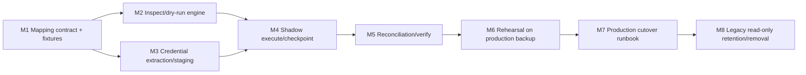

# Conversation Domain Standalone Migration 设计

> [!success] Implemented and archived
> 本设计已于 2026-08-01 实现为显式 `inspect`、`dry-run`、`execute`、`verify`、`cutover` migration Interface，保留 immutable source manifest、shadow destination、reconciliation、credential 隔离和原子 pointer cutover 安全性。

**Status:** Implemented and archived on 2026-08-01
**Date:** 2026-07-17
**Scope:** 将旧 Task/Attempt/RuntimeSession/output/session transcript/provider override 数据一次性迁移到 Task/Turn/Item/Binding/RuntimeExecution/ProviderProfile/CredentialStore
**Depends on:** [`2026-07-17-codex-aligned-conversation-domain-design.md`](2026-07-17-codex-aligned-conversation-domain-design.md)、[`2026-07-17-engine-runtime-and-credential-injection-design.md`](2026-07-17-engine-runtime-and-credential-injection-design.md)
**Boundary:** 本文只定义一次性 standalone 数据转换与 production cutover；正常应用启动、schema migration 和 runtime hot path 不执行历史数据推断

## 1. 决策摘要

1. 旧生产数据迁移由独立 maintenance executable/process 完成，不嵌入 API startup、worker startup、普通 Alembic/SQLite migration 或 engine adapter。
2. 正常 schema migration 只创建新空表、索引和约束；历史 Task/Attempt/credential 转换必须显式运行 standalone tool。
3. 不长期 dual-write。迁移使用 source snapshot → shadow destination → reconciliation → cutover。
4. migration 必须支持 inspect、dry-run、execute、verify 和 report；每次运行绑定不可变 source manifest/hash。
5. 所有旧 secret 只允许直接进入 CredentialStore，不能进入新 Task/Turn/Runtime 表、报告或日志。
6. 旧 Attempt 不机械地一行映射为一个 Turn。工具优先根据 user message、terminal result、control 和 native session evidence恢复 Turn 边界；无法证明时使用 `legacy_inferred` 与 confidence/provenance，而不是伪造精确历史。
7. 迁移前必须 drain 或 interrupt 所有 active execution。正在运行、launch unknown 或无法确认 session 状态的数据不得在线猜测转换。
8. 旧数据库和原始 backup 在 cutover 后只读保留一个明确保留期；新 runtime 永不回写旧结构。

## 2. 为什么必须 standalone

旧数据包含多套互相重叠的语义：

- `tasks.status` 同时表示 queue、runtime 和用户结果；
- `agent_task_attempts` 把 initial、continue、retry、resume 和 recovery 混在一起；
- `agent_runtime_sessions` 既可能指进程，也可能承载 native session key；
- `task_outputs` 是扁平事件流，未稳定保存 Item lifecycle；
- Claude `session_transcripts` 保存另一套 native transcript；
- Task/profile 列中可能直接保存 API key；
- legacy `sessions.sqlite3` 还可能有独立 Session/Attempt 投影。

这些转换需要跨表推断、冲突报告、人工 mapping 和生产停写窗口。如果把它们放进普通 schema migration 或服务热路径，会产生：

- 每次启动都携带一次性复杂度；
- 运行时长期保留 legacy 分支；
- 失败时数据库处于半新半旧状态；
- credential 容易被普通 migration log 泄漏；
- 后续维护者无法知道某个 fallback 何时可以删除。

因此，新实现代码只接收新 schema；standalone tool 对 immutable source snapshot 负责。

## 3. Tool contract

建议提供显式 maintenance command：

```text
uv run openscience migration conversation-v3 inspect ...
uv run openscience migration conversation-v3 dry-run ...
uv run openscience migration conversation-v3 execute ...
uv run openscience migration conversation-v3 verify ...
uv run openscience migration conversation-v3 cutover ...
```

命令名称可以在实施时调整，但必须满足：

- 默认不连接生产 live writer；
- 必须显式指定 source snapshot、destination 和 artifact/code version；
- execute 不直接覆盖 source；
- inspect/dry-run 不写 destination domain；
- report 默认脱敏；
- 只有 cutover 子命令可以切换 active generation/pointer；
- tool 不由 `openscience serve` 自动调用。

## 4. 输入、输出与 manifest

### 4.1 Source inputs

工具按显式 manifest 读取：

- `agentic_researcher.sqlite3` snapshot；
- legacy `sessions.sqlite3` snapshot，若存在；
- auth/user/tenant identity snapshot，仅用于 owner mapping；
- Environment/Workspace/Project registry snapshot；
- Claude session transcript rows或文件 archive；
- Codex native thread/session paths或 binding evidence，若存在；
- operator provider/credential mapping manifest，若需要；
- source code/artifact SHA 和 schema versions。

不读取：

- 浏览器 localStorage 中不可审计的隐式当前值；
- host ambient `OPENAI_*`、`ANTHROPIC_*` env；
- OpenAI/Anthropic OAuth/keychain；
- 运行中 engine process 的猜测状态。

### 4.2 SourceManifest

每次 run 保存：

```text
run_id
source file paths
size / mtime
sha256
schema version
row counts by table
artifact/code version
operator
created_at
```

execute 和 verify 必须引用同一 manifest。source 文件变化后必须生成新 run，不能在旧 checkpoint 上继续。

### 4.3 Destination

execute 写入独立 shadow destination：

- 新 conversation domain database/generation；
- CredentialStore staging namespace；
- migration provenance tables；
- attention/conflict report；
- 不含 secret 的 reconciliation summary。

只有 verify 全部通过后，cutover 才把 active pointer 切到该 generation。

## 5. Task 映射

保留：

- `task_id`；
- owner、Project、Workspace、Environment；
- title、prompt、created/updated/archive metadata；
- researcher preset、skills、MCP；
- context version/snapshot provenance；
- engine family；
- historical source fingerprint。

Engine 映射：

| Legacy value | New family/driver |
|---|---|
| `codex-app-server` | `codex / codex-app-server` |
| `agent-sdk` | `claude / claude-agent-sdk` |
| `claude-code` | `claude / claude-cli`，迁移后新 Turn 默认可使用规范 Agent SDK driver |

Task engine family 一经迁移固定。不得因为新系统偏好 Agent SDK 而把旧 Claude Task 改成 Codex。

### 5.1 Work status

在生产 snapshot 前应先停止新 dispatch，并处理 active execution。静态映射：

| Legacy Task/latest execution | New Task work status | New latest Turn outcome |
|---|---|---|
| succeeded | completed | completed |
| failed | open | failed |
| cancelled/stopped | cancelled | interrupted 或 failed，按证据 |
| legacy paused | open | interrupted，禁止保留 paused |
| archived | 保留映射前状态 | 另存 archive metadata |
| queued but never delivered | open | 不创建 in-progress Turn；保留 pending/legacy notice |
| running/starting/launch_unknown | 阻断 cutover | 必须先 drain/reconcile/operator resolve |

迁移不得把所有旧 succeeded Task 永久锁死；新系统允许 completed Task 显式 reopen。

## 6. Turn 边界恢复

### 6.1 Evidence priority

Turn boundary 按以下优先级恢复：

1. 明确 user message/client message ID；
2. engine native Turn/result boundary；
3. Claude ResultMessage/session transcript parent chain；
4. Task output 中的 lifecycle started/terminal 事件；
5. legacy Attempt trigger/status/time range；
6. 保守 inferred boundary。

每个 migrated Turn 保存：

```text
boundary_source
boundary_confidence = exact | high | inferred | ambiguous
legacy_attempt_ids
legacy_output_range
native_refs
migration_run_id
```

### 6.2 Attempt trigger 处理

| Legacy trigger | 默认转换 |
|---|---|
| initial | 创建首个 Turn |
| continue + 新 user message | 创建新 Turn；若有确切 active native steer evidence，记录为原 Turn 的 steer Item/control |
| retry | 创建新 Turn，`retry_of_turn_id` 指向前一个相关 Turn |
| resume + 无新 user input | 不创建新 Turn；转换为前一 Turn 的 RuntimeExecution/recovery provenance |
| resume + 新 user input | 创建新 Turn |
| legacy | 依据 message/result 边界；无法判断时创建 `legacy_inferred` Turn |

当前旧 `send_input()` 多数只排队到下一次 start，不能仅凭 control request `completed` 推断 same-turn steer。没有 native/message evidence 时必须按 next Turn 或 ambiguous 处理。

### 6.3 Active control

- 旧 pause control 不迁移为新状态；若它导致 execution 结束，Turn 映射为 interrupted；
- cancel/stop 根据 terminal/process evidence 映射为 interrupted 或 failed；
- acknowledged 但无 terminal evidence 的 control 进入 attention report；
- 旧 approval 若 runtime 已终止，迁为 invalidated audit item，不得恢复成 pending。

## 7. Item 与 transcript 映射

### 7.1 Canonical Items

从 Task output、SDK messages 和 native transcript 建立有序 Item：

- user/assistant message 保留完整可见 content；
- tool call/result 尽量保存 native ID 与结构；
- thinking/reasoning 按现有可见性与 redaction policy处理；
- command/file/MCP 事件保留 status、时间和引用；
- 无法结构化的旧 output 转为 `legacy_event` Item，保存 source kind/sequence；
- 同一 native UUID/event ID 去重；
- 事件顺序冲突时保存原 sequence 和 timestamp，不静默丢弃。

### 7.2 Native transcript archive

Claude raw session transcript 和 Codex rollout 是 engine-native recovery evidence，不与 canonical Items 混为同一真相：

- 可继续保存在专用 native transcript/archive store；
- EngineConversationBinding 指向 native session/thread ID；
- canonical UI 从 Turn/Item projection 读取；
- driver resume/reconcile 可以读取 native store；
- migration 不把 raw transcript 自动拼进下一次 prompt。

### 7.3 Transcript size report

每个 Task 的 migration report 记录：

- Turn/Item/message 数；
- visible transcript chars/bytes；
- token estimate；
- tool result/reasoning 占比；
- native transcript 是否完整；
- canonical projection 与 native transcript 是否存在 gap。

这份统计供后续跨 engine Fork preview 使用，但 migration 本身不执行 engine change 或 transcript transfer。

## 8. EngineConversationBinding 与 RuntimeExecution

### 8.1 Binding

按可靠证据建立：

```text
Task -> Codex thread_id
Task -> Claude session_id
```

如果一个 Task 出现多个 native session ID：

- 保存 binding history；
- 标记 active/latest candidate；
- 记录 discontinuity reason；
- 不把多个 session 静默合并成一个 native identity；
- 无法确认 active binding 时，Task 可以迁移历史，但新 Turn admission 阻塞并进入 attention report。

### 8.2 RuntimeExecution

Legacy RuntimeSession、dispatch 和 launch evidence 转为 RuntimeExecution：

- legacy runtime ID 保存为 provenance；
- native turn/query/process ID 分字段保存；
- launch key、pid、started/finished、exit/error、driver version 尽量保留；
- old launch unknown 必须在 snapshot 前解决，否则阻断 cutover；
- 旧 runtime 记录只用于历史，不会在新系统启动时被当作 live process 自动接管。

## 9. Provider 与 credential 迁移

### 9.1 ProviderProfile dedup

工具按 tenant 和以下非秘密字段建立候选 profile：

```text
protocol
normalized base_url
model aliases/default model
credential fingerprint
```

来源可以包括：

- Task raw `api_base_url/codex_base_url`；
- Task raw key fingerprint；
- operator mapping manifest；
- 已存在的 server-side Environment credential refs。

浏览器 localStorage provider 不能作为服务器迁移的可靠唯一来源。operator 可以导出并通过显式 mapping manifest 提供，但 tool 不自动扫描用户浏览器数据。

### 9.2 Secret handling

旧 raw key 的唯一合法迁移路径：

```text
source snapshot -> in-memory read -> CredentialStore.put -> credential_ref
```

约束：

- report 只显示 fingerprint/masked suffix；
- exception、SQL trace、debug log 不包含 secret；
- destination Task/Turn/Runtime row 不包含 raw key；
- provider config materialization 在新 runtime 启动时进行，不由 migration 写入运行进程环境；
- 同一 tenant/相同 fingerprint 可以复用一个 credential ref；
- 不跨 tenant dedup secret；
- 缺少 base URL、protocol 或 credential 时，历史数据仍可迁移，但 Task 标记 `provider_unresolved`，禁止新 Turn admission。

### 9.3 Protocol mapping

| Legacy fields | New protocol |
|---|---|
| `api_base_url/api_key` for Claude | `anthropic_messages` |
| `codex_base_url/codex_api_key` | `openai_responses` |
| legacy `openai-chat` provider | `openai_chat_completions`，无可用 driver 时只迁 profile |

迁移不创建 OpenAI/Anthropic official/OAuth profile，也不从 host ambient credential 补全缺失数据。

## 10. Safety、cutover 与 rollback

### 10.1 Preflight

- 进入 maintenance mode，停止 Task create/Turn create/control 写入；
- 停止 dispatcher claim 新工作；
- 等待 active Turns drain，或由 operator interrupt；
- reconcile 所有 starting/running/launch_unknown；
- 创建数据库和 native session store backup；
- 计算 SourceManifest；
- 验证磁盘空间、owner、mode 和目标 generation 不存在。

### 10.2 Dry-run

Dry-run 输出：

- source row counts；
- Task/Turn/Item/Binding/Runtime/Profile/Credential 候选数；
- exact/inferred/ambiguous Turn boundary 数；
- unresolved owner/Project/Workspace/Environment/provider/binding；
- duplicate/conflict；
- secret field presence count，但不显示值；
- blocking 与 non-blocking issues；
- projected destination size。

存在 blocking issue 时 execute 默认拒绝；operator override 必须按 issue ID 显式记录，不能使用全局 `--force` 跳过全部检查。

### 10.3 Execute 与 verify

Execute 写 shadow destination，并按 batch checkpoint。Verify 至少检查：

- source Task 全部得到 migrated/attention/explicitly excluded 结论；
- 每个 migrated Task 的 Turn 顺序与唯一 active invariant；
- terminal Turn 不存在 active RuntimeExecution；
- binding engine family 与 Task 一致；
- provider protocol 与 engine family 一致；
- raw credential 不存在于普通 destination tables/report；
- Item/usage aggregate 与 source 在允许误差内；
- migration provenance 可以反查每个 destination row；
- standalone tool 重跑相同 manifest 产生相同 logical result。

### 10.4 Cutover

```text
maintenance active
  -> final source snapshot/hash check
  -> verify shadow generation
  -> atomically switch active generation/pointer
  -> start new API/worker in read-only smoke mode
  -> run projection/session/provider checks
  -> enable new writes
```

旧数据库：

- cutover 后只读；
- 不再 dual-write；
- 保留 rollback/audit 窗口；
- legacy API 只能读取 migration projection，不能触发旧 runtime。

### 10.5 Rollback

- 新 writes 启用前，可以原子切回旧 generation；
- 新 writes 启用后，不执行自动 reverse migration；
- 需要回滚时进入 maintenance，保全新 generation，再从原 backup 恢复旧系统或执行另立的 forward repair；
- rollback 操作、原因和 source/destination manifest 全部审计。

## 11. 实施任务与依赖



### M1：冻结 mapping contract

- 枚举所有 source schema versions；
- 建立 Task status、Attempt trigger、output kind、engine、credential mapping；
- 准备包含冲突、多个 session、resume、lost runtime 和 raw key 的脱敏 fixtures；
- 新 conversation/runtime schema 必须已冻结。

### M2/M3：并行转换基础

- M2 实现 source manifest、inspect、dry-run、boundary inference 和 report；
- M3 实现 credential scanner、fingerprint、CredentialStore staging 和 provider mapping manifest；
- M3 的测试必须证明 secret 不进入报告和 traceback。

### M4/M5：执行与验证

- shadow destination、batch checkpoint、idempotent upsert；
- provenance、row-level reconciliation、aggregate checks；
- 故障注入覆盖中断后 resume；
- verify 不依赖 live production engine。

### M6：生产 backup rehearsal

- 在隔离目录对真实 production backup 执行完整 dry-run/execute/verify；
- 记录耗时、磁盘、blocking issues 和 operator mapping；
- 不连接生产端口、不启动外部 LLM；
- rehearsal 结果冻结为 production runbook 输入。

### M7/M8：cutover 与清理

- maintenance、backup、drain、execute、verify、pointer switch、read-only smoke；
- 观察一个明确周期；
- legacy DB 保持只读；
- 确认无 rollback 需求后，另行批准归档/删除，不由 migration tool 自动清除 source。

## 12. 验收标准

- 正常 `openscience serve` 和 worker startup 不运行历史数据转换；
- migration 可以在 production backup 上完全离线执行；
- 相同 source manifest 重跑得到稳定结果；
- active/unknown runtime 在未解决前阻断 cutover；
- 旧 Task ID、Project、Workspace、owner 和 archive history 保留；
- succeeded/failed/cancelled 不再直接成为 runtime Task status；
- pause 不进入新 schema；
- retry/continue/resume 不再机械等同于 Attempt；
- 每个 migrated Turn 都有 boundary provenance/confidence；
- Claude/Codex session/thread binding 可用于新 driver resume；
- raw API key 只进入 CredentialStore，普通表、日志和报告均无 secret；
- unresolved provider/binding 数据可读但无法启动新 Turn；
- cutover 后无 dual-write，旧数据库只读；
- rollback 边界和新写入后的处理方式明确且经过 rehearsal。

## 13. 非目标

- 不在 migration 中调用 LLM 总结 transcript；
- 不在 migration 中执行跨 engine Fork；
- 不自动修复 Project/Workspace/Environment 权限冲突；
- 不从 ambient env、OAuth、keychain 或浏览器状态猜 credential；
- 不在应用代码中永久保留 legacy mapping 分支；
- 不自动删除 production source database、native transcript 或 backup；
- 不承诺把缺失的 native tool/undo history重建为精确 Codex/Claude state。
