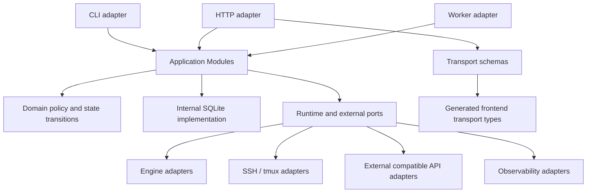
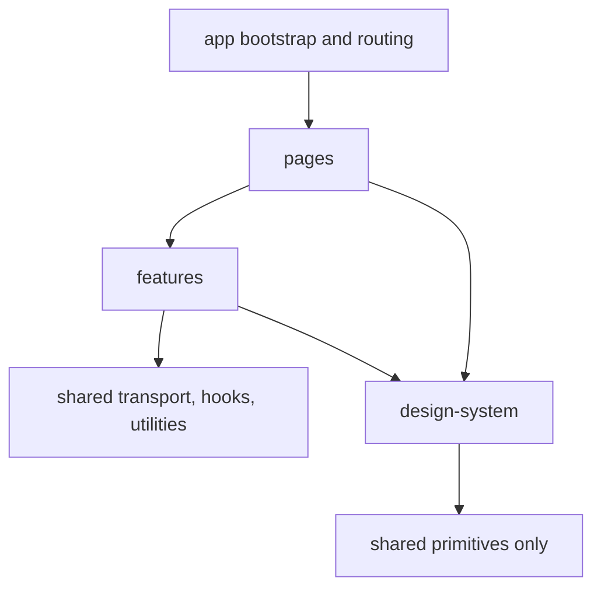
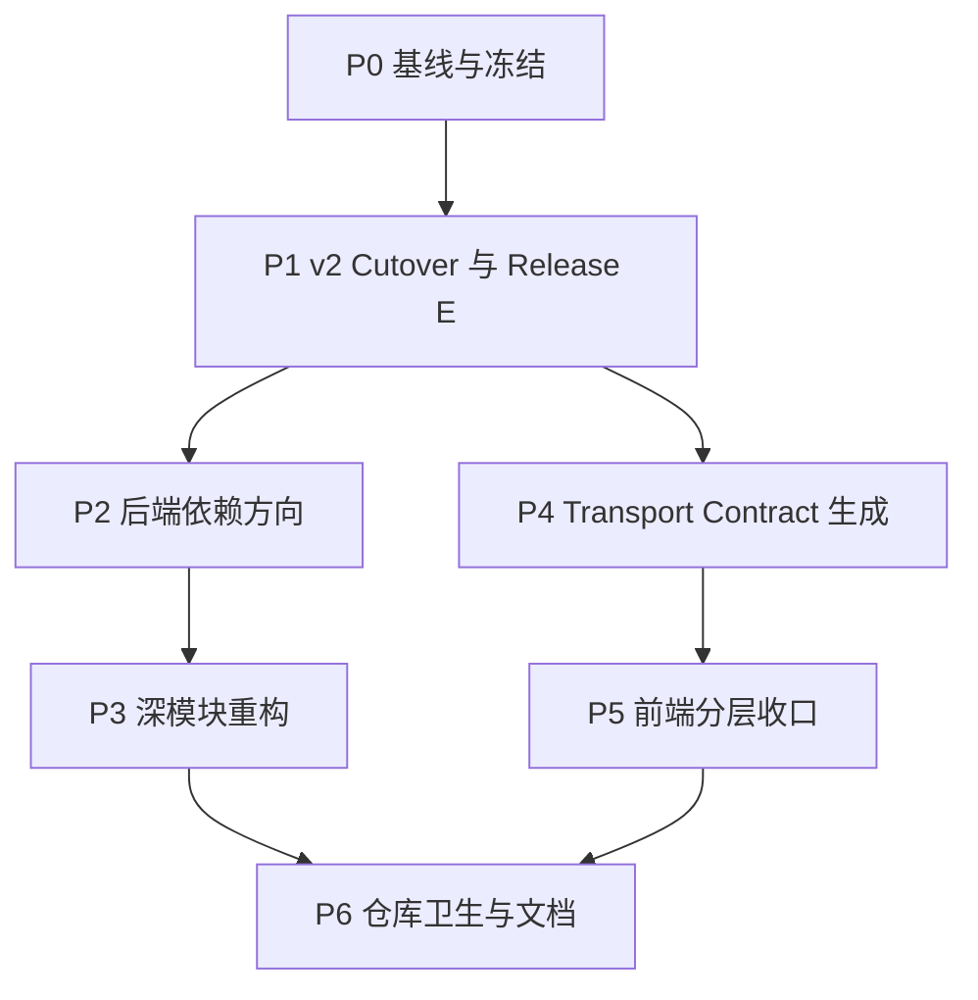

# OpenScience 架构清理与深模块重构设计

> [!warning] Historical specification
> 本文已归档，不再定义当前产品 contract。请以 `PROJECT_BASIS.md`、`docs-site/docs/`、代码与活跃 spec 为准；原文保留用于解释历史决策和迁移来源。

**Status:** Executed and archived (P0–P6 complete 2026-07-30)
**Date:** 2026-07-29
**Scope:** Release E 执行、monorepo 边界、legacy/v2 收口、Python 后端模块划分与依赖方向、前后端契约、前端分层、测试与仓库卫生
**Detailed cutover contract:** [`2026-07-12-openscience-domain-refactor-execution-spec.md`](2026-07-12-openscience-domain-refactor-execution-spec.md)
**Related:** [`2026-07-17-engine-runtime-and-credential-injection-design.md`](../2026-07-17-engine-runtime-and-credential-injection-design.md)、[`2026-07-11-five-layer-hybrid-ci-design.md`](../2026-07-11-five-layer-hybrid-ci-design.md)
**Does not supersede:** 已接受的 Project / Task / Workspace、Conversation、Engine Runtime 和五层 CI 领域契约

> [!done]
> P0–P6 已于 2026-07-30 执行完成。P6 删除了 cleanup-only 基础设施和无长期 owner 的 tracked research/export 资产，将仍有效的 compatibility inventory 迁移到 VitePress 长期文档，并保持所有缺少生产完整观察窗口零流量证据的 surface fail-closed。本文保留原始设计、阶段约束与审计历史，不将历史计划改写为当前 contract。

## 1. 目的

本规范定义 OpenScience 从准备并完成 v2 cutover、执行 Release E 到全面清理仓库和运行时代码的统一重构计划。Release E 是本规范必须交付的 P1，而不是需要由其他计划先行完成的外部前置任务。原领域执行规范继续定义 importer、reconciliation、backup、cutover 和 rollback 的详细安全契约；本规范拥有 Release E 的排期、技术债关闭清单、验收和后续结构重构顺序。

它解决的不是“是否把前端和后端拆成两个仓库”，而是以下已经实际出现的维护问题：

- legacy 与 v2 两套 Project、Workspace、Task、Session 模型长期共存；
- Python 后端同时按旧功能包、新领域包和迁移阶段三种轴线组织；
- application module 的 Interface 过宽，调用方需要了解过多内部规则；
- 低层 persistence、execution 和 telemetry 代码反向依赖 HTTP adapter；
- lazy import 避免了模块加载失败，但没有消除模块之间的知识循环；
- 后端 Pydantic schema、前端 TypeScript 类型和浏览器 mock 各自维护同一 transport contract；
- 前端主体分层已形成，但 `design-system`、`shared`、`features` 和旧 `components` 之间仍存在反向依赖；
- 兼容 route、迁移工具、历史测试资产和过期文档没有统一的删除终点。

本规范给出目标依赖方向、模块深化原则、分阶段删除顺序、验证门禁和最终完成定义。具体文件移动、函数拆分和逐批提交仍由后续 implementation plan 决定。

## 2. 决策摘要

1. **保留单一 monorepo。** `frontend/`、`src/ainrf/`、`docs-site/`、部署脚本和契约测试继续在同一仓库演进，不因为内部模块不整洁而拆仓。
2. **本计划先交付 Release E，再做全面结构重构。** P0 建立本地基线，P1 按既有 cutover 安全契约完成 v2 authority、兼容观察和 Release E 技术债删除；P2-P6 才进行依赖修正、深模块重构、契约生成、前端收口和仓库卫生。
3. **以依赖方向和 Interface 深度衡量模块质量，不以文件行数衡量。** 大而深的 importer、cutover、dispatcher 可以保留；宽而浅的 facade、repository 和 compatibility layer 必须收窄或删除。
4. **HTTP adapter 只做 transport。** `api/` 不拥有通用 metrics、领域状态机、持久化规则或运行时能力；非 HTTP 模块不得依赖 `ainrf.api`。
5. **一个领域概念只有一个权威写入 Module。** Project、Workspace、Task、Attempt、Context、Conversation 等 mutation 不得同时存在 legacy writer、v2 writer 和 route-local writer。
6. **SQLite 是 local-substitutable dependency。** 不为每条 SQL 建立公开 port；persistence seam 默认保持在深模块内部，使用临时 SQLite 数据库验证。
7. **只有真实变化点才建立 port。** Engine、SSH、tmux、外部 compatible API、credential store 等具有生产和测试 Adapter 的 seam 保留；单一实现的 repository 不因“解耦”名义增加一层转发。
8. **前后端 transport contract 以 FastAPI/OpenAPI 为单一来源。** 前端生成 transport 类型；前端业务 view model 和 UI state 仍可手写，但不能重复定义 HTTP payload。
9. **前端固定单向依赖。** `app/pages → features → shared`；`design-system` 只能依赖 shared primitive，不得依赖 product feature。
10. **兼容代码必须有 owner、telemetry、deadline 和删除门禁。** 不允许新增无终点的 legacy flag、route alias、response 字段或 adapter。

## 3. 当前基线

本规范以 2026-07-29 的静态架构审查为基线：

| 范围 | 基线 |
| --- | --- |
| Python 后端 | 约 69,872 行、193 个源文件 |
| Python 测试 | 约 36,838 行、121 个测试文件 |
| 前端 | 约 27,765 行、239 个 TypeScript/TSX 文件 |
| 前端测试 | 约 10,190 行、67 个测试文件 |
| HTTP route | 约 171 个逻辑 route，同时挂载到 root、`/v1`、`/api` |
| 后端 schema | `api/schemas.py` 约 125 个 Pydantic model |
| 精确重复 | 跨文件完全相同函数体数量有限，主要债务不是复制粘贴 |

### 3.1 当前结构的正面基础

- Python、frontend 和 docs 已有统一 L0/L1 入口；
- backend redeploy 会构建同一 commit 的 frontend；
- Python 模块加载图没有顶层 runtime import cycle；
- `HarnessEngine`、Environment reader、Observability reporter 已形成真实 seam；
- dispatcher、migration、reconciliation、backup 和 cutover 有较强的故障恢复与测试覆盖；
- frontend 静态 import 图没有 cycle，并已具备 `features/`、`shared/` 和 `design-system/`；
- v2 capability 和 immutable artifact fuse 已为安全删除 legacy 提供基础。

### 3.2 当前结构的主要债务

#### 领域双轨

当前默认 `DomainModelMode` 仍为 `legacy`，并保留：

- `ProjectRegistryService`；
- `WorkspaceRegistryService`；
- `SessionService`；
- legacy `AgenticResearcherService` task lifecycle；
- JSON registry、旧 Session SQLite 和 v2 control-plane SQLite；
- route 内的 legacy/v2 条件分支；
- legacy response、request field 和兼容序列化。

这些代码是迁移资产，不是最终产品架构。原领域执行规范定义其安全删除条件，本规范 P1 负责实际执行 Release E 并关闭对应技术债。

#### 宽 Interface

当前多个 Module 暴露过宽 Interface：

- `DomainService` 同时处理 Project、Workspace、Environment、成员、关系、权限、查询和兼容 facade；
- `SqliteDomainRepository` 暴露大量接近 SQL 粒度的方法，但主要服务于单一调用集群；
- `ProjectContextService`、`AttemptService`、`LiteratureTrackingService` 的 public surface 同时包含用户用例、worker 协调和内部 persistence 操作；
- `ExecutionContext` 同时携带公共 runtime 数据和 Claude/Codex 专属配置。

调用方因此需要知道过多 ordering、模式、错误和配置约束，Module 的 Interface 成本接近其 implementation 复杂度。

#### 依赖方向漂移

当前存在以下反向依赖或知识循环：

- DB instrumentation、SSH、Literature、legacy task runtime 依赖 `api.routes.metrics` 或 `api.routes.sla_metrics`；
- `domain.service` 与 `domain.tasks` 通过 lazy import 互相了解；
- domain worker 使用 auth module 的私有 Linux user helper 和具体 engine Adapter；
- v2 facade 复用 legacy Project/Workspace/Environment/Task model；
- frontend `design-system` 依赖 settings feature type；
- frontend `shared` mock 依赖 domain feature type；
- `components` 与 `features` 同时向对方取用实现。

#### 契约重复

同一个 HTTP contract 当前分散在：

1. FastAPI route 和 Pydantic model；
2. `frontend/src/shared/types/index.ts`；
3. frontend endpoint wrapper；
4. MSW browser mock；
5. backend API contract tests；
6. frontend mock contract tests。

测试能发现部分漂移，但不能证明两套手写 schema 一致。

## 4. 目标与非目标

### 4.1 目标

- 在本计划内完成 v2 cutover、兼容观察和 Release E；
- 删除 legacy/v2 双写、双读和模式分支；
- 建立可由静态检查验证的单向依赖；
- 让每个主要领域 Module 拥有窄而稳定的 Interface；
- 将 persistence、transaction、audit、idempotency 等实现细节隐藏在领域 Module 内部；
- 让 HTTP route 和测试通过同一 Interface 使用领域能力；
- 使 engine、runtime、SSH、tmux、credential 等真实变化点通过明确 seam 和 Adapter 接入；
- 建立后端到前端的可生成 transport contract；
- 收敛 frontend 分层并禁止反向依赖；
- 删除无调用、deprecated、过期和历史性资产；
- 保持 monorepo 的统一 CI、统一版本来源和可追溯发布。

### 4.2 非目标

- 不把 frontend 和 backend 拆成独立仓库；
- 不引入微服务、消息总线或远程数据库；
- 不把 SQLite repository 全部抽象成 interface；
- 不为了缩短文件而拆分 importer、cutover、dispatcher 等深模块；
- 不在本轮重新设计已接受的 Project、Task、Conversation 或 Engine 领域语义；
- 不把 Python 包名从 `ainrf` 改成 `openscience`；
- 不在结构重构中同时加入新的用户功能；
- 不以总代码行数减少作为唯一成功指标；
- 不在生产 cutover 之前删除 rollback 所需的 legacy archive 和 migration evidence。

## 5. 架构原则

### 5.1 深模块优先

Module 是否合理取决于 Interface 带来的 leverage，而不是 implementation 行数。

保留或继续深化的典型 Module：

- `DomainImporter`；
- `DomainReconciliationService`；
- `DomainCutoverController`；
- `BackupService`；
- `TaskDispatcher`；
- engine Adapter；
- credential store 和 runtime supervisor 的未来实现。

它们可以拥有较大的 implementation，只要调用方只需学习少量稳定操作和清晰错误模式。

需要收窄、合并或删除的典型 Module：

- 只转发 SQL、且只有一个调用集群的 repository；
- 同时暴露多个 aggregate mutation 的全能 facade；
- route-local service locator 和重复的 `_get_*_service` helper；
- 只有一个 production Adapter、没有真实测试 Adapter 的假想 port；
- 同一逻辑的 legacy wrapper、v2 wrapper 和 compatibility wrapper。

### 5.2 删除测试

每个候选 Module 使用删除测试判断：

- 删除后复杂性会扩散到多个调用方：保留并深化；
- 删除后复杂性只回到唯一调用者：合并为内部 implementation；
- 删除后行为已由新 Module 完整覆盖：直接删除；
- 删除后只剩 compatibility route：先通过 telemetry 清零，再删除 route。

### 5.3 Interface 是测试表面

- 新测试默认通过 Module Interface 或 HTTP transport Interface 验证；
- 不因测试方便把 transaction、repository、raw connection 暴露为 public；
- 深化完成后，用新 Interface 测试替换旧浅模块测试，不叠加两套同义测试；
- fault injection 可以使用 Module 的 internal seam，但不得成为产品调用 Interface；
- observable outcome 包括返回结果、durable state、event、audit 和外部 Adapter receipt，不包括私有字段。

### 5.4 只在真实变化点建立 seam

| Dependency | 分类 | 策略 |
| --- | --- | --- |
| 纯计算、授权判断、payload mapping | in-process | 直接合并或作为内部 Module 测试 |
| SQLite、临时文件系统 | local-substitutable | 使用真实临时 Adapter；不公开 repository port |
| 自有 worker/未来独立 runtime host | remote but owned | 在进程/网络 seam 定义 port，提供 production 和 in-memory Adapter |
| compatible LLM API、arXiv 等第三方 | true external | 注入 port；测试使用 mock Adapter |
| tmux、SSH、engine process | local external/runtime | 保留可替换 Adapter 和 probe/reconcile Interface |

## 6. 目标 monorepo 结构

仓库继续保持以下产品级划分：

```text
open-science/
├── src/ainrf/       Python package、CLI、HTTP adapter、领域与 runtime
├── frontend/        React WebUI
├── docs-site/       产品文档站点
├── docs/            长期设计、研究与工作记录
├── tests/           Python 确定性测试
├── testing/         隔离集成 fixture 与 cell
├── scripts/         仓库级开发和 CI 编排
└── deploy/          部署 manifest 与发布脚本
```

### 6.1 仓库级规则

- root 不引入 JavaScript workspace manager 作为本轮前置；
- `scripts/ci.sh` 继续作为跨语言统一入口；
- backend、frontend、docs 各自保留独立 lockfile；
- 所有正式发布产物记录同一 git commit 和独立 artifact digest；
- frontend-only deploy 必须验证其目标 backend capability/contract version；
- `test/` 历史研究资产迁入 `docs/archive/`、外部存储或明确 fixture 目录；正式自动化测试只使用 `tests/` 和 `testing/`；
- tracked binary、生成目录和 runtime workspace 不得继续扩张。

## 7. 后端目标依赖方向

### 7.1 概念依赖图



硬性方向：

```text
api / cli / worker adapters
  → application modules
    → domain policy + internal persistence
      → runtime/external ports
        → concrete adapters
```

禁止方向：

- `db`, `domain`, `execution`, `literature`, `harness_engine` → `api`；
- domain policy → concrete FastAPI/Pydantic type；
- domain worker → concrete engine implementation；
- shared domain model → legacy registry implementation；
- route module → 另一个 route module 的私有 mapper；
- compatibility adapter → direct SQLite writer。

### 7.2 Composition root

当前 `create_app()` 同时承担：

- mode 判断；
- migration/cutover fuse；
- concrete Module 构造；
- legacy/v2 选择；
- lifespan；
- middleware；
- router；
- frontend static mount。

目标是保留一个 composition root，但把组装结果收敛为显式 runtime graph：

```text
build_runtime_graph(config) -> RuntimeGraph
create_http_app(config, runtime_graph) -> FastAPI
run_lifespan(runtime_graph)
```

`RuntimeGraph` 是 composition 数据，不是业务 service locator。route 通过 FastAPI dependency adapter 获取窄 Interface，不直接任意读取 `app.state`。

maintenance read-only graph 与 normal writable graph 使用两个显式 builder；不得靠大量 `app.state.foo = None` 表达不完整图。

## 8. 后端 Module 深化方案

### 8.1 Project Module

目标 Interface 只表达 Project 用户用例：

```text
create_project
read_project / list_projects
update_project
archive_project / unarchive_project
manage_membership
manage_workspace_links
```

内部隐藏：

- Project/Member/Link SQL；
- authorization；
- audit；
- idempotency；
- transaction ordering；
- default Project invariant；
- compatibility mapping。

是否将 membership/link 拆成 internal Module 由 implementation plan 决定，但不得把 repository 粒度方法暴露给 route。

### 8.2 Workspace Module

目标 Interface：

```text
register_workspace
read_workspace / list_workspaces
update_workspace
unregister_workspace
resolve_execution_binding
```

Workspace 文件系统创建、tenant owner、Environment grant 和 canonical path 校验必须在一个深 Module 内形成可测试流程。route 不自行拼路径，不推断 primary Environment，不直接执行 `sudo`。

### 8.3 Environment Registry Module

目标 Interface 分为两类：

- registry mutation/read；
- runtime observation/probe。

registry 与 probe 可以作为同一外部 Interface 下的内部 seam，但 permission、durable identity 和 observation 不得重新形成两套 Environment truth。

### 8.4 Task Lifecycle Module

`TaskApplicationService` 是唯一 Task mutation writer 的方向保持不变，但需要：

- 将 Project archive 对 Task 的影响作为明确 collaborator，而不是 `DomainService` 与 Task module 互相 lazy import；
- 把 Attempt、Context 和 dispatch coordination 隐藏在少量 lifecycle operation 后；
- 将 worker-only mutation 收入 internal Interface；
- 将用户 mutation、dispatcher mutation 和 projection read 分成清晰 seam；
- 删除 legacy `AgenticResearcherService` 对同一 Task lifecycle 的写权限。

### 8.5 Context Module

Context 对外只暴露：

- draft/read/publish；
- candidate propose/accept/reject；
- version/diff；
- Task context preview/confirm。

snapshot assembly、fragment provenance、transaction capability token 和 Task pin 更新为 internal seam。外部调用方不得传入私有 capability object。

### 8.6 Attempt 与 Runtime Module

Attempt Module 对 application 暴露 lifecycle receipt，对 worker 暴露 claim/control/reconcile 的窄 internal Interface。避免一个 public class 同时服务用户 route、dispatcher、projection 和 repair command。

Engine seam 延续已接受的 Engine Runtime 设计：

- 通用 `RuntimeSpec`、`ConversationSpec`、`TurnSpec`；
- engine-specific options 由对应 Adapter 自己拥有；
- 不再向所有 Adapter 传递包含全部 Claude/Codex 字段的公共 `ExecutionContext`；
- concrete engine 只在 composition root 注册。

### 8.7 Persistence implementation

SQLite persistence 默认是各深 Module 的 internal implementation：

- transaction 由 application Module 拥有；
- SQL helper 可以按 aggregate 私有拆分；
- 不建立覆盖所有领域表的公共 `SqliteDomainRepository` Interface；
- 同一 transaction 需要跨 Project/Task/Context 表时，调用方使用 application operation，而不是暴露多个 repository；
- migration/import/reconciliation 可以直接访问 schema，但不得成为常规 mutation path。

### 8.8 Domain write kernel

以下重复不变量收敛为 domain internal Module：

- `BEGIN IMMEDIATE`；
- maintenance epoch 检查；
- cutover artifact fuse；
- actor identity；
- canonical request hash；
- durable idempotency lookup/store；
- audit event；
- commit/rollback；
- bounded telemetry。

该 Module 的 Interface 必须小于当前每个 application class 各自复制的 helper 集。它不负责具体业务校验，也不成为可以绕过 Project/Task/Context Module 的通用数据库写入口。

### 8.9 Observability Module

所有 Prometheus metric、SLA measurement 和 domain telemetry primitive 移入 `observability` 或等价中立位置：

```text
observability metrics registry
  ← domain/execution/literature recorders
  ← HTTP/worker instrumentation
  → Prometheus exposition HTTP adapter
```

`api/routes/metrics.py` 只保留 HTTP exposition 和 request-specific adapter；`sla_metrics.py` 不再位于 routes 目录。DB、SSH、Literature 和 engine 不得 import route module。

## 9. HTTP Interface 收口

### 9.1 Canonical route

目标产品 HTTP Interface 使用 `/api/...` 作为 WebUI 和产品客户端 canonical prefix。

- product root route alias 退役；
- product `/v1/...` alias 在 telemetry 清零后退役；
- Anthropic/OpenAI compatible external protocols 可以继续使用其约定的 `/v1/...`，但与 OpenScience product route 分开注册；
- OpenAPI 只描述 canonical product route 和明确保留的 external compatibility route；
- deprecated alias 不进入新 frontend、文档或生成 client。

若发布环境证明已有外部客户端依赖 product `/v1`，可以延长兼容窗口，但不能永久同时把三个 prefix 视为 canonical。

### 9.2 Compatibility adapter

所有 legacy HTTP compatibility 集中到显式 adapter package 或 router：

- 只能调用新的 application Interface；
- 不直接访问 legacy JSON/Session DB；
- 每个 route/field 记录 bounded deprecation telemetry；
- 每个 adapter 有 replacement、minimum compatibility release 和 removal release；
- compatibility tests 只验证映射，不复制新领域全部行为测试。

### 9.3 Error contract

application Module 返回 typed domain error；HTTP adapter 统一映射为 transport error：

```text
NotFound
PermissionDenied
Conflict
MaintenanceActive
CapabilityUnavailable
ValidationFailed
ExternalDependencyFailed
```

route 不再为每个文件分别维护近似 `_translate_*_error` 分支。错误映射集中后仍必须保留隐藏资源存在性的 404/403 语义。

## 10. 前后端契约单一来源

### 10.1 Canonical transport schema

FastAPI/Pydantic OpenAPI 是 HTTP transport contract 的权威来源。CI 生成：

- TypeScript request/response 类型；
- operation ID；
- canonical path/method；
- enum 和 nullable/optional 语义；
- compatibility/deprecation metadata。

生成产物放在 frontend 明确的 generated 目录，并带生成器版本和 schema digest。生成代码不得手工修改。

### 10.2 Frontend 类型分层

```text
generated transport types
  → feature adapter/mapping
    → frontend domain/view models
      → UI
```

- transport payload 不在 `shared/types/index.ts` 手写重复；
- UI-specific state、表单 draft、derived view model 可以手写；
- frontend mapper 是 transport 与 UI seam；
- backend 字段变化必须先更新 OpenAPI，再生成 frontend contract；
- schema generation drift 在 L0/L1 失败。

### 10.3 Mock 架构

MSW mock 继续作为离线 frontend Adapter，但必须：

- 使用 generated transport types；
- 按 feature/scenario 拆分；
- 不从 `shared` 反向 import feature type；
- 与 real API 共用 endpoint definition 或 generated operation metadata；
- mock contract test 只证明 Adapter 符合 transport contract；
- managed synthetic API 继续作为真实 backend projection 的主要前端验证面。

## 11. 前端目标依赖方向



硬性规则：

- `app` 可以组装 provider、route 和 feature；
- `pages` 只做页面级 composition；
- `features` 拥有产品用例、query/mutation、feature UI 和 feature state；
- `shared` 不依赖任何 feature；
- `design-system` 不依赖 settings/auth/task 等产品 feature；
- 通用 `components` 要么下沉 design-system/shared，要么归入具体 feature；
- 禁止 `components ↔ features` 长期双向依赖；
- route-level lazy loading 保持；
- barrel 只暴露稳定 Interface，不把内部 helper 全量导出。

这些规则通过 ESLint import restriction 或 dependency-cruiser 等确定性检查执行，不依赖代码评审记忆。

## 12. 分阶段实施



### 12.1 P0：基线、冻结与自动 guard

内容：

- 建立 import graph 和 module Interface 基线；
- 建立 legacy route/field 调用量 dashboard；
- 建立 Release E debt ledger，列出所有 legacy writer、reader、adapter、field、fixture 和 config；
- 禁止在 legacy path 增加新产品功能；
- 建立 backend `non-api -> api` import guard；
- 建立 frontend layer import guard；
- 固定 OpenAPI snapshot 和 canonical route inventory；
- 标记直接删除候选，如无调用 deprecated instrumentation。

退出条件：

- guard 有统一、显式的本地执行命令，且不会被默认测试发现或进入远端 CI；
- 所有兼容项有 owner 和 removal phase；
- 当前生产/发布环境的 domain mode、deprecated traffic 和 client prefix 有可信证据；
- 后续 PR 不再扩大 legacy surface。

#### 临时 guard 的所有权与生命周期

P0 为本次清理建立的基线、allowlist、inventory、snapshot 和迁移断言是仅供本地开发使用的临时脚手架，不能散落在常规测试目录、产品 Module、仓库 CI 脚本或 GitHub Actions workflow 中。

- 所有 cleanup-only Python guard、跨语言静态扫描、allowlist、route inventory 和 snapshot 集中在仓库外显命名的临时 cleanup-only tree；该目录位于 pytest 默认 `testpaths` 和 `scripts/test.sh all` 的 `tests/` 范围之外；
- 该目录必须包含显眼的 `README.md`，标注 `TEMPORARY: local-only architecture cleanup P0-P6`、owner、当前 phase、最终删除条件和允许存在的最长生命周期；
- 如果使用 pytest，专用 marker 只在临时 tree 的局部 `pytest.ini` 中注册，目录内每个文件统一声明该 cleanup-only marker；不得修改仓库级 pytest 配置，也不得附加 `unit`、`api` 等会被常规 lane 选中的 marker；
- 唯一执行 Interface 是临时 README 记录的本地显式 pytest 命令；不得新增常规 test runner、`scripts/ci.sh` 接线或 workflow job；
- `.github/workflows/`、`scripts/ci.sh`、当前 L0/L1 和 GitHub required checks 不因这些临时 guard 发生任何行为变化；
- cleanup-only helper 留在临时 tree 的 `support/` 子目录，不得进入 `src/ainrf/`、`scripts/` 根部、`tests/` 或 frontend product source；
- frontend 临时分层扫描也由该目录统一拥有，不自动迁入 ESLint 或 frontend test runner；
- allowlist 只能单调收缩。新增例外必须同时记录 owner、原因、replacement、removal phase 和到期条件，不能用重新生成基线掩盖回归。

P6 必须直接删除整个临时 cleanup-only tree；其本地 pytest 配置和 marker 随目录一并消失。不得将临时 guard 原样改名、迁入常规测试或转接到远端 CI；若未来需要永久架构约束，应在本 spec 之外单独设计、评审和落地。

### 12.2 P1：完成 v2 Cutover 与 Release E

P1 是本清理重构计划的交付范围。既有领域执行规范是 P1 的数据安全和行为 contract，不是把 Release E 移出本计划的理由。

#### P1-A：Cutover readiness

- 在隔离环境完成 import、reconcile、cutover、rollback 演练；
- 冻结 legacy writer surface，不再接受新产品能力；
- 完成 backup/restore、immutable artifact、maintenance epoch 和 source manifest 验证；
- 将 P0 debt ledger 中每个 legacy writer、reader、adapter、field、fixture 和 config 映射到明确删除批次。

#### P1-B：v2 authority cutover

- 将支持环境切换为 v2 authoritative model；
- 确认第一笔 v2 mutation 后旧 binary 和 legacy writer fail closed；
- 验证 Project、Workspace、Task、Attempt、Context 和 Session projection 的权威来源唯一；
- 保留切换前完整备份和不可变 artifact，禁止依靠重新打开 legacy mode 回滚。

#### P1-C：Compatibility observation

- 经过完整兼容观察周期；
- 记录 legacy route、request field、response field、mode 和 adapter 的实际调用量；
- 调用量非零的项目不得删除，必须记录 caller、replacement、owner 和最早删除 release；
- 观察期内只允许修复 v2 correctness 和 compatibility mapping，不重新扩大 legacy Interface。

#### P1-D：Release E debt removal

- 删除 legacy Project/Workspace/Session writer 和 reader；
- 删除 legacy task lifecycle writer；
- 删除 `legacy|validate` runtime branch；
- 删除旧 request/response 字段和 route mapping；
- 删除仅服务 legacy runtime 的配置、service locator、scheduler、fallback 和序列化；
- 删除只证明旧 writer/facade 转发行为的测试，并以 v2 Interface 测试替代；
- 更新 CLI、deploy、README、docs-site 和运维说明，停止宣传已删除的 mode 和 contract；
- 保留版本化 legacy archive、backup 和只读审计工具。

#### Release E 技术债关闭清单

| 债务面 | P1 必须关闭 | 可以保留的证据 |
| --- | --- | --- |
| 权威模式 | `legacy|validate` 启动分支、双写、双读、fallback-to-legacy | cutover state、不可变 artifact、回滚说明 |
| 旧领域 Module | Project/Workspace registry、SessionService、legacy Task writer | 只读 archive inspector |
| 持久化 | 产品运行时读取或写入旧 JSON、旧 Session DB | 版本化备份、migration fixture |
| HTTP contract | legacy-only request/response field、route-local mapping、compatibility writer | 有明确保留期限的外部协议 Adapter |
| Worker/runtime | legacy scheduler、planner、task lifecycle 和 concrete fallback | migration/recovery 工具的只读路径 |
| 配置与部署 | domain mode 环境变量、旧启动参数、过期 capability 宣告 | rollback artifact 自带的历史配置 |
| 测试与文档 | 旧 facade 转发测试、已删除入口的使用说明 | cutover/recovery 证据和审计文档 |

root、product `/v1` 等通用 route alias 只有在确认属于 legacy contract 且调用量归零时才在 P1 删除；仍承担非 legacy 客户兼容的 alias 继续进入后续 canonical route 收口，不得借 Release E 无证据删除。

退出条件：

- Release E debt ledger 中所有 `delete-in-P1` 项已关闭，没有无 owner 或无限期延期项；
- runtime 不再接受 `OPENSCIENCE_DOMAIN_MODEL_MODE=legacy|validate`；
- `ProjectRegistryService`、`WorkspaceRegistryService`、`SessionService` 不在 writable runtime graph；
- legacy JSON/Session DB 不再是产品 read source；
- 无双写、双读或 fallback-to-legacy；
- product code、deploy config 和当前文档不再构造或宣传 legacy writer/mode；
- 保留的 migration/archive Module 都是只读 Interface，并与正常 runtime graph 隔离；
- deprecated compatibility traffic 已经过完整发布周期为零，或有不属于 Release E 的显式后续预算；
- L1、isolated L2、trusted L3 通过；
- release rollback 只依赖明确备份和旧 artifact，不依赖当前代码继续包含 legacy writer。

### 12.3 P2：修正后端依赖方向

内容：

- metrics/SLA 移出 `api.routes`；
- domain/DB/execution 禁止 import `ainrf.api`；
- 将 Linux tenant identity helper 从 auth 私有实现移入中立 runtime Module；
- worker 只依赖 engine port，不依赖 concrete engine；
- route-to-route 私有 helper 替换为 transport mapper；
- composition root 显式化；
- 清除 lazy import 形成的双向知识依赖。

退出条件：

- backend architecture guard 无例外或只有有期限 allowlist；
- Python runtime import graph 和全作用域 import graph 均无 product cycle；
- metrics exposition 与 metric recording 可独立测试；
- normal/read-only runtime graph 均有显式构造测试。

### 12.4 P3：深模块重构

内容：

- 按 Project、Workspace、Environment、Task、Context、Attempt 深化 Module；
- 合并或私有化浅 repository；
- 建立 domain write kernel internal seam；
- 收窄 public method 和参数对象；
- 把 worker-only、migration-only、repair-only Interface 移出产品外部 Interface；
- 按 replace-don't-layer 原则替换测试。

退出条件：

- HTTP route 只依赖对应 application Interface；
- 不存在横跨多个 aggregate 的全能 `DomainService` external Interface；
- repository 不作为 route/worker public dependency；
- Task/Context/Attempt mutation 各有单一权威入口；
- Module 测试不需要访问私有 connection、private dict 或 capability sentinel；
- importer、cutover 等深模块没有因文件行数被无意义拆薄。

### 12.5 P4：Transport contract 生成

内容：

- 规范 operation ID；
- 收敛 Pydantic transport schema；
- 引入 OpenAPI→TypeScript 生成；
- 迁移 endpoint wrapper 到 generated type；
- 为 schema digest 和生成 drift 建立 CI；
- 从 frontend shared types 删除重复 transport model。

退出条件：

- backend transport 字段只定义一次；
- frontend build 不依赖手写重复 request/response type；
- generated code 可在干净 checkout 确定性重建；
- real API contract test 与 mock Adapter 使用同一 schema。

### 12.6 P5：前端分层收口

内容：

- 消除 `design-system -> features`；
- 消除 `shared -> features`；
- 将旧 `components` 归入 feature 或 design-system/shared；
- 按 feature 拆分 endpoint、types、mock 和 tests；
- 保留 pages 作为 composition，不继续堆积业务状态机；
- 对大页面按用户用例和 Interface 拆分，不按 JSX 行数拆分。

退出条件：

- frontend dependency graph 满足目标方向；
- 无 import cycle；
- `shared` 和 `design-system` 不包含 product feature knowledge；
- 每个 feature 通过自己的 public barrel 暴露 Interface；
- mock scenario 不再形成第二套手写 backend schema。

### 12.7 P6：仓库卫生和长期文档

执行状态：**已完成（2026-07-30）**。当前架构、release/rollback contract 与 fail-closed compatibility inventory 由 `docs-site/docs/architecture.md` 长期维护；临时 cleanup-only tree 已删除。

内容：

- 清理 tracked `test/` 历史 binary 和一次性研究产物；
- 校正 README、PROJECT_BASIS、docs-site 与真实目录/构建工具的漂移；
- 删除无调用 deprecated 模块、兼容常量和死测试；
- 删除临时 cleanup-only tree、专用 marker、allowlist、inventory 和 snapshot；
- 更新架构图、开发入口和 release contract；
- 归档迁移 spec 的执行结果，但保留审计历史。

退出条件：

- root 目录只包含长期拥有者明确的产品、测试、文档和部署目录；
- README 与实际 VitePress、CLI、route prefix、domain mode 一致；
- 无 tracked runtime workspace、构建输出或无政策例外的大型 binary；
- 临时 cleanup-only tree 和所有 cleanup-only surface 已删除；
- `.github/workflows/`、`scripts/ci.sh` 和 GitHub required checks 没有残留本次清理的规则、marker、路径或 allowlist。

## 13. 测试策略

### 13.1 Replace, don't layer

- 新 Module Interface 测试建立后，删除只验证旧 facade 转发的测试；
- legacy route 删除后，删除其完整行为测试，只在 archive 中保留迁移证据；
- repository 私有化后，不把 SQL helper 测试与 Module 行为测试重复保留；
- frontend generated transport 生效后，删除手写 type parity 测试；
- mock Adapter 测试不复制真实 backend 的状态机测试。

### 13.2 分层验证

| 层级 | 主要证据 |
| --- | --- |
| Module | Interface observable outcome、临时 SQLite、in-memory Adapter |
| Adapter | engine/SSH/tmux/external protocol contract、failure mapping |
| HTTP | canonical route、auth、error、idempotency、schema |
| Frontend | feature behavior、generated contract、accessibility、query state |
| L1 | backend/frontend/docs deterministic gate |
| L2 | legacy fixture→v2 cutover、artifact pairing、isolated runtime |
| L3 | tenant permission、SSH/tmux、backup/restore、race、performance |
| L4 | immutable release、read-only post-smoke、rollback readiness |

### 13.3 Architecture checks

P0-P6 期间，以下临时检查统一由 cleanup-only tree 拥有，只能由开发者在本地显式运行，不属于 L0/L1、GitHub Actions 或 required checks：

- Python forbidden import rules；
- Python module cycle detection；
- frontend layer import rules；
- OpenAPI generated artifact drift；
- canonical route inventory；
- deprecated route/field allowlist；
- tracked binary/generated/runtime file guard；
- public Interface snapshot仅用于识别意外扩张，不冻结合理演进。

每项检查必须在目录 README 的 lifecycle table 中标记 owner、introduced phase、removal phase 和 `delete` 终态。该 lifecycle table 不允许使用 `promote` 作为退出方式；没有明确删除条件的检查不得加入该目录。

## 14. 迁移与发布约束

### 14.1 每批单一职责

推荐提交和 PR 顺序：

1. guard；
2. 删除一个 legacy writer/read path；
3. 修复一个依赖方向；
4. 深化一个领域 Module；
5. 生成一个 transport contract slice；
6. 迁移一个 frontend feature；
7. 删除对应旧测试和 adapter。

不得在同一批同时：

- 改领域语义；
- 迁移 schema；
- 大规模移动文件；
- 重写 frontend 页面；
- 删除兼容 route。

### 14.2 Compatibility budget

每个 compatibility item 必须记录：

- owner；
- caller/client；
- replacement；
- telemetry key；
- introduced release；
- earliest removal release；
- blocking rollback scenario；
- final deletion evidence。

没有这些信息的新 compatibility code 不得合并。

### 14.3 回滚

- P1 数据 cutover 依赖 immutable artifact 和完整 backup rollback；
- P2/P3 结构重构必须保持 durable schema 和 transport contract 不变，可直接回滚代码；
- P4 contract generation 首次只替换类型来源，不同时删除兼容字段；
- P5 frontend feature 逐 route/feature 发布，可独立回滚静态 artifact；
- P6 删除 archive/binary 前确认其已进入版本化外部存储或不再属于产品证据。

## 15. 风险与缓解

### 15.1 在 cutover 前重构两套模型

风险：同一结构修改需要在 legacy 和 v2 重复实现，增加数据语义偏差。

缓解：P1 前只增加 guard、telemetry 和直接安全删除；领域深化必须等待单一 v2 authority。

### 15.2 过度抽象 persistence

风险：为 SQLite 建立大量 repository port，使 Interface 与 SQL 一样复杂。

缓解：SQLite 使用 local-substitutable 测试；repository 默认 private；只有第二个真实 Adapter 出现时才提升为 port。

### 15.3 按文件大小拆出浅模块

风险：importer、cutover、dispatcher 被拆成大量一对一转发文件，调用和测试 Interface 反而扩大。

缓解：使用删除测试和 public Interface 审查；只在独立 invariant、不同变化率或真实 seam 处分割。

### 15.4 Contract 生成绑死 frontend

风险：generated type 直接渗透 UI，使后端字段改动扩散到所有页面。

缓解：feature adapter 把 transport type 映射为 frontend view model；UI 不直接依赖 raw generated payload。

### 15.5 Frontend/backend artifact 不匹配

风险：frontend-only redeploy 指向不支持其 contract 的 backend。

缓解：build-info、contract version、capability preflight 和 release smoke 必须同时验证；不能只根据 git commit 相同推断兼容。

### 15.6 删除测试过多

风险：把 implementation-coupled 测试删除时误丢关键行为证据。

缓解：先建立新 Interface 行为矩阵，再逐项映射旧测试；只有行为已覆盖才删除旧测试。

## 16. 成功指标

结构指标：

- writable runtime 只有 v2 authoritative model；
- product code 不再包含 legacy/validate mode branch；
- 非 adapter 模块不 import `ainrf.api`；
- Python 和 frontend import graph 无 cycle；
- `design-system`、`shared` 不依赖 feature；
- Project、Workspace、Task、Context、Attempt 各有单一权威 mutation Interface；
- transport request/response type 只在后端 schema 定义一次；
- product HTTP route 只有一个 canonical prefix；
- compatibility allowlist 为空，或每一项都有尚未到期的明确预算。

质量指标：

- L1 确定性通过；
- 领域 cutover/backup/restore L2/L3 通过；
- frontend managed synthetic API smoke 通过；
- generated contract 在 clean checkout 可重建；
- Module 测试对内部文件移动、SQL helper 重排和私有方法重命名保持稳定；
- deprecated traffic 在删除前经过完整发布周期为零。

代码量只作为结果观察：legacy 和 compatibility LOC 应显著下降，但深模块 implementation 可以因为集中 invariant 而暂时增长。

## 17. 最终完成定义

本清理重构只有同时满足以下条件才算完成：

1. monorepo 仍是 OpenScience 单一产品和发布事实来源；
2. legacy Project、Workspace、Session 和 Task writer 已从 runtime 删除；
3. v2 是唯一领域 authority，migration mode 不再进入热路径；
4. backend 依赖方向由自动 guard 强制执行；
5. HTTP、CLI 和 worker 通过窄 application Interface 调用领域能力；
6. persistence 作为深模块内部 implementation，不形成全局浅 repository layer；
7. engine/runtime/external dependency 在真实 seam 使用 Adapter；
8. 前后端 transport contract 可以确定性生成且无手写重复；
9. frontend 满足 `app/pages → features → shared` 和 design-system 独立规则；
10. canonical product route、deprecated policy 和 artifact pairing 已写入长期文档；
11. 旧测试已按 replace-don't-layer 原则清理；
12. tracked binary、runtime workspace、过期构建描述和历史目录漂移已处理；
13. L1、相关 L2/L3 和 release smoke 均提供可追溯证据；
14. Release E cleanup 后至少经过一个稳定发布周期，没有恢复 legacy code path。
15. cleanup-only guard 目录、marker、allowlist 和 snapshot 已全部删除，常规测试、L0/L1、GitHub Actions 和 required checks 中没有残留本次迁移的 phase、例外和历史知识。

完成后，OpenScience 的目标不是拥有更多层，而是让每个调用方只需要学习少量稳定 Interface，让复杂性留在能产生 leverage 和 locality 的深模块内部。
